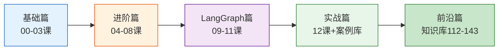

# LangChain & LangGraph 系统学习计划

> 本项目为零基础学习者量身打造，以文档形式沉淀所有学习知识资料，循序渐进地引导你从零开始掌握 LangChain 与 LangGraph 框架。配以丰富的 Mermaid 图解和完整实战案例。

> 共 **1212 篇文档**：学习课程 13 篇 · 知识库 576 篇 · 图解 547 篇 · 实战案例 72 篇 · 学习评估 3 篇

---

## 目录结构

```
LangChain_LangGraph_学习计划/
├── README.md                      ← 你在这里：总入口与导航
│
├── 学习课程/                       ← 教学引导与学习路径 13 篇
│   ├── 00-课程总览与学习路径.md  ~ 12-实战项目-从零到一.md
│
├── 知识库/                         ← 技术细节与结构化数据 426 篇
│   ├── [01-13] 基础参考篇
│   ├── [14-23] 核心技术篇
│   ├── [24-33] 工程实践篇
│   ├── [34-49] 进阶专题篇
│   ├── [50-65] 生产运维篇
│   ├── [66-79] 高级架构篇
│   ├── [80-99] 深度专题篇
│   ├── [100-111] 前沿主题篇
│   ├── [112-117] 最新补充篇一
│   ├── [118-123] 最新补充篇二
│   ├── [124-133] 最新补充篇三
│   ├── [134-138] 最新补充篇四
│   └── [139-143] 最新补充篇五
│
├── 图解/                           ← 可视化图解与决策树 397 篇
│   ├── [00] 学习路线全景图
│   ├── [01-12] 基础图解篇
│   ├── [13-22] 进阶图解篇
│   ├── [23-40] 高级图解篇
│   ├── [41-60] 架构图解篇
│   ├── [61-79] 运维与高级模式篇
│   ├── [80-85] 前沿补充篇一
│   ├── [86-96] 前沿补充篇二
│   ├── [97-101] 前沿补充篇三
│   ├── [102-106] 前沿补充篇四
│   └── [107-111] 前沿补充篇五
│       └── [112-116] 前沿补充篇六
│   └── [107-111] 前沿补充篇五
│
├── 实战案例库/                      ← 完整项目实战 71 篇
│   ├── 00-案例库导读.md  ~ 11-多Agent协作研究系统.md
│   └── 12-数据科学分析Agent实战.md
│
└── 学习评估/                       ← 自测与进度跟踪 3 篇
    ├── 01-学习里程碑与进度跟踪.md
    ├── 02-知识检验题库与面试准备.md
    └── 03-速查卡.md
```

## 四个文件夹的定位

| 文件夹 | 定位 | 阅读方式 |
|--------|------|----------|
| `学习课程/` | 教学引导、学习路径、动手实践 | 按顺序逐课学习，从第 00 课开始 |
| `知识库/` | 技术细节、术语速查、架构解析、代码示例 | 遇到不懂的概念时随时查阅 |
| `图解/` | Mermaid 流程图、架构图、决策树 | 学完每课后看对应图解巩固理解 |
| `实战案例库/` | 完整可运行的项目，多场景实战 | 学完基础课程后，按兴趣选择案例 |
| `学习评估/` | 里程碑跟踪、面试题库、速查卡 | 每学完一个阶段后自测 |

## 学习建议


## 学习路线速览



---

## 知识库前沿主题索引 [112-426]

| 编号 | 文档 | 核心内容 |
|------|------|----------|
| 112 | Agent 评估与基准测试 | 轨迹评估、工具准确率、回归测试 |
| 113 | 多模态 RAG 实践指南 | 三种架构、CLIP嵌入、多向量检索 |
| 114 | LangGraph Functional API 指南 | @entrypoint/@task、控制流、选型 |
| 115 | A2A 协议与 Agent 互联 | Agent Card、Task生命周期、多Agent协作 |
| 116 | 语义缓存层设计 | 向量相似度缓存、两层架构、漂移检测 |
| 117 | LLM 应用混沌工程 | 故障注入、稳态验证、实验调度 |
| 118 | LangGraph 预构建 Agent 指南 | create_react_agent、ToolNode、定制模式 |
| 119 | RAG 分块策略深度指南 | 7种策略、父子分块、效果评估 |
| 120 | LangGraph 部署与 Studio 指南 | Studio可视化、Cloud/Docker部署、API设计 |
| 121 | RAGAS 评估框架实践 | 四大指标、LLM-as-Judge、配置对比调优 |
| 122 | Agent 记忆架构设计 | 四种记忆类型、遗忘巩固、LangGraph集成 |
| 123 | LLM 应用可观测性体系 | 三支柱、指标采集、分布式追踪、告警 |
| 124 | RAG 高级检索策略 | 查询重写、Multi-Query、HyDE、查询分解 |
| 125 | Token 优化与上下文压缩 | LLMLingua、压缩检索器、对话历史压缩 |
| 126 | LLM 框架竞品对比 | CrewAI/AutoGen/LlamaIndex对比、选型 |
| 127 | LangGraph Command API | resume/update/goto、update_state、时间旅行 |
| 128 | LLM 应用红队测试 | 攻击面分类、攻击用例库、自动化执行 |
| 129 | Agent 工作流模式全集 | ReAct/Plan-Execute/Reflection/ReWOO/LATS |
| 130 | 流式输出前端集成指南 | SSE流式、React/Vue集成、打字机效果 |
| 131 | 向量库生产运维指南 | HNSW调优、蓝绿重建、零停机迁移 |
| 132 | 评测数据集构建与管理 | 数据来源、版本管理、防泄露、分层设计 |
| 133 | LLM 应用成本优化策略 | 模型路由、语义缓存、批量API、成本监控 |
| 134 | Agent 代码执行沙箱安全指南 | 4级隔离、Docker沙箱、安全审计 |
| 135 | 知识图谱构建与GraphRAG实践 | 实体关系抽取、图谱存储、混合检索 |
| 136 | 多轮对话状态跟踪与流程控制 | 对话状态机、槽位填充、流程引擎 |
| 137 | LLM 网关与多模型API管理 | 统一接口、智能路由、降级链、限流 |
| 138 | Prompt工程进阶模式与思维链 | CoT/Self-Consistency/ToT/CoV/分解 |
| **139** | **自适应RAG** | **Self-RAG反思、Corrective RAG纠错、LangGraph编排** |
| **140** | **合成数据生成与数据增强** | **测试用例生成、对话数据、攻击载荷、质量控制** |
| **141** | **OWASP LLM Top10安全风险与防护** | **注入防护、输出处理、PII脱敏、过度代理防护** |
| **142** | **多模态生成：文生图与图像理解** | **DALL-E/SD集成、图文工作流、图像编辑** |
| **143** | **Agent测试自动化与CI集成** | **测试金字塔、语义断言、CI/CD分层、回归基线** |
| 347 | Agent 自适应整合指南 | 查询分类+自适应配置+降级策略 |
| 348 | LLM 应用灰度发布整合指南 | 金丝雀发布+特性开关+自动回滚 |
| 349 | RAG 重排序整合速查指南 | Bi vs Cross-Encoder+两阶段检索 |
| 350 | Agent 记忆持久化整合指南 | Checkpointer+Store+情景记忆 |
| 351 | LLM 应用 SLO 整合速查指南 | SLI/SLO/SLA+错误预算+告警规则 |
| 352 | RAG 查询路由与多知识源选择指南 | 意图分类+多源检索+去重合并 |
| 353 | Agent 工具幂等性与重试策略指南 | 请求ID去重+指数退避+死信队列 |
| 354 | LLM 应用 Prompt 注册中心与 A/B 测试指南 | 版本管理+确定性分流+效果分析 |
| 355 | LangGraph 条件分支与动态路由指南 | 条件边+质量回路+运行时路由 |
| 356 | RAG 幻觉检测与事实校验指南 | 分句校验+置信度评分+引用追溯 |
| 357 | Agent 工具权限矩阵与细粒度访问控制指南 | RBAC+参数过滤+动态工具裁剪+审计日志 |
| 358 | RAG 语义分块与自适应分块指南 | 嵌入相似度断点+递归分块+文档类型自适应 |
| 359 | LLM 应用多租户资源配额与限流指南 | 令牌桶+日Token配额+并发限制+公平调度 |
| 360 | LangGraph 消息总线与节点间通信指南 | pub/sub总线+事件驱动+通配订阅+审计 |
| 361 | Agent 对话摘要与长上下文压缩策略指南 | 滑动窗口+摘要+关键事实+混合压缩 |
| 362 | Agent 工具调用链追踪与分布式 span 指南 | span树+慢节点检测+异常事件+调用链摘要 |
| 363 | RAG 多跳问答与推理链编排指南 | 子问题分解+依赖感知检索+串行编排+合成 |
| 364 | LLM 应用特征开关与动态配置中心指南 | FLAG/VALUE/JSON/SECRET+变更回调+版本追踪 |
| 365 | LangGraph 子图组合与模块化编排指南 | 子图定义+状态映射+路由组合+独立测试 |
| 366 | Agent 输出格式校验与结构化约束指南 | JSON提取+自动修复+Schema校验+重试反馈 |
| 367 | Agent 自评估与轨迹评分指南 | 逐步骤评分+LLM-as-Judge+综合评分+改进建议 |
| 368 | 向量库选型决策树与性能基准指南 | 决策树+对比矩阵+索引算法+场景化推荐 |
| 369 | Prompt 版本对比与回归测试指南 | 测试集+LLM-as-Judge评分+退化检测+回归报告 |
| 370 | LangGraph 状态快照与时间旅行指南 | Checkpointer+快照列表+状态修改+分叉重跑 |
| 371 | Agent 用户反馈闭环与持续改进指南 | 反馈收集+分类分析+改进动作+闭环循环 |
| 372 | Agent 连接池与 LLM 资源管理指南 | 连接复用+健康检查+预热+并发限制 |
| 373 | LangGraph 编译优化与延迟降低指南 | 并行扇出+状态裁剪+短路返回+调用合并 |
| 374 | Agent 版本兼容与平滑迁移指南 | 版本路由+状态适配器+灰度迁移+回滚 |
| 375 | Agent 输出护栏与分级内容过滤指南 | 规则+PII+LLM安全三级管线+脱敏重写 |
| 376 | LLM 应用成本预算与超支告警指南 | 日月双预算+实时追踪+三级告警+自动降级 |
| 377 | Agent 健康探针与存活检测指南 | Liveness+Readiness双探针+多项检查+降级状态 |
| 378 | RAG 检索增强排序与多样性策略指南 | MMR排序+去重+上下文组装+多样性评估 |
| 379 | LangGraph 断点调试与步骤回放指南 | interrupt_before+单步执行+状态修改+快照回放 |
| 380 | Agent 指标采集与监控面板指南 | Counter+Histogram+Gauge+中间件采集+面板 |
| 381 | LLM 应用优雅扩缩容指南 | 利用率决策+预热+排空+冷却+多指标 |
| 382 | 模型降级链与断路器集成指南 | 三态断路器+降级链+缓存兜底+半开恢复 |
| 383 | Agent 流式输出与 SSE 实时推送指南 | astream_events+SSE格式+心跳+打字机 |
| 384 | Agent 离线批量推理管线指南 | 分块+并发Worker+检查点+断点续跑 |
| 385 | 语义缓存与查询去重指南 | 嵌入相似度+TTL+淘汰策略+成本统计 |
| 386 | Agent 多模态输入输出处理指南 | 图问答+OCR+多图对比+文生图+降级 |
| 387 | Agent 目标分解与任务规划指南 | LLM分解+任务依赖图+拓扑排序+动态重规划 |
| 388 | Agent 反思与自我纠错机制指南 | 批判-修正循环+置信度+LangGraph条件边 |
| 389 | Agent 记忆分层与遗忘策略指南 | 四层记忆+混合遗忘+巩固提升+保留分数 |
| 390 | LLM 应用分布式追踪与调用图谱指南 | trace_id透传+调用树+调用图谱+慢路径 |
| 391 | Agent 云原生部署与容器化指南 | Docker+K8s+ConfigMap+HPA+健康探针 |
| 392 | Agent 端到端测试框架指南 | 测试套件+多类断言+Mock+CI门禁+报告 |
| 393 | Agent 提示词模板库与复用模式指南 | 继承+变量插值+条件块+预设场景 |
| 394 | LangGraph 状态机设计模式指南 | 状态转换+路由+转换表+Mermaid导出 |
| 395 | Agent 审计日志与合规追溯指南 | 链式哈希+PII脱敏+追溯查询+合规报告 |
| 396 | Agent 并发安全与锁机制指南 | 悲观锁+乐观锁+分布式锁+TTL防死锁 |
| 397 | Agent 事件溯源与 CQRS 架构指南 | 不可变事件+EventStore+命令处理器+投影读模型 |
| 398 | RAG 多模态检索与跨模态对齐指南 | CLIP编码+共享向量空间+图文混合检索+模态过滤 |
| 399 | LangGraph 子图通信与消息传递指南 | 子图嵌套+状态映射+独立编译+父子图通信 |
| 400 | Agent 推理预算与 Token 配额管理指南 | TokenBudget+消耗计量+超额降级+上下文截断 |
| 401 | LLM 应用金丝雀发布与流量切换指南 | 流量路由器+指标采集+分步放量+自动回滚 |

| 402 | Agent 多策略路由与动态选择指南 | 意图分类+策略评分+动态选择+回退机制 |
| 403 | RAG 知识库版本管理与文档变更追踪指南 | 文档版本树+变更追踪+差异检索+版本回滚 |
| 404 | LangGraph 持久化检查点与状态恢复指南 | Checkpointer+状态快照+崩溃恢复+时间旅行 |
| 405 | Agent 多租户隔离与资源配额指南 | 租户识别+配额管理+资源池隔离+公平调度 |
| 406 | LLM 应用全链路压测与性能基准指南 | 混合场景+阶梯加压+性能基线+瓶颈分析 |
| 407 | RAG 重排序指南 | Cross-encoder重排+LLM重排+RRF融合+MMR多样性 |
| 408 | LangGraph 中断与人机交互指南 | interrupt审批+风险分级+多人审批+超时降级 |
| 409 | Prompt 缓存与上下文复用指南 | 前缀缓存+命中条件+缓存友好设计+成本统计 |
| 410 | Agent 对齐与价值约束指南 | 输入护栏+输出护栏+约束注册+对齐评估 |
| 411 | 向量量化与索引压缩指南 | float16/SQ8/PQ/Binary+两阶段搜索+压缩比对比 |
| 412 | 多模态 Agent 指南 | 图像/音频/视频多模态输入+模态识别+多模态RAG+Token优化 |
| 413 | Agent 通信协议指南 | 消息格式+请求响应/发布订阅/点对点+能力发现+通信总线 |
| 414 | 数据飞轮与持续学习指南 | 反馈收集+根因定位+持续优化引擎+隐式反馈+飞轮看板 |
| 415 | 模型 AB 测试与实验平台指南 | 分流策略+指标收集+统计检验+样本量计算+实验结论 |
| 416 | Tool 缓存与工具结果复用指南 | 精确/语义缓存+缓存装饰器+多级缓存+失效策略 |
| 417 | Agent 监控与可观测性指南 | 指标采集+分布式追踪+结构化日志+监控仪表盘+告警规则 |
| 418 | LLM 推理加速与批处理指南 | 动态批处理+并发控制+语义缓存+vLLM+推测解码 |
| 419 | 提示词版本管理与 AB 测试指南 | 版本注册中心+一键回滚+Prompt A/B测试+变更审查 |
| 420 | Agent 注册中心与服务发现指南 | 注册/注销+心跳+能力索引+负载均衡+健康检查 |
| 421 | 对话编排与多轮状态管理指南 | 意图识别+槽位填充+话题切换+上下文窗口管理 |

| 422 | Agent 协商与共识机制指南 | 投票/加权/协商讨论/仲裁/置信度融合 |
| 423 | LLM 应用反馈循环与自动调优指南 | 反馈采集+根因定位+自动调优+隐式反馈 |
| 424 | 数据脱敏管道与隐私保护指南 | PII识别+脱敏管道+差分隐私+审计日志 |
| 425 | Agent 工具动态发现与绑定指南 | 运行时发现+能力索引+动态绑定+安全校验 |
| 426 | LLM 网关与统一模型管理指南 | 统一接口+智能路由+降级链+限流+计费+缓存 |
| **427** | **MCP 协议与 LangChain 工具集成指南** | **三大原语+Stdio/SSE传输+MultiServerMCPClient+自建Server+安全策略** |
| **428** | **推理模型与 Agent 集成指南** | **o3/R1思考Token+混合模型路由+reasoning_effort+成本管理+RAG评估** |
| **429** | **Agent 可恢复性与容错编排指南** | **检查点恢复+节点降级链+Saga补偿+熔断器+状态自修复+超时编排** |
| **430** | **Agentic RAG 与自适应检索决策指南** | **检索决策器+迭代检索+查询分解+多源交叉验证+幻觉检测+混合策略** |
| **431** | **长上下文模型与 RAG 策略权衡指南** | **成本对比+中间遗忘+决策框架+混合策略+Prompt缓存+场景分析** |

| **432** | **Computer Use 与浏览器自动化 Agent 指南** | **Claude Computer Use+操作类型+Playwright集成+安全沙箱+Browser Use** |
| **433** | **OpenAI Realtime API 与语音 Agent 指南** | **WebSocket事件流+VAD打断+函数调用+LangGraph集成+中文方案** |
| **434** | **自托管 LLM 与本地推理部署指南** | **vLLM/Ollama/llama.cpp选型+量化部署+性能调优+混合路由** |
| **435** | **LLM 评测工具链集成指南** | **DeepEval/Ragas/Promptfoo/LangSmith+CI门禁+组合评测** |
| **436** | **AI 编程 Agent 与代码自动化指南** | **三个层次+工具集+规划-编码-测试-调试循环+沙箱+代码审查** |

| **437** | **OpenAI Agents SDK 与多 Agent 框架指南** | **Handoff机制+function_tool+Guardrails+四大框架对比+混合使用** |
| **438** | **NeMo Guardrails 与 Agent 护栏系统指南** | **四层防护+输入/输出护栏+主题控制+注入检测+PII脱敏+分级策略** |
| **439** | **PEFT 微调与 DPO 对齐实践指南** | **LoRA/QLoRA原理+SFT微调+DPO偏好对齐+vLLM部署+效果评估** |
| **440** | **Agent 前端与聊天 UI 构建指南** | **SSE流式+打字机效果+工具调用可视化+Markdown渲染+引用展示+断线重连** |
| **441** | **LangGraph Platform 部署与生产化指南** | **Cloud/自托管+检查点恢复+Cron调度+人机交互+Studio可视化+生产化检查** |

| **442** | **Agent 身份认证与授权体系指南** | **JWT/APIKey/OAuth+RBAC/ABAC+动态工具过滤+多租户隔离+审计日志** |
| **443** | **多模态文档智能与 OCR Agent 指南** | **三代演进+PaddleOCR/VLM对比+OCR+VLM混合+PDF管线+表格提取+发票/合同场景** |
| **444** | **Agent 可解释性与 XAI 指南** | **三层次解释+推理链可视化+置信度评分+工具选择解释+SHAP+审计报告** |
| **445** | **Agent 调试与可观测工具链指南** | **LangSmith追踪+OpenTelemetry+断点/单步调试+指标/告警+结构化日志+工具链选型** |
| **446** | **Agent 记忆架构与长期记忆系统指南** | **四层记忆(工作/短期/情景/语义)+LangGraph Store+偏好提取+遗忘巩固+Postgres持久化** |

| **447** | **AI 伦理与偏见检测指南** | **偏见三层来源+对照测试法+多维度检测+LLM-as-Judge+反偏见Prompt+输出过滤+公平性监控** |
| **448** | **Agent 红队测试与对抗攻防深度指南** | **四大攻击面+Prompt注入用例库+工具层攻击+自动化红队+Garak扫描+纵深防御体系** |
| **449** | **隐私计算与联邦学习指南** | **差分隐私+同态加密+安全多方+联邦学习+Opacus+Flower+场景选型** |
| **450** | **Agent 经济模型与激励机制指南** | **Token经济学+预算控制+成本感知路由+多Agent贡献度+质量激励+自主交易+资源调度** |
| **451** | **LLM 应用合规与法律框架指南** | **全球AI法规+EU AI Act分级+数据合规+GDPR/PIPL+知识产权+AI内容标识+风险评估+合规工程化** |

| **452** | **低代码 Agent 平台与 Dify/Coze 指南** | **平台对比+Dify自托管+Coze Bot+工作流编排+混合架构+API调用** |
| **453** | **视频理解与多模态 Agent 指南** | **帧采样策略+GPT-4o帧序列+Gemini原生+帧描述省Token+视频RAG+音频处理** |
| **454** | **LLM 推理引擎深度优化指南** | **Prefill/Decode+KV Cache+PagedAttention+连续批处理+推测解码+量化+vLLM调优** |
| **455** | **Agent 数据管道与知识更新指南** | **多源采集+清洗+自适应分块+增量更新+定时调度+失效检测+质量监控** |
| **456** | **多 Agent 博弈与资源调度指南** | **优先级/公平/轮转调度+负载均衡+多层限流+拍卖机制+预算分配博弈** |

| **457** | **LLMOps 与 Agent 全生命周期运维指南** | **DevOps/MLOps/LLMOps对比+Prompt版本管理+模型AB测试+质量监控+数据飞轮+灰度发布** |
| **458** | **人机协作与 Human-in-the-Loop 深度指南** | **四种HITL模式+风险分级审批+interrupt实现+多审批者协调+超时降级+审批通知** |
| **459** | **Agent 个性化与用户画像系统指南** | **画像维度+显式/隐式采集+自动更新+画像驱动Prompt+个性化推荐+LangGraph集成** |
| **460** | **事件响应与根因分析指南** | **五类故障分类+事件分级+五步根因法+变更分析+指标关联+自动诊断+复盘报告** |
| **461** | **企业 Agent 集成与系统对接指南** | **五种集成模式+CRM/工单/通知/知识库工具封装+SSO认证+CDC同步+凭证管理** |

| **462** | **Agent 设计模式与参考架构指南** | **12种设计模式+ReAct/Plan-Execute/Reflection/Supervisor/Debate/Map-Reduce/Saga+选型矩阵+模式组合** |
| **463** | **GraphRAG 与知识图谱实体抽取指南** | **向量vs图谱RAG+实体关系抽取+图谱存储+邻居/路径查找+混合检索+Neo4j集成** |
| **464** | **强化学习与 RLHF 对齐指南** | **RL基础+RLHF三阶段(SFT/RM/PPO)+DPO简化+ORPO/KTO变体+副作用+偏好数据质量** |
| **465** | **RPA 与业务流程自动化 Agent 指南** | **传统vs AI RPA+混合策略+流程定义+执行引擎+扇出扇入+异常重试+LangGraph集成** |
| **466** | **Agent 数据流与 DAG 编排引擎指南** | **DAG模型+拓扑排序+并行执行+动态编排+子图嵌套+Temporal/Airflow对比+数据依赖追踪** |

| **467** | **多 Agent 仿真与群体智能指南** | **群体智能原理+Boid三规则+仿真器+共识/多样性测量+涌现行为检测+市场/舆论/决策仿真** |
| **468** | **自动 Prompt 优化与元学习指南** | **DSPy框架+签名+模块+BootstrapFewShot优化器+APO元Prompt优化+元学习+自我改进循环** |
| **469** | **分布式 Agent 与边缘部署指南** | **分布式架构+跨节点通信+协调者模式+边缘智能路由+边缘缓存+分布式状态管理+容灾故障转移** |
| **470** | **Agent 生态系统与标准互操作指南** | **四层生态+MCP/A2A/Agent Card+跨框架迁移+Agent注册中心+市场愿景+标准化趋势** |
| **471** | **数字孪生与 Agent 仿真环境指南** | **数字孪生概念+仿真环境构建+Agent仿真循环+安全测试沙箱+预测性仿真+制造/城市/医疗场景** |

| **472** | **Agent 质量度量与基准测试体系指南** | **五维度质量模型+基准数据集+质量评估器+质量门禁+持续评估管线+按类别/难度分析** |
| **473** | **Agent 可靠性与韧性工程指南** | **韧性六原则+分级异常处理+优雅降级链+三态熔断器+背压限流+健康检查自愈+混沌工程** |
| **474** | **Agent 会话管理与上下文工程指南** | **上下文五组成+Token预算分配+上下文压缩(摘要/截断)+多会话管理+优先级排序** |
| **475** | **Agent 性能调优与延迟优化指南** | **延迟拆解+TTFT优化+并行化(工具/多路检索)+多级缓存+上下文优化+瓶颈诊断** |
| **476** | **Agent 计费与成本管理深度指南** | **多维度成本追踪+按量/订阅/阶梯计费+预算控制闭环+自动降本+成本仪表盘** |

| **477** | **Agent 数据安全与加密体系指南** | **三层防护(传输/存储/处理)+TLS+字段级AES加密+密钥管理轮换+数据脱敏管道+安全审计链** |
| **478** | **AIOps 与智能运维指南** | **异常检测+语义异常分析+故障预测+LLM智能诊断+自愈闭环+运维知识学习+修复手册** |
| **479** | **Agent 自动扩缩容与弹性指南** | **五种策略+扩缩容决策器+K8s HPA+KEDA事件驱动+GPU调度+预热排空+冷却期** |
| **480** | **Agent 日志管理与审计追溯指南** | **结构化日志Schema+日志脱敏+分布式聚合+request_id透传+链式哈希审计+日志智能分析** |
| **481** | **Agent 变更管理与发布流程指南** | **变更分类风险+变更注册中心+审批流程+灰度发布管理+自动回滚+变更审计** |

| **482** | **Agent API 设计与 OpenAPI 规范指南** | **四种API模式+端点设计+OpenAPI文档+JWT/APIKey认证+版本管理+限流配额+SDK自动生成** |
| **483** | **Agent 内容生成与文档自动化指南** | **六种生成类型+模板系统+多格式导出(MD/HTML/PDF/Word)+质量检查+周报自动化+文档同步** |
| **484** | **Agent 跨平台与多端部署指南** | **渠道适配器模式+统一消息模型+格式转换+Web/飞书/钉钉适配器+多渠道路由** |
| **485** | **Agent 调度与定时任务 Cron 指南** | **Cron表达式+APScheduler集成+每日/每周/间隔任务+早报/知识库更新/异常检测+LangGraph Cron** |
| **486** | **Agent Webhook 与事件驱动通知指南** | **事件驱动架构+通知路由器+Webhook可靠投递+注册管理+免打扰频率控制+多渠道并行** |

| **487** | **Agent 最佳实践与反模式深度指南** | **20条最佳实践+15个反模式+架构/Prompt/工具/生产四层+好坏对比+检查清单** |
| **488** | **Agent 环境管理与配置即代码指南** | **三环境分层+配置文件体系+加载器+密钥分离+密钥轮换+环境隔离验证** |
| **489** | **Agent 容器化与 K8s 生产部署指南** | **Docker多阶段构建+Deployment+ConfigMap/Secret+HPA+健康探针+Helm Chart** |
| **490** | **Agent 版本兼容与平滑升级指南** | **版本兼容策略+兼容层适配+状态迁移+灰度迁移+回滚机制+依赖管理** |
| **491** | **Agent 冷启动优化与预热策略指南** | **冷启动四阶段+模型预加载+Embedding预热+向量库预热+缓存预热+渐进式就绪** |

| **492** | **Agent 异地多活与灾难恢复深度指南** | **RTO/RPO+双活架构+多区域路由+故障切换+数据库双向同步+向量库增量同步+灾备演练** |
| **493** | **Agent 数据迁移与零停机搬迁指南** | **双写迁移+全量+CDC增量+渐进读切流+一致性校验+向量库迁移+模型切换+回滚** |
| **494** | **Agent 混合搜索与语义检索增强指南** | **多路召回+RRF融合+Multi-Query+HyDE+同义词扩展+查询分解+重排序+效果对比** |
| **495** | **Agent 工具选择与智能编排指南** | **工具描述优化+动态过滤+工具链编排+自动链选择+调用监控+使用统计分析** |
| **496** | **Agent 经验沉淀与组织知识库指南** | **经验飞轮+成功/失败收集+失败模式分析+Few-shot生成+评估集创建+工具描述优化** |

| **497** | **Agent 对话压缩与长上下文管理深度指南** | **五种压缩策略+混合压缩(截断+摘要+提取)+增量摘要+Token预算动态分配+效果对比** |
| **498** | **Agent 语义缓存与智能缓存策略深度指南** | **精确vs语义缓存+多层缓存(L1精确+L2语义)+RRF+LRU淘汰+TTL过期+失效策略+效果分析** |
| **499** | **Agent 性能压测与负载基准指南** | **五种压测类型+Locust集成+混合场景+性能基线+瓶颈分析(GPU/CPU/内存/延迟)+CI/CD回归** |
| **500** | **Agent 越狱防护与提示注入防御深度指南** | **10种越狱模式+5级防御(正则/模式/小模型/大模型/间接注入)+输出防护+系统提示泄露检测** |
| **501** | **Agent 数据保护与隐私合规深度指南** | **PII生命周期+全链路脱敏(输入/输出/存储/日志)+被遗忘权+数据访问权+保留策略+LLM检测PII** |

| **502** | **Agent 可观测性三支柱整合指南** | **Metrics/Tracing/Logging三支柱+OpenTelemetry自动埋点+Prometheus指标+Grafana统一面板+trace_id关联+告警规则** |
| **503** | **Agent SRE 与 On-Call 事件管理指南** | **SLI/SLO/错误预算+On-Call排班+告警升级+事件生命周期(IMAC)+Runbook自动化+复盘报告** |
| **504** | **Agent DevOps 与 CI/CD 流水线工程化指南** | **CI/CD全流程+GitHub Actions配置+测试金字塔+LLM评估测试+安全扫描+质量门禁+金丝雀发布** |
| **505** | **Agent 云原生与 Serverless 部署指南** | **四种部署模式+Lambda部署+Cloudflare边缘+K8s生产配置+混合部署路由+冷启动处理** |
| **506** | **Agent 微服务拆分与服务网格指南** | **拆分原则+何时拆分+同步/异步通信+Istio服务网格+流量管理/mTLS/API网关** |

| **507** | **Agent 错误处理与异常恢复工程化指南** | **错误分类体系+指数退避重试+重试策略选择+多级降级链+LangGraph错误路由+上下文超长处理** |
| **508** | **Agent 限流配额与流量治理指南** | **四种限流算法+令牌桶+滑动窗口+多维度配额(用户/租户/全局)+优先级调度+流量整形** |
| **509** | **Agent 优雅关闭与排空深度指南** | **SIGTERM→排空→保存→退出+FastAPI lifespan+K8s preStop+排空管理器+客户端通知** |
| **510** | **Agent 配置热更新与动态配置中心指南** | **动态配置中心+热更新监听+Feature Flag+按用户灰度+紧急配置(降级/熔断)+配置版本管理** |
| **511** | **Agent 回滚与版本管理工程化指南** | **版本注册中心+多组件版本管理+一键回滚+自动回滚触发+版本对比验证+紧急回滚预案** |

| **512** | **Agent 对话状态机与槽位填充深度指南** | **对话状态机模型+槽位定义+LLM提取+主动追问+确认机制+对话管理器+话题切换** |
| **513** | **Agent 推理链优化与思维链工程化指南** | **五种推理模式(CoT/Self-Consistency/ToT/推理模型)+深度控制+推理链压缩** |
| **514** | **Agent 工具编排与动态工具链指南** | **四种编排模式(顺序/并行/条件/DAG)+动态工具发现+MCP集成+依赖图+拓扑排序** |
| **515** | **Agent 情景记忆与语义记忆深度指南** | **情景vs语义记忆+向量存储+KV Store+偏好提取+记忆巩固+遗忘策略+对话注入** |
| **516** | **Agent 踩坑实录与生产事故案例分析指南** | **15个真实事故(Prompt/工具/性能/安全)+根因分析+修复方案+预防措施+复盘模板** |

| **517** | **Agent 数据分析与可视化自动化指南** | **数据解析+画像+趋势分析+异常检测+相关性+图表生成(6种)+洞察提取+LangGraph集成** |
| **518** | **Agent 代码生成与代码审查深度指南** | **需求→代码生成+项目结构+6维度审查+自动修复+测试生成+沙箱运行** |
| **519** | **Agent 多语言翻译与国际化指南** | **语言检测+路由+翻译引擎+术语库管理+文化适配+RTL布局+多语言知识库** |
| **520** | **Agent 搜索增强与网页信息提取指南** | **查询变体+并行搜索+结果排序+网页抓取+内容提取+交叉验证+引用标注** |
| **521** | **Agent 内容创作与写作辅助深度指南** | **4种风格控制+大纲规划+逐段起草+润色打磨+原创性检查+技术博客+营销文案** |

| **522** | **Agent 教育应用与智能学习辅导指南** | **学情评估+知识追踪(BKT)+自适应路径+智能出题+自动批改+苏格拉底式辅导+隐私合规** |
| **523** | **Agent 医疗辅助与诊断支持指南** | **三原则+症状采集+分诊+鉴别诊断+检验解读+用药安全+医生确认(HITL)+合规** |
| **524** | **Agent 金融风控与智能投顾指南** | **KYC+风险评估+信用评估+投顾建议+反欺诈检测+合规检查+链式哈希审计** |
| **525** | **Agent 法律辅助与合同审查指南** | **合同解析+条款分类+风险识别(8维度)+合规检查+法律问答+律师确认** |
| **526** | **Agent 客服自动化与智能对话指南** | **意图识别+情绪检测+FAQ回答+工单创建+人工转接(带摘要)+满意度追踪** |

| **527** | **Agent 智能制造与工业互联网指南** | **设备状态监控+健康度计算+故障预测+维护计划+生产调度优化+质量检测(VLM)+边缘计算** |
| **528** | **Agent 供应链优化与物流管理指南** | **需求预测+库存优化(安全库存+EOQ)+路径规划+物流跟踪+延迟通知** |
| **529** | **Agent 能源管理与电力调度指南** | **负荷预测(天气因子)+发电调度(风光火储)+储能管理(谷充峰放)+需求响应+负荷预警** |
| **530** | **Agent 人力资源与智能招聘指南** | **简历解析+智能匹配(4维度)+候选人排序+面试题生成+回答评估+员工服务** |
| **531** | **Agent 税务申报与智能审计指南** | **发票解析+验真查重+增值税/所得税计算+申报表生成+合规检查+智能审计+税务优化** |

| **532** | **Agent 智慧政务与公共服务指南** | **政策知识库+带引用回答+办事引导+材料预审+合规检查+政务数据安全(等保三级)** |
| **533** | **Agent 农业智能化与精准种植指南** | **环境监测+病虫害识别(VLM)+灌溉决策(天气+作物)+产量预测+作物理想条件库** |
| **534** | **Agent 智慧交通与城市管理指南** | **路况分析(拥堵指数)+信号灯优化(动态配时)+事故响应(分级调度)+绕行引导+投诉处理** |
| **535** | **Agent 零售电商与智能营销指南** | **个性化推荐+智能搜索(语义+意图)+营销文案生成+AB测试标题+价格优化(竞品分析)** |
| **536** | **Agent 心理咨询与心理健康服务指南** | **情绪评估(PHQ-9)+危机检测+共情式支持+心理教育+危机干预(热线转介)+情绪追踪** |

| **537** | **Agent 旅游规划与智能出行指南** | **行程规划+路线优化+实时讲解+排队应对+天气调整+突发应对** |
| **538** | **Agent 保险理赔与智能核保指南** | **智能核保(风险评分)+理赔材料审核+损失评估(VLM)+赔付计算+欺诈检测** |
| **539** | **Agent 专利分析与知识产权管理指南** | **专利解析+价值评估(4维度)+侵权检测+续展管理+组合分析** |
| **540** | **Agent 智能建筑与物业管理指南** | **HVAC优化+照明控制+设备监控+安防联动+能耗优化+物业服务** |
| **541** | **Agent 医药研发与临床试验指南** | **文献分析(靶点发现)+化合物虚拟筛选+临床试验设计+试验监测+药物警戒** |

| **542** | **Agent 环保监测与碳排放管理指南** | **环境监测(多污染物分级)+污染预测(天气因子)+碳足迹(范围1/2/3)+ESG报告自动生成** |
| **543** | **Agent 智能汽车与自动驾驶辅助指南** | **多传感器融合感知+危险预测(多维评分)+车载语音助手+驾驶决策建议** |
| **544** | **Agent 食品安全与质量追溯指南** | **质量检测(VLM+理化)+全链追溯+根源定位+风险预警+召回建议** |
| **545** | **Agent 新闻媒体与内容采编指南** | **多源信息采集+事实核查+新闻写作(4风格)+多格式改编+多渠道发布** |
| **546** | **Agent 城市规划与智慧社区指南** | **区域分析(6维度)+方案模拟+社区服务+老人关爱+应急响应(疏散方案)** |

| **547** | **Agent 半导体制造与良率优化指南** | **缺陷分析(VLM分类)+良率分析(根因定位)+工艺优化(参数调整)+趋势追踪** |
| **548** | **Agent 影视制作与内容创作指南** | **剧本大纲+对白写作+智能剪辑方案+字幕生成(ASR+翻译)+内容审核(分级)** |
| **549** | **Agent 气象预报与灾害预警指南** | **预报生成+自然语言预报+灾害预警(台风/暴雨/高温/寒潮/雾 5类分级)+穿衣/出行建议** |
| **550** | **Agent 房地产智能估值与交易指南** | **多因素估值(位置/楼层/装修/配套)+房源匹配+市场分析(趋势/供需)+投资建议** |
| **551** | **Agent 图书馆与智能知识管理指南** | **智能检索(语义+元数据)+知识问答+个性化推荐+自动编目(分类/标签/摘要)+阅读路径** |

| **552** | **Agent 游戏开发与智能 NPC 指南** | **智能NPC对话+自主行为+动态任务生成+玩家行为观察+反作弊检测** |
| **553** | **Agent 体育分析与赛事辅助指南** | **比赛分析(战术/球员评分)+训练计划生成+自动赛事解说+伤病预防** |
| **554** | **Agent 化工生产安全与工艺优化指南** | **安全监控(超限检测)+异常预测+工艺优化(收率/能耗)+应急响应(泄漏/火灾)** |
| **555** | **Agent 海洋探索与海事管理指南** | **碰撞预警(TCPA)+海洋环境监测(海啸/赤潮/风暴)+渔业管理(配额/禁渔)+搜救方案** |
| **556** | **Agent 会展活动管理与智能场馆指南** | **展位布局优化+人流分析(拥堵预警)+智能签到(QR/人脸)+活动报告生成** |

| **557** | **Agent 多模态融合与跨模态推理深度指南** | **三种融合策略+跨模态推理+多模态RAG(CLIP)+医疗/工业/安防/自动驾驶应用** |
| **558** | **Agent 知识蒸馏与模型压缩实践指南** | **三种蒸馏方法(Response/Feature/Relation)+KL散度+量化(4/8bit)+剪枝+部署** |
| **559** | **Agent 联邦学习与隐私保护深度指南** | **横向/纵向联邦+FedAvg+安全聚合+差分隐私(Laplace)+医疗/金融/工业场景** |
| **560** | **Agent 自进化与持续学习闭环指南** | **自进化闭环+在线学习+经验回放+EWC防遗忘+自动Prompt优化** |
| **561** | **Agent 安全攻防实战与红队工具链指南** | **5类攻击(注入/越狱/提取/工具/间接)+自动化红队+Garak扫描+纵深防御** |

| **562** | **Agent 边缘计算与端侧部署深度指南** | **云边协同+智能路由(端侧优先)+离线模式+设备适配(mobile/PI/car)+端侧量化** |
| **563** | **Agent 量子计算融合与未来展望指南** | **量子优化(QAOA)+量子搜索(Grover)+量子ML+未来5-10年趋势** |
| **564** | **Agent 区块链与去中心化应用指南** | **智能合约分析+自动执行+预言机+去中心化Agent网络+DAO治理** |
| **565** | **Agent 数字人虚拟助手与元宇宙指南** | **LLM+TTS语音合成+唇形同步+面部动画+情感表达+手势生成** |
| **566** | **Agent 知识图谱推理与因果推断指南** | **图谱推理vs向量+因果发现+反事实推理+多跳因果链+医疗/金融应用** |

| **567** | **Agent 知识管理与企业搜索深度指南** | **混合搜索(向量+关键词+图谱RRF)+意图理解+权限过滤+知识图谱构建+知识推荐** |
| **568** | **Agent 自动化测试与质量保障体系指南** | **测试金字塔+语义断言(LLM-as-Judge)+工具选择测试+回归测试+CI/CD质量门禁** |
| **569** | **Agent 数据治理与数据质量管理指南** | **六大质量维度+质量检查+数据血缘追踪+影响分析+质量评分** |
| **570** | **Agent 实时决策与流式处理指南** | **流式架构(Kafka)+滑动窗口+实时异常检测(Z-Score)+事件驱动决策+规则引擎** |
| **571** | **Agent 自然语言交互与对话体验设计指南** | **五大设计原则+对话状态管理+意图检测+体验度量+对话模式库** |

| **572** | **Agent 智能决策与运筹优化指南** | **决策建模+调度优化+路径优化(VRP)+资源分配+LLM验证可行性** |
| **573** | **Agent 自然语言编程与代码即指令指南** | **NL→代码生成→沙箱执行→自动测试→自动修复→部署** |
| **574** | **Agent 多Agent博弈论与机制设计深度指南** | **四种博弈类型+VCG拍卖+Shapley值分配+纳什均衡分析** |
| **575** | **Agent 认知架构与思维模型指南** | **双系统(快/慢思考)+元认知反思+5种认知偏差缓解** |
| **576** | **Agent 伦理治理与负责任AI体系指南** | **六大原则+伦理审查流程+影响评估+事件响应+审查周期** |


---

## 图解前沿补充索引 [80-396]

| 编号 | 图解 | 对应知识库 |
|------|------|------------|
| 80-85 | [前沿图解一] | 112-117 |
| 86-96 | [前沿图解二] | 118-128 |
| 97-101 | [前沿图解三] | 129-133 |
| 102-106 | [前沿图解四] | 134-138 |
| **107** | **自适应RAG架构图解** | **139** |
| **108** | **合成数据生成流程图解** | **140** |
| **109** | **OWASP LLM Top10图解** | **141** |
| **110** | **多模态生成架构图解** | **142** |
| **111** | **Agent测试自动化图解** | **143** |
| **317** | **Agent自适应图解** | **347** |
| **318** | **灰度发布图解** | **348** |
| **319** | **重排序图解** | **349** |
| **320** | **记忆持久化图解** | **350** |
| **321** | **SLO速查图解** | **351** |
| **322** | **RAG查询路由图解** | **352** |
| **323** | **工具幂等性图解** | **353** |
| **324** | **Prompt注册中心图解** | **354** |
| **325** | **条件分支动态路由图解** | **355** |
| **326** | **幻觉检测图解** | **356** |
| **327** | **工具权限矩阵图解** | **357** |
| **328** | **语义分块图解** | **358** |
| **329** | **多租户限流图解** | **359** |
| **330** | **消息总线图解** | **360** |
| **331** | **对话压缩图解** | **361** |
| **332** | **调用链追踪图解** | **362** |
| **333** | **多跳问答图解** | **363** |
| **334** | **特征开关图解** | **364** |
| **335** | **子图组合图解** | **365** |
| **336** | **输出格式校验图解** | **366** |
| **337** | **轨迹评分图解** | **367** |
| **338** | **向量库选型图解** | **368** |
| **339** | **Prompt回归测试图解** | **369** |
| **340** | **状态快照时间旅行图解** | **370** |
| **341** | **反馈闭环图解** | **371** |
| **342** | **连接池图解** | **372** |
| **343** | **编译优化图解** | **373** |
| **344** | **版本兼容图解** | **374** |
| **345** | **输出护栏图解** | **375** |
| **346** | **成本预算图解** | **376** |
| **347** | **健康探针图解** | **377** |
| **348** | **多样性排序图解** | **378** |
| **349** | **断点调试图解** | **379** |
| **350** | **指标监控面板图解** | **380** |
| **351** | **优雅扩缩容图解** | **381** |
| **352** | **降级链断路器图解** | **382** |
| **353** | **流式SSE图解** | **383** |
| **354** | **批量推理管线图解** | **384** |
| **355** | **语义缓存图解** | **385** |
| **356** | **多模态处理图解** | **386** |
| **357** | **目标分解图解** | **387** |
| **358** | **反思纠错图解** | **388** |
| **359** | **记忆分层遗忘图解** | **389** |
| **360** | **分布式追踪图解** | **390** |
| **361** | **云原生部署图解** | **391** |
| **362** | **端到端测试图解** | **392** |
| **363** | **提示词模板库图解** | **393** |
| **364** | **状态机设计图解** | **394** |
| **365** | **审计日志图解** | **395** |
| **366** | **并发安全锁机制图解** | **396** |
| **367** | **事件溯源CQRS图解** | **397** |
| **368** | **多模态检索图解** | **398** |
| **369** | **子图通信图解** | **399** |
| **370** | **推理预算Token配额图解** | **400** |
| **371** | **金丝雀发布图解** | **401** |
| **372** | **多策略路由图解** | **402** |
| **373** | **知识库版本管理图解** | **403** |
| **374** | **持久化检查点图解** | **404** |
| **375** | **多租户隔离与资源配额图解** | **405** |
| **376** | **全链路压测与性能基准图解** | **406** |
| **377** | **RAG重排序图解** | **407** |
| **378** | **LangGraph中断与人机交互图解** | **408** |
| **379** | **Prompt缓存与上下文复用图解** | **409** |
| **380** | **Agent对齐与价值约束图解** | **410** |
| **381** | **向量量化与索引压缩图解** | **411** |
| **382** | **多模态Agent图解** | **412** |
| **383** | **Agent通信协议图解** | **413** |
| **384** | **数据飞轮与持续学习图解** | **414** |
| **385** | **模型AB测试图解** | **415** |
| **386** | **Tool缓存与结果复用图解** | **416** |
| **387** | **Agent监控与可观测性图解** | **417** |
| **388** | **推理加速与批处理图解** | **418** |
| **389** | **提示词版本管理图解** | **419** |
| **390** | **Agent注册中心图解** | **420** |
| **391** | **对话编排与状态管理图解** | **421** |

| **392** | **Agent协商与共识机制图解** | **422** |
| **393** | **反馈循环与自动调优图解** | **423** |
| **394** | **数据脱敏管道与隐私保护图解** | **424** |
| **395** | **Agent工具动态发现与绑定图解** | **425** |
| **396** | **LLM网关与统一模型管理图解** | **426** |
| **397** | **MCP协议与LangChain工具集成图解** | **427** |
| **398** | **推理模型与Agent集成图解** | **428** |
| **399** | **Agent可恢复性与容错编排图解** | **429** |
| **400** | **AgenticRAG与自适应检索决策图解** | **430** |
| **401** | **长上下文模型与RAG策略权衡图解** | **431** |

| **402** | **Computer Use与浏览器自动化Agent图解** | **432** |
| **403** | **OpenAI Realtime API与语音Agent图解** | **433** |
| **404** | **自托管LLM与本地推理部署图解** | **434** |
| **405** | **LLM评测工具链集成图解** | **435** |
| **406** | **AI编程Agent与代码自动化图解** | **436** |

| **407** | **OpenAI Agents SDK与多Agent框架图解** | **437** |
| **408** | **NeMo Guardrails与Agent护栏系统图解** | **438** |
| **409** | **PEFT微调与DPO对齐实践图解** | **439** |
| **410** | **Agent前端与聊天UI构建图解** | **440** |
| **411** | **LangGraph Platform部署与生产化图解** | **441** |

| **412** | **Agent身份认证与授权体系图解** | **442** |
| **413** | **多模态文档智能与OCR-Agent图解** | **443** |
| **414** | **Agent可解释性与XAI图解** | **444** |
| **415** | **Agent调试与可观测工具链图解** | **445** |
| **416** | **Agent记忆架构与长期记忆系统图解** | **446** |

| **417** | **AI伦理与偏见检测图解** | **447** |
| **418** | **Agent红队测试与对抗攻防深度图解** | **448** |
| **419** | **隐私计算与联邦学习图解** | **449** |
| **420** | **Agent经济模型与激励机制图解** | **450** |
| **421** | **LLM应用合规与法律框架图解** | **451** |

| **422** | **低代码Agent平台与Dify-Coze图解** | **452** |
| **423** | **视频理解与多模态Agent图解** | **453** |
| **424** | **LLM推理引擎深度优化图解** | **454** |
| **425** | **Agent数据管道与知识更新图解** | **455** |
| **426** | **多Agent博弈与资源调度图解** | **456** |

| **427** | **LLMOps与Agent全生命周期运维图解** | **457** |
| **428** | **人机协作与Human-in-the-Loop深度图解** | **458** |
| **429** | **Agent个性化与用户画像系统图解** | **459** |
| **430** | **事件响应与根因分析图解** | **460** |
| **431** | **企业Agent集成与系统对接图解** | **461** |

| **432** | **Agent设计模式与参考架构图解** | **462** |
| **433** | **GraphRAG与知识图谱实体抽取图解** | **463** |
| **434** | **强化学习与RLHF对齐图解** | **464** |
| **435** | **RPA与业务流程自动化Agent图解** | **465** |
| **436** | **Agent数据流与DAG编排引擎图解** | **466** |

| **437** | **多Agent仿真与群体智能图解** | **467** |
| **438** | **自动Prompt优化与元学习图解** | **468** |
| **439** | **分布式Agent与边缘部署图解** | **469** |
| **440** | **Agent生态系统与标准互操作图解** | **470** |
| **441** | **数字孪生与Agent仿真环境图解** | **471** |

| **442** | **Agent质量度量与基准测试体系图解** | **472** |
| **443** | **Agent可靠性与韧性工程图解** | **473** |
| **444** | **Agent会话管理与上下文工程图解** | **474** |
| **445** | **Agent性能调优与延迟优化图解** | **475** |
| **446** | **Agent计费与成本管理深度图解** | **476** |

| **447** | **Agent数据安全与加密体系图解** | **477** |
| **448** | **AIOps与智能运维图解** | **478** |
| **449** | **Agent自动扩缩容与弹性图解** | **479** |
| **450** | **Agent日志管理与审计追溯图解** | **480** |
| **451** | **Agent变更管理与发布流程图解** | **481** |

| **452** | **AgentAPI设计与OpenAPI规范图解** | **482** |
| **453** | **Agent内容生成与文档自动化图解** | **483** |
| **454** | **Agent跨平台与多端部署图解** | **484** |
| **455** | **Agent调度与定时任务Cron图解** | **485** |
| **456** | **Agent Webhook与事件驱动通知图解** | **486** |

| **457** | **Agent最佳实践与反模式深度图解** | **487** |
| **458** | **Agent环境管理与配置即代码图解** | **488** |
| **459** | **Agent容器化与K8s生产部署图解** | **489** |
| **460** | **Agent版本兼容与平滑升级图解** | **490** |
| **461** | **Agent冷启动优化与预热策略图解** | **491** |

| **462** | **Agent异地多活与灾难恢复深度图解** | **492** |
| **463** | **Agent数据迁移与零停机搬迁图解** | **493** |
| **464** | **Agent混合搜索与语义检索增强图解** | **494** |
| **465** | **Agent工具选择与智能编排图解** | **495** |
| **466** | **Agent经验沉淀与组织知识库图解** | **496** |

| **467** | **Agent对话压缩与长上下文管理深度图解** | **497** |
| **468** | **Agent语义缓存与智能缓存策略深度图解** | **498** |
| **469** | **Agent性能压测与负载基准图解** | **499** |
| **470** | **Agent越狱防护与提示注入防御深度图解** | **500** |
| **471** | **Agent数据保护与隐私合规深度图解** | **501** |

| **472** | **Agent可观测性三支柱整合图解** | **502** |
| **473** | **Agent SRE与On-Call事件管理图解** | **503** |
| **474** | **Agent DevOps与CI-CD流水线工程化图解** | **504** |
| **475** | **Agent云原生与Serverless部署图解** | **505** |
| **476** | **Agent微服务拆分与服务网格图解** | **506** |

| **477** | **Agent错误处理与异常恢复工程化图解** | **507** |
| **478** | **Agent限流配额与流量治理图解** | **508** |
| **479** | **Agent优雅关闭与排空深度图解** | **509** |
| **480** | **Agent配置热更新与动态配置中心图解** | **510** |
| **481** | **Agent回滚与版本管理工程化图解** | **511** |

| **482** | **Agent对话状态机与槽位填充深度图解** | **512** |
| **483** | **Agent推理链优化与思维链工程化图解** | **513** |
| **484** | **Agent工具编排与动态工具链图解** | **514** |
| **485** | **Agent情景记忆与语义记忆深度图解** | **515** |
| **486** | **Agent踩坑实录与生产事故案例分析图解** | **516** |

| **487** | **Agent数据分析与可视化自动化图解** | **517** |
| **488** | **Agent代码生成与代码审查深度图解** | **518** |
| **489** | **Agent多语言翻译与国际化图解** | **519** |
| **490** | **Agent搜索增强与网页信息提取图解** | **520** |
| **491** | **Agent内容创作与写作辅助深度图解** | **521** |

| **492** | **Agent教育应用与智能学习辅导图解** | **522** |
| **493** | **Agent医疗辅助与诊断支持图解** | **523** |
| **494** | **Agent金融风控与智能投顾图解** | **524** |
| **495** | **Agent法律辅助与合同审查图解** | **525** |
| **496** | **Agent客服自动化与智能对话图解** | **526** |

| **497** | **Agent智能制造与工业互联网图解** | **527** |
| **498** | **Agent供应链优化与物流管理图解** | **528** |
| **499** | **Agent能源管理与电力调度图解** | **529** |
| **500** | **Agent人力资源与智能招聘图解** | **530** |
| **501** | **Agent税务申报与智能审计图解** | **531** |

| **502** | **Agent智慧政务与公共服务图解** | **532** |
| **503** | **Agent农业智能化与精准种植图解** | **533** |
| **504** | **Agent智慧交通与城市管理图解** | **534** |
| **505** | **Agent零售电商与智能营销图解** | **535** |
| **506** | **Agent心理咨询与心理健康服务图解** | **536** |

| **507** | **Agent旅游规划与智能出行图解** | **537** |
| **508** | **Agent保险理赔与智能核保图解** | **538** |
| **509** | **Agent专利分析与知识产权管理图解** | **539** |
| **510** | **Agent智能建筑与物业管理图解** | **540** |
| **511** | **Agent医药研发与临床试验图解** | **541** |

| **512** | **Agent环保监测与碳排放管理图解** | **542** |
| **513** | **Agent智能汽车与自动驾驶辅助图解** | **543** |
| **514** | **Agent食品安全与质量追溯图解** | **544** |
| **515** | **Agent新闻媒体与内容采编图解** | **545** |
| **516** | **Agent城市规划与智慧社区图解** | **546** |

| **517** | **Agent半导体制造与良率优化图解** | **547** |
| **518** | **Agent影视制作与内容创作图解** | **548** |
| **519** | **Agent气象预报与灾害预警图解** | **549** |
| **520** | **Agent房地产智能估值与交易图解** | **550** |
| **521** | **Agent图书馆与智能知识管理图解** | **551** |

| **522** | **Agent游戏开发与智能NPC图解** | **552** |
| **523** | **Agent体育分析与赛事辅助图解** | **553** |
| **524** | **Agent化工生产安全与工艺优化图解** | **554** |
| **525** | **Agent海洋探索与海事管理图解** | **555** |
| **526** | **Agent会展活动管理与智能场馆图解** | **556** |

| **527** | **Agent多模态融合与跨模态推理深度图解** | **557** |
| **528** | **Agent知识蒸馏与模型压缩实践图解** | **558** |
| **529** | **Agent联邦学习与隐私保护深度图解** | **559** |
| **530** | **Agent自进化与持续学习闭环图解** | **560** |
| **531** | **Agent安全攻防实战与红队工具链图解** | **561** |

| **532** | **Agent边缘计算与端侧部署深度图解** | **562** |
| **533** | **Agent量子计算融合与未来展望图解** | **563** |
| **534** | **Agent区块链与去中心化应用图解** | **564** |
| **535** | **Agent数字人虚拟助手与元宇宙图解** | **565** |
| **536** | **Agent知识图谱推理与因果推断图解** | **566** |

| **537** | **Agent知识管理与企业搜索深度图解** | **567** |
| **538** | **Agent自动化测试与质量保障体系图解** | **568** |
| **539** | **Agent数据治理与数据质量管理图解** | **569** |
| **540** | **Agent实时决策与流式处理图解** | **570** |
| **541** | **Agent自然语言交互与对话体验设计图解** | **571** |

| **542** | **Agent智能决策与运筹优化图解** | **572** |
| **543** | **Agent自然语言编程与代码即指令图解** | **573** |
| **544** | **Agent多Agent博弈论与机制设计深度图解** | **574** |
| **545** | **Agent认知架构与思维模型图解** | **575** |
| **546** | **Agent伦理治理与负责任AI体系图解** | **576** |


---

## 实战案例库（71 篇）

| 案例 | 核心技术 | 难度 | 关联知识库 |
|------|----------|------|-----------|
| 00-案例库导读 | — | — | — |
| 01-智能客服机器人 | Memory + Agent + 条件路由 | ★★☆ | — |
| 02-多文档 RAG 问答系统 | RAG + 流式输出 + 引用溯源 | ★★☆ | — |
| 03-代码审查助手 | 多Agent + Human-in-Loop | ★★★ | — |
| 04-数据分析对话助手 | Agent + 代码执行 + 自纠错 | ★★★ | — |
| 05-多模态文档助手 | 多模态RAG + 图文生成 | ★★★ | 113 |
| 06-SQL 数据分析 Agent | Text-to-SQL + 代码执行 | ★★★ | 22 |
| 07-实战索引与学习路径串联 | — | — | — |
| 08-Web 搜索研究 Agent | 搜索 + 多步推理 | ★★★ | 49 |
| 09-自动化工作流 Agent | LangGraph + interrupt + Command + 调度 | ★★★ | 127 |
| 10-进阶 RAG 问答系统 | 高级检索+Token优化+RAGAS+成本监控 | ★★★ | 124/125/121/133 |
| 11-多Agent协作研究系统 | Supervisor模式+4角色Agent+状态共享 | ★★★ | 129 |
| **12-数据科学分析Agent** | **代码沙箱+pandas+matplotlib+报告生成** | **★★★** | **134/118** |
| 56-智能海关通关Agent | 通关查询+HS编码分类+税费计算+报告 | ★★★ | 347/348/349 |
| 57-智能法律合同审查Agent | 条款提取+风险识别+合规检查+审查报告 | ★★★ | 352/355/356 |
| 58-智能医疗诊断辅助Agent | 症状采集+鉴别诊断+检验分析+诊疗建议 | ★★★ | 357/361 |
| 59-智能供应链优化Agent | 库存分析+需求预测+供应商评估+补货决策 | ★★★ | 362/364/365 |
| 60-智能能源调度Agent | 负荷分析+发电调度+储能管理+需求响应 | ★★★ | 367/369/371 |
| 61-智能教育个性化学习Agent | 学情评估+薄弱点分析+学习路径+练习生成 | ★★★ | 372/375/376 |
| 62-智能金融风控Agent | 用户画像+行为分析+风险评分+决策建议 | ★★★ | 377/380/381 |
| 63-智能舆情监控Agent | 多源采集+情感分析+热点识别+预警报告 | ★★★ | 383/384/385 |
| 64-智能环保排放监控Agent | 数据采集+达标分析+异常检测+预警报告 | ★★★ | 387/390/391 |
| 65-智能物流路径优化Agent | 订单分析+路径规划+车辆调度+成本估算 | ★★★ | 392/394/396 |
| 66-智能招聘Agent实战 | 简历解析+岗位匹配+候选人评估+面试安排 | ★★★ | 397/399/400 |
| 67-智能法务合同审查Agent实战 | 合同解析+条款审查+风险识别+合规检查 | ★★★ | 402/405/406 |
| 68-智能税务申报Agent实战 | RAG重排+interrupt审批+约束护栏+Prompt缓存 | ★★★ | 407/408/409/410/411 |
| 69-智能保险理赔Agent实战 | 多模态输入+多Agent协作+数据飞轮+AB测试+工具缓存 | ★★★ | 412/413/414/415/416 |
| 70-智能运维监控Agent实战 | 监控可观测+批处理加速+Prompt版本+注册中心+对话编排 | ★★★ | 417/418/419/420/421 |
| **71-智能投顾多Agent协商实战** | **多Agent协商+共识机制+加权投票+置信度融合** | **★★★** | **422/423/426** |


---

## 学习评估（3 篇）

| 文档 | 用途 |
|------|------|
| 01-学习里程碑与进度跟踪 | 每阶段学完后检查里程碑达成情况 |
| 02-知识检验题库与面试准备 | 自测题目 + 面试高频问题 |
| 03-速查卡 | 快速查阅核心概念和 API |

---

## 前置要求

- 一台能联网的电脑（Windows / macOS / Linux 均可）
- Python 3.9+ 已安装（学习课程第 01 课会带你配置环境）
- 一个 LLM API Key（如 OpenAI、或科大讯飞星火等，第 01 课会说明如何获取）
- 不需要任何 AI 或编程的高级知识——我们会从零开始

---

> 💡 **提示**：所有图解使用 Mermaid 语法，在 GitHub、VS Code（需安装 Mermaid 插件）、Typora、Obsidian 等 Markdown 编辑器中可直接渲染为图形。如果看不到图，可以安装 [Markdown Preview Mermaid Support](https://marketplace.visualstudio.com/items?itemName=bierner.markdown-mermaid) 插件（VS Code）。
