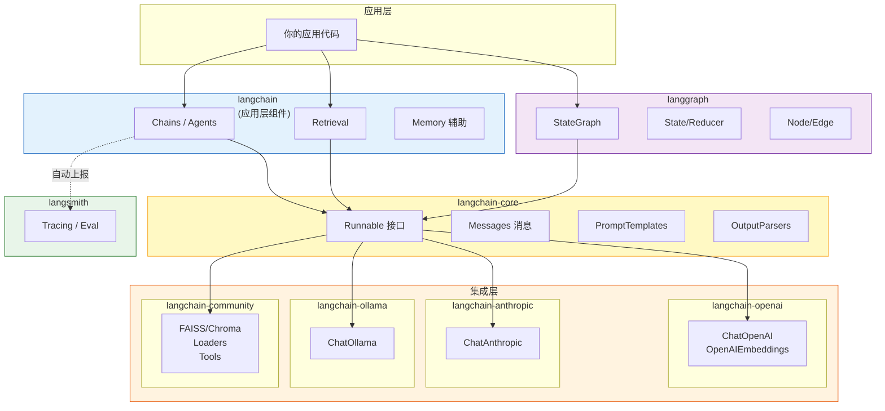
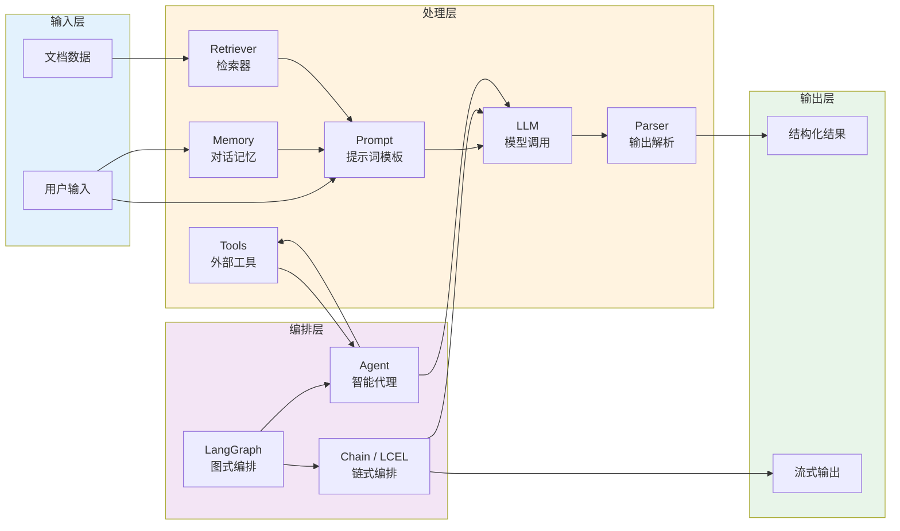
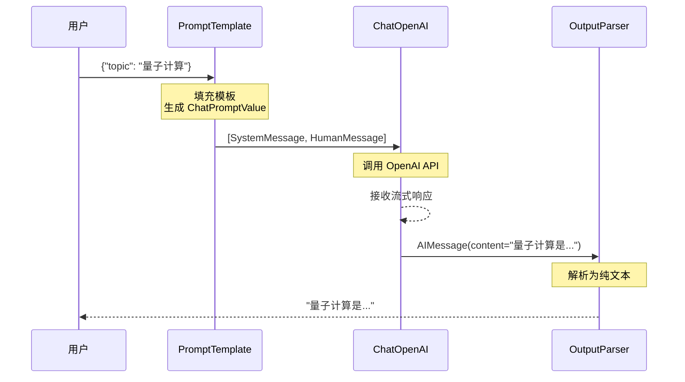
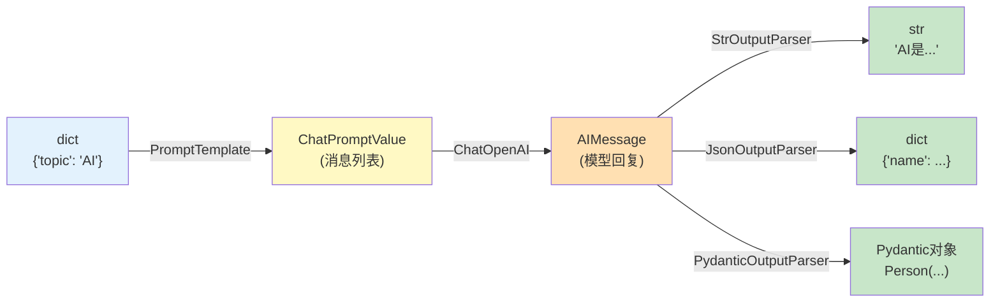
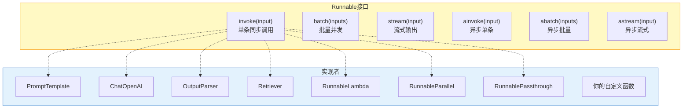
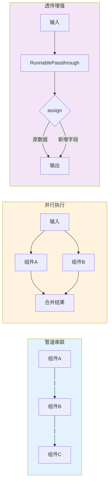
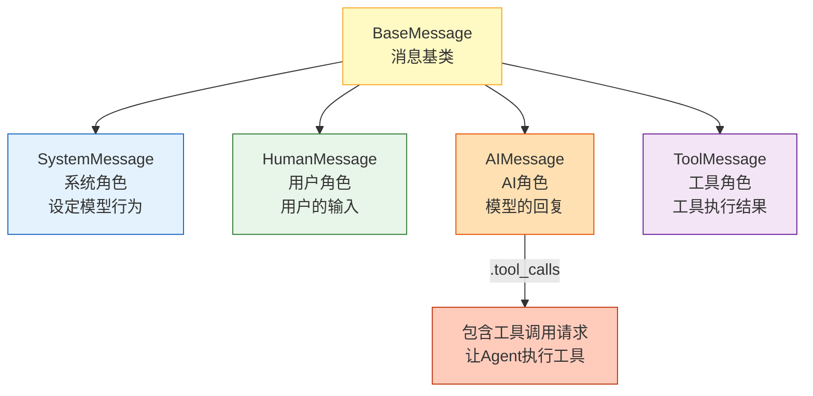
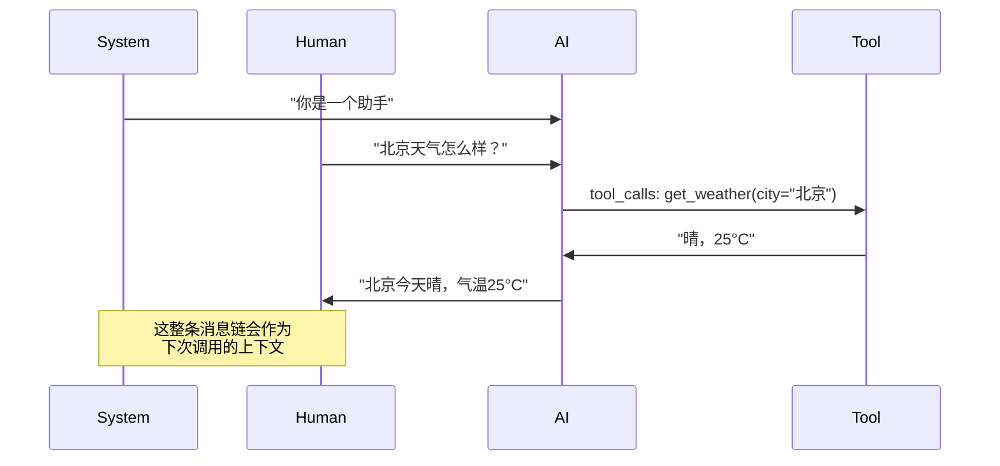
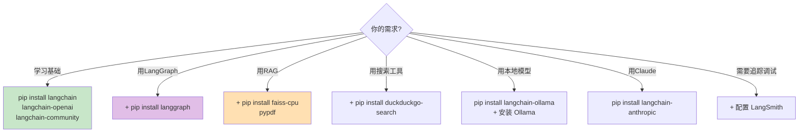

# LangChain 生态架构图解

> 用图解方式理解 LangChain 的包结构、模块组成和数据流转。

---

## 一、包结构全景

LangChain 从 v0.2 起拆分为多个独立包，各自职责清晰：

## 二、核心模块关系

## 三、数据在 LangChain 中的流转

以一个典型的"问答链"为例，追踪数据从输入到输出的完整流转过程：

### 类型流转详解

## 四、Runnable 统一接口

所有 LangChain 组件都实现了 Runnable 接口，这是可组合性的基础：

### 组合方式

## 五、消息类型体系

### 消息在对话中的顺序

## 六、安装策略决策

