# LCEL 数据流图解

> 深入理解 LangChain Expression Language 的管道机制、类型流转和组合方式。

---

## 一、LCEL 核心理念

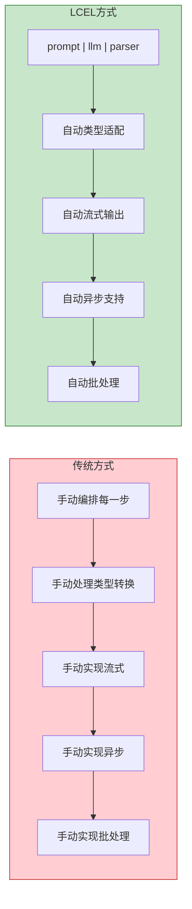

## 二、管道符的工作原理

`|` 管道符把多个 Runnable 串联成一个流水线。上一步的输出自动作为下一步的输入：

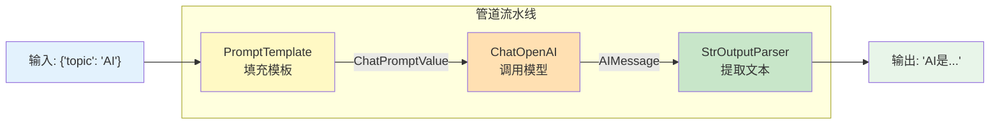

### 每一步的类型变化

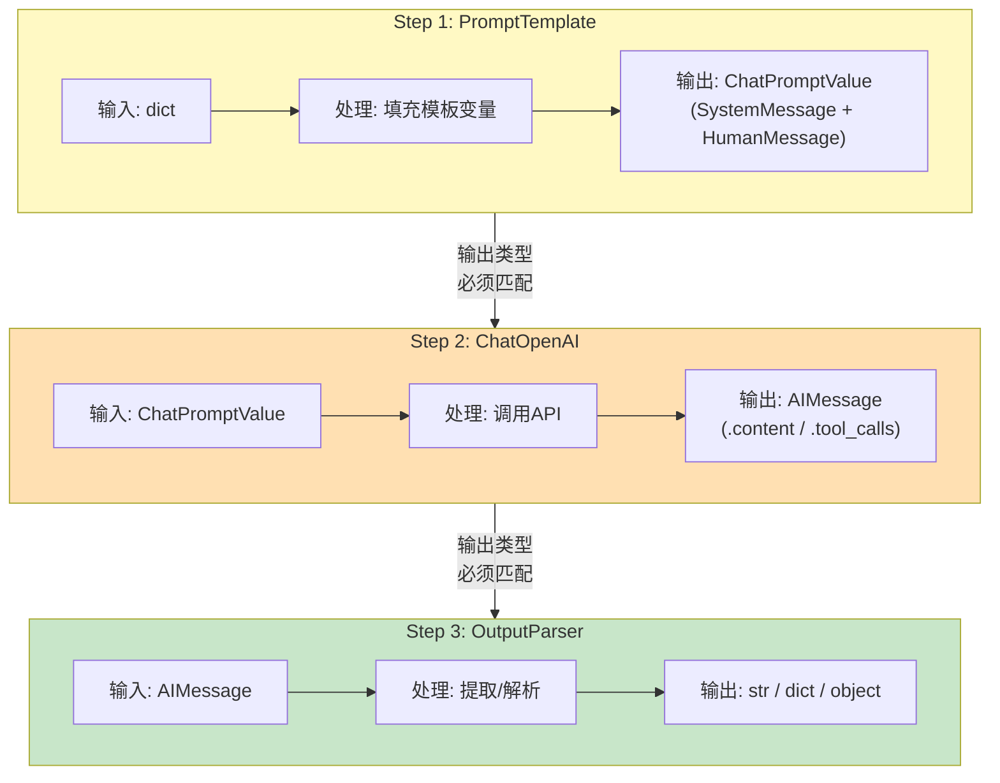

## 三、Runnable 组件家族

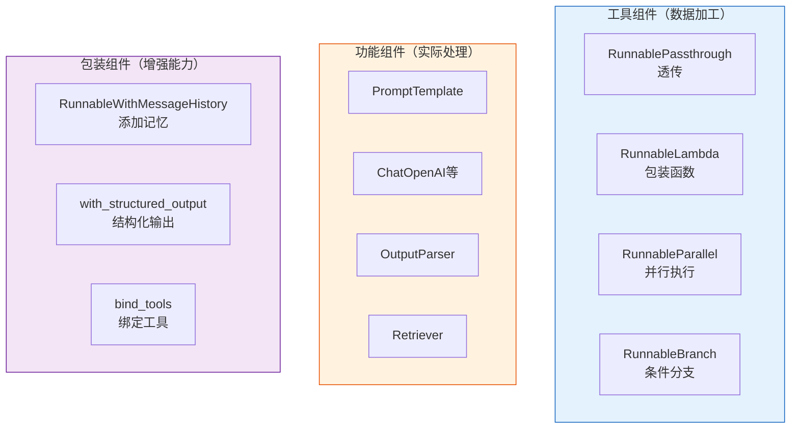

### 各组件的作用与数据流

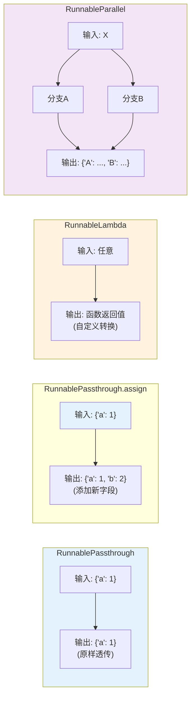

## 四、经典组合模式

### 模式一：基础三件套

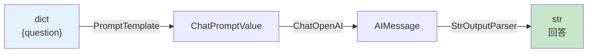

```python
chain = prompt | llm | StrOutputParser()
```

### 模式二：RAG 检索增强

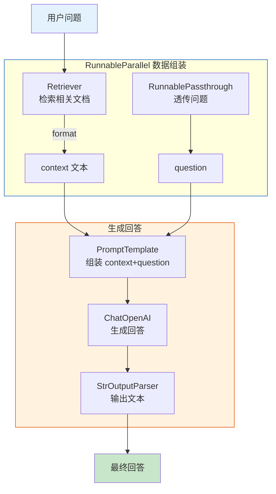

```python
chain = (
    {"context": retriever | format_docs, "question": RunnablePassthrough()}
    | prompt
    | llm
    | StrOutputParser()
)
```

### 模式三：多步骤串联

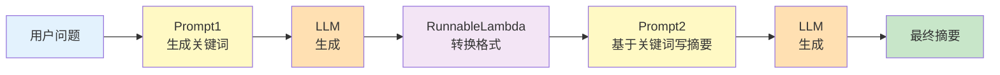

### 模式四：并行生成

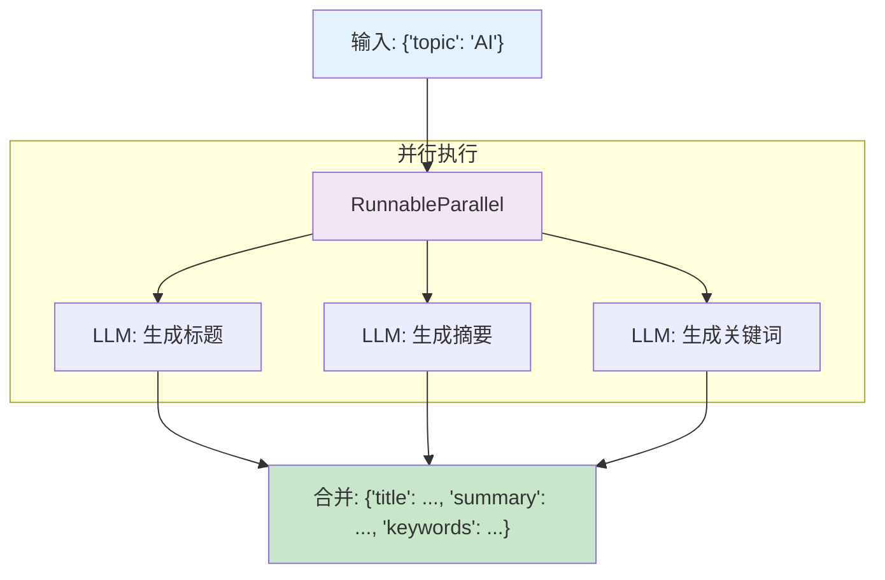

## 五、invoke / stream / batch 对比

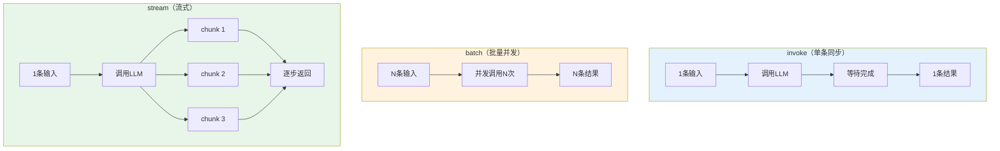

### 性能对比示意

```
invoke 逐个调用: ──●──────●──────●──  (总时间: 9秒)
batch 批量调用:   ──●●●─────────────  (总时间: 3秒，并发)
stream 流式输出:  ──▓▓▓▓▓▓▓▓▓─────  (首字时间: 0.3秒)
```

## 六、类型兼容性规则

管道串联的关键约束——上一步的输出类型必须能被下一步接收：

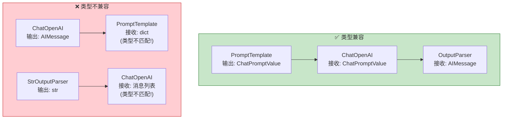

### 常见类型链路速查

| 组合方式 | 输入类型 | Step 1 输出 | Step 2 输入 | Step 2 输出 |
|----------|----------|-------------|-------------|-------------|
| `prompt \| llm` | dict | ChatPromptValue | ChatPromptValue | AIMessage |
| `prompt \| llm \| StrOutputParser` | dict | ChatPromptValue | — | str |
| `retriever \| format_docs` | str | List[Document] | str | str |
| `RunnablePassthrough \| llm` | 消息列表 | 消息列表 | 消息列表 | AIMessage |
