# Agent 工作原理图解

> 深入理解 Agent 的 ReAct 循环、Tool Calling 流程和 Chain vs Agent 的区别。

---

## 一、Chain vs Agent 对比

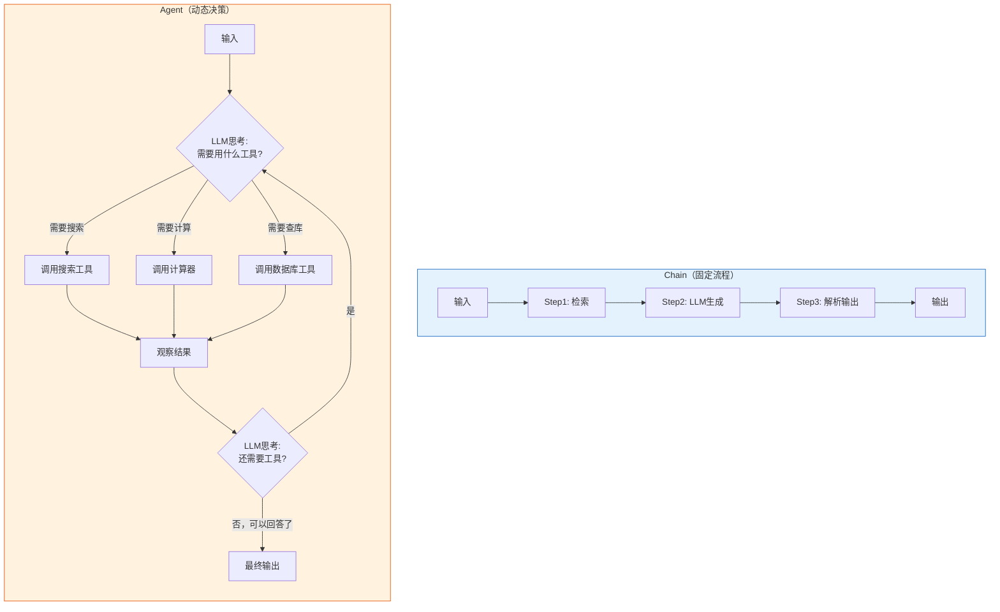

### 何时用 Chain，何时用 Agent

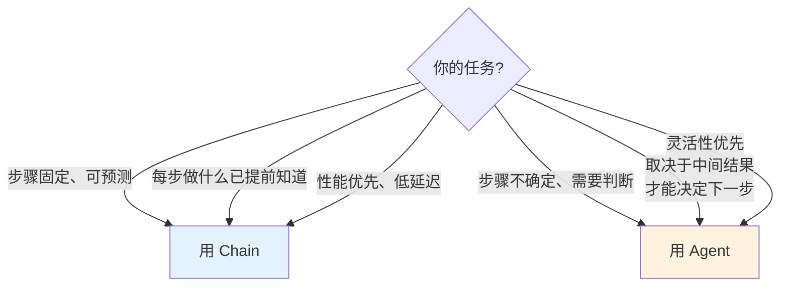

## 二、ReAct 模式详解

ReAct = Reasoning（推理）+ Acting（行动）。这是 Agent 的核心范式：

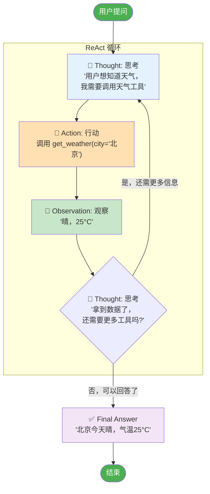

### ReAct 执行示例

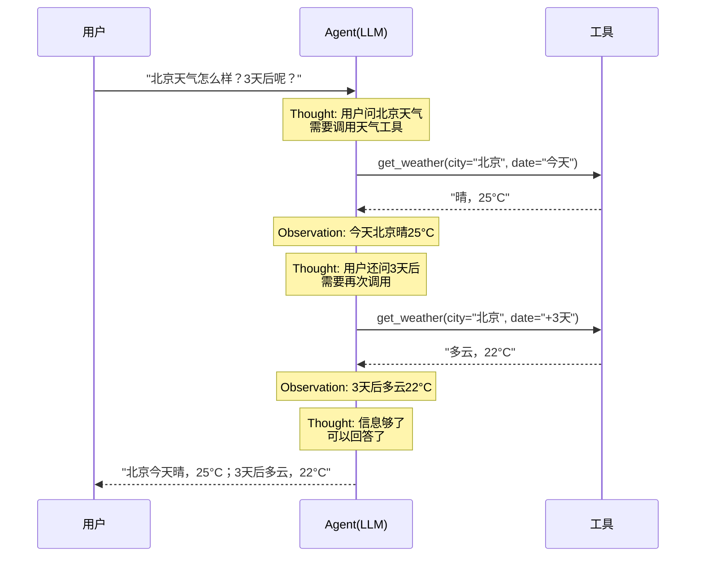

## 三、Tool Calling 流程

现代 LLM 原生支持 Tool Calling，流程如下：

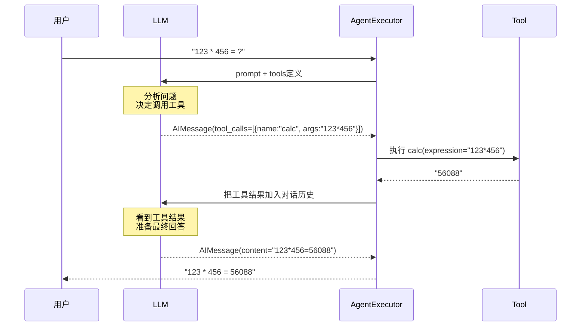

### 工具定义结构

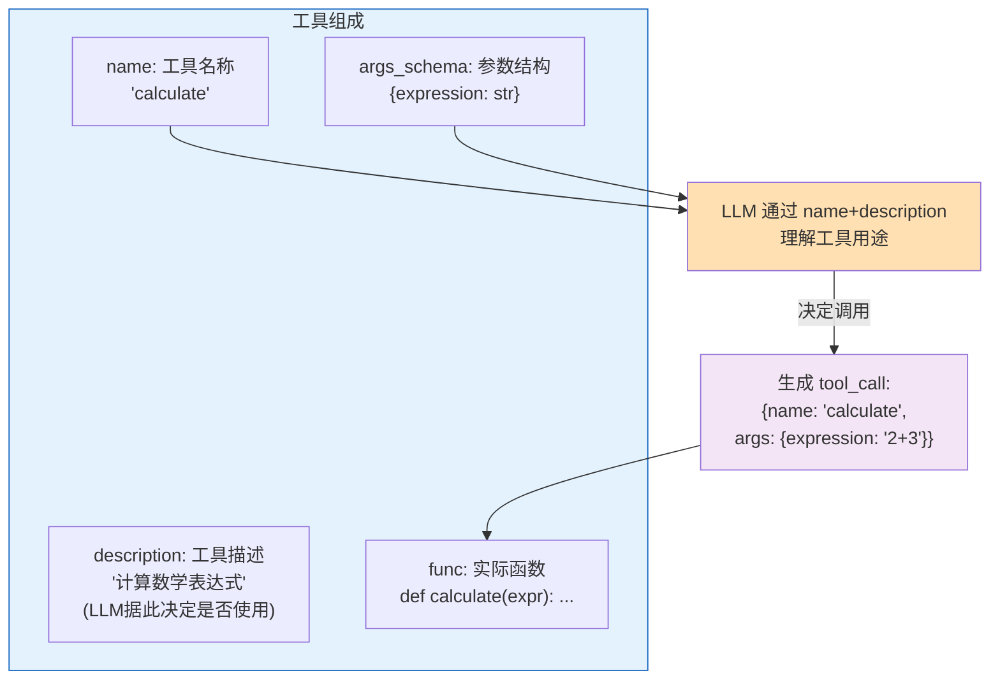

### 工具描述的重要性

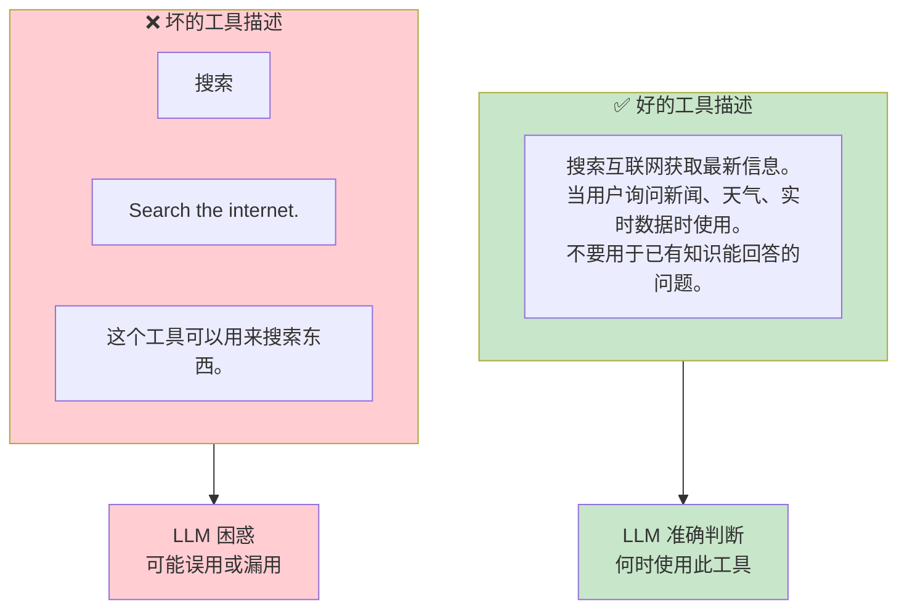

## 四、Agent 执行器工作流程

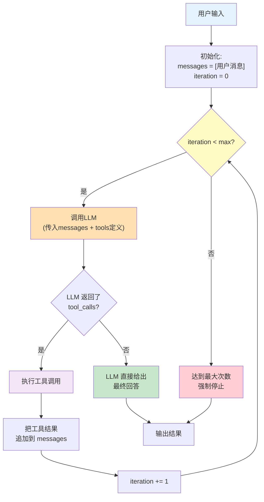

## 五、Agent 类型对比

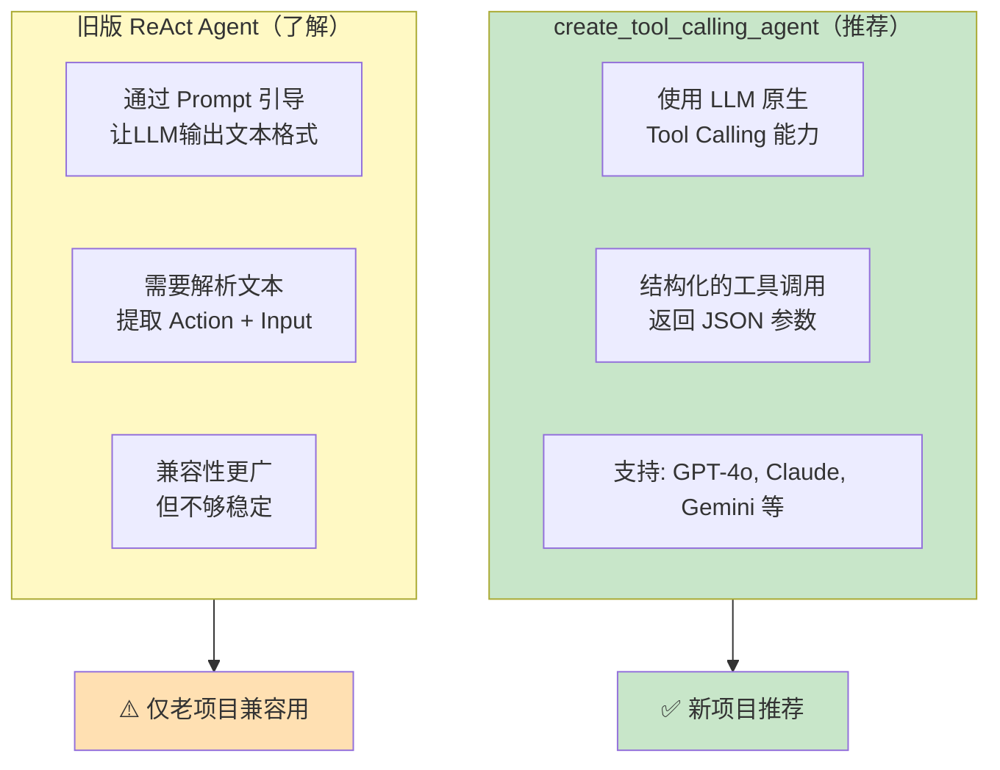

## 六、多工具 Agent 架构

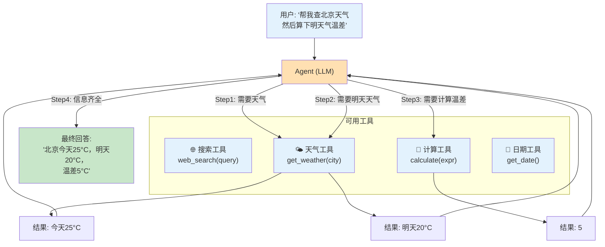

## 七、Agent 关键参数

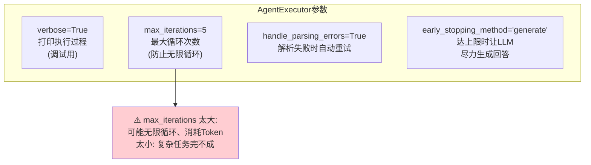
