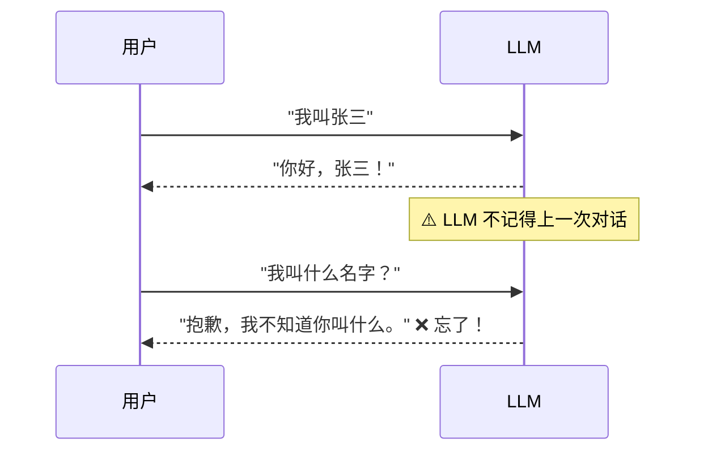
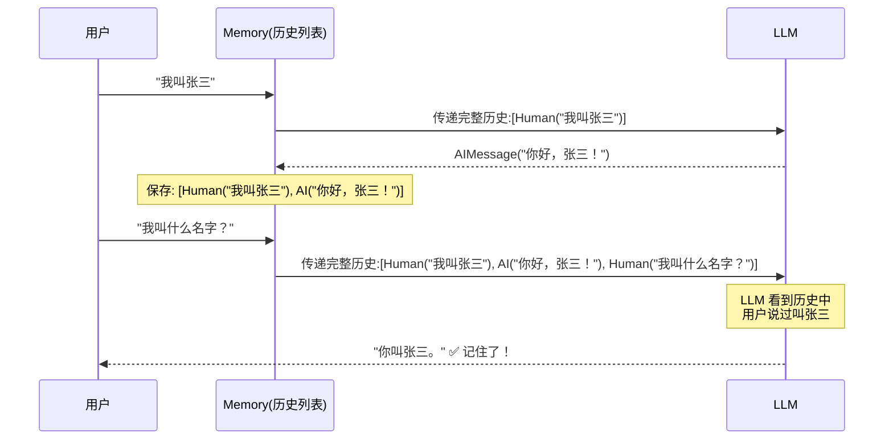
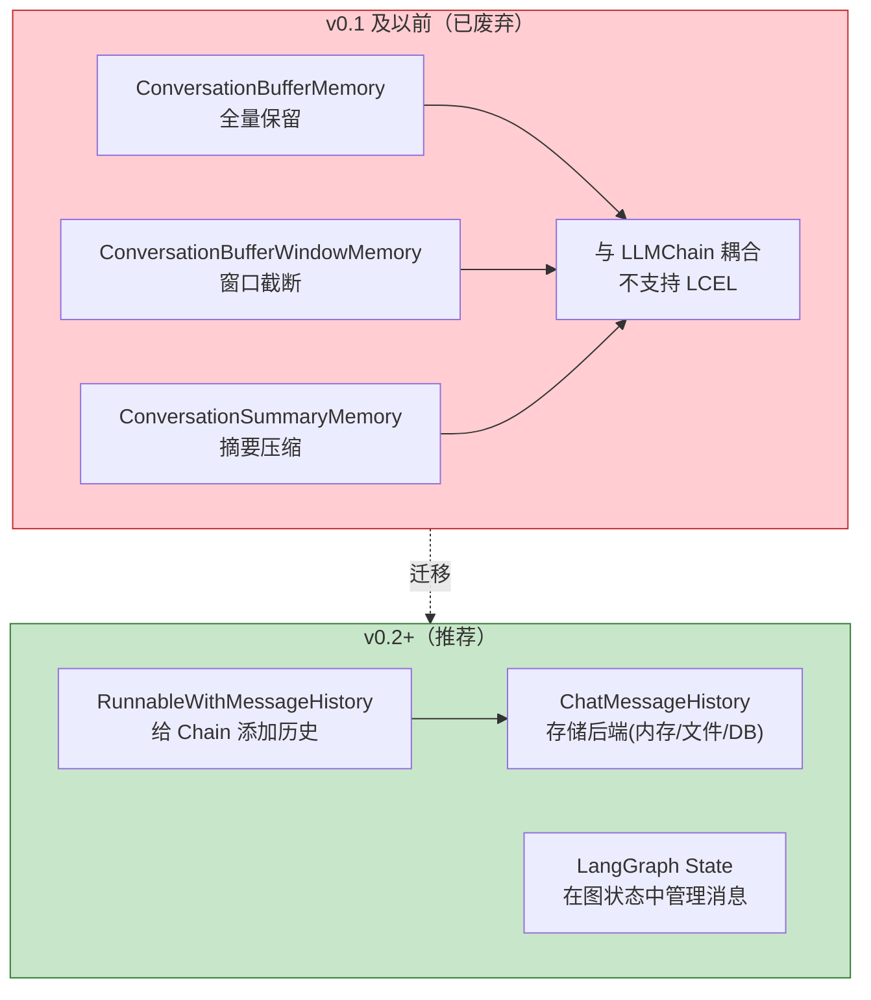
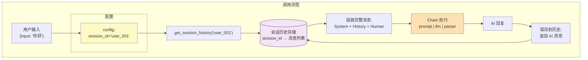
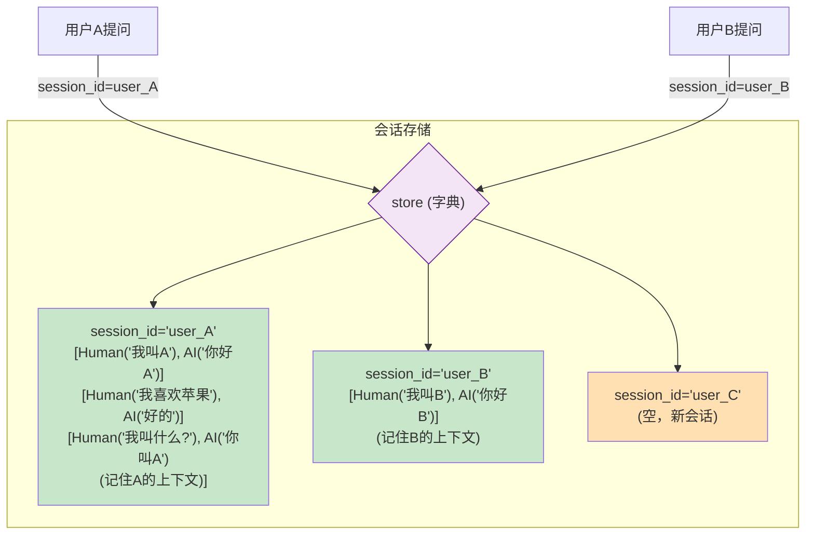
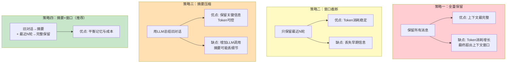
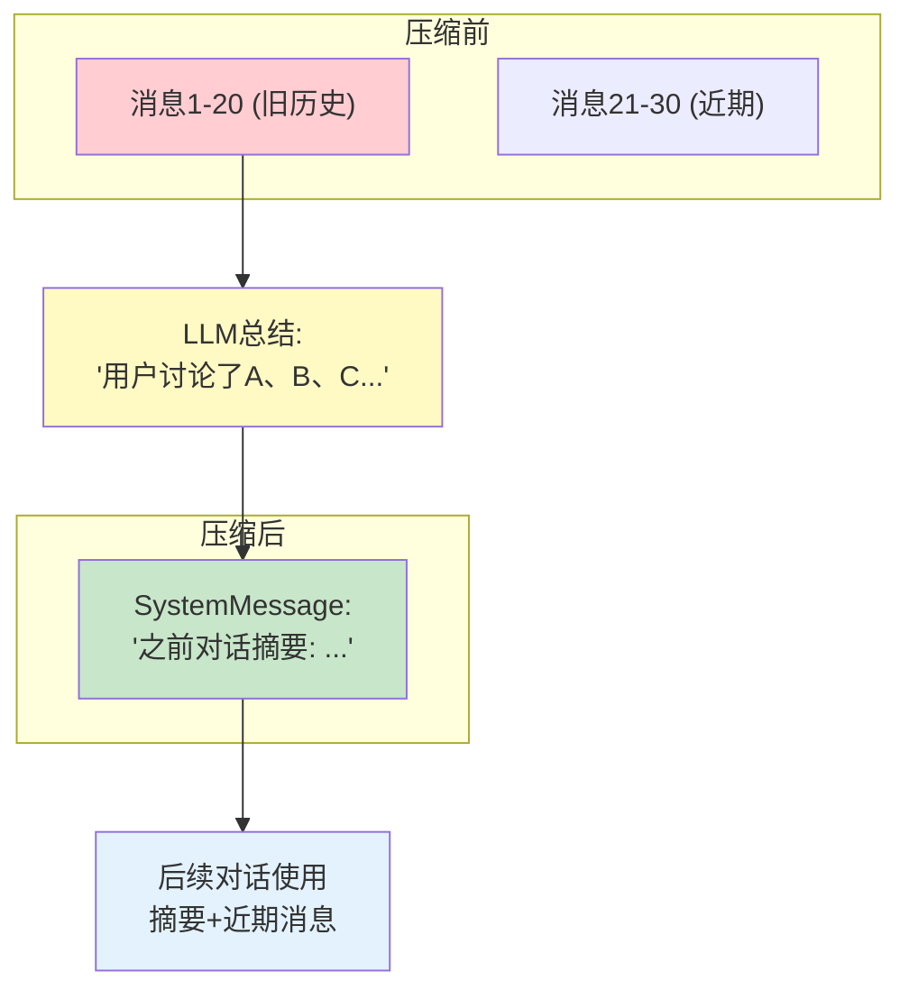
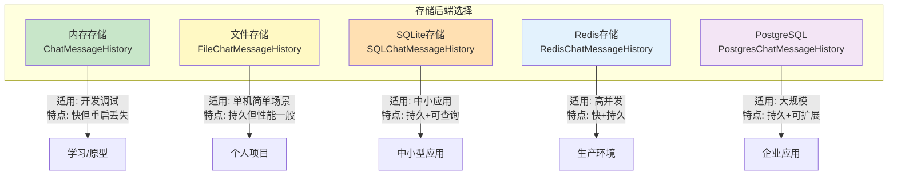
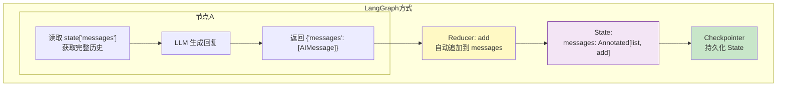
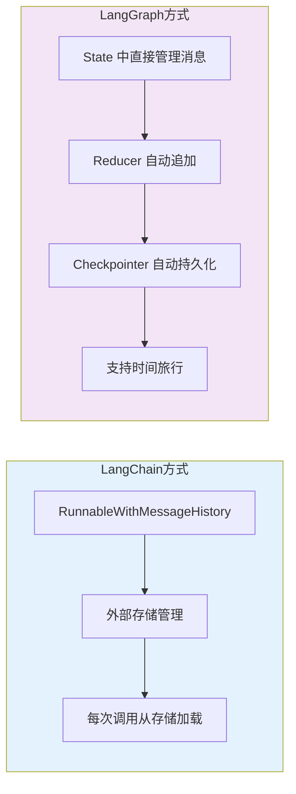

# Memory 机制图解

> 理解 LLM 的"无状态"问题以及 LangChain 如何通过 Memory 机制解决它。

---

## 一、问题：LLM 是无状态的



## 二、解决思路：手动传递历史



## 三、Memory 架构演进



## 四、RunnableWithMessageHistory 工作原理



### 多用户隔离



## 五、历史管理策略对比



### 窗口截断可视化

```mermaid
graph LR
    subgraph 对话历史
        M1["消息1 (旧)"]
        M2["消息2"]
        M3["消息3"]
        M4["消息4"]
        M5["消息5"]
        M6["消息6 (最新)"]
    end

    subgraph 窗口=4
        W["保留最近4条"]
    end

    M3 --> W
    M4 --> W
    M5 --> W
    M6 --> W

    M1 -.->|丢弃| D["❌"]
    M2 -.->|丢弃| D

    style W fill:#C8E6C9
    style D fill:#FFCDD2
```

### 摘要压缩流程



## 六、持久化存储层



## 七、LangGraph 中的 Memory

在 LangGraph 中，Memory 通过 State + Reducer 实现，更加灵活：



### LangChain Memory vs LangGraph State 对比


