# LangGraph 图结构图解

> 用图解方式理解 LangGraph 的 State、Node、Edge 和条件路由机制。

---

## 一、LangGraph 核心三要素

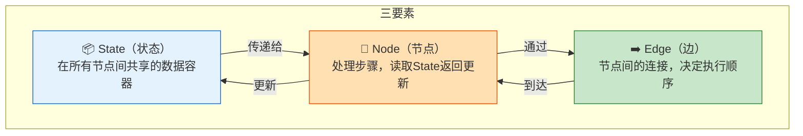

## 二、State 与 Reducer 机制

### 默认行为 vs Reducer

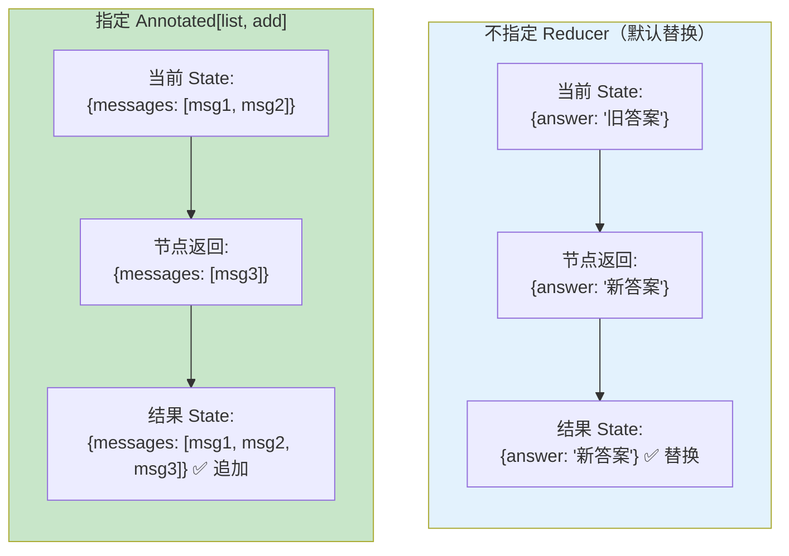

### Reducer 的工作流程

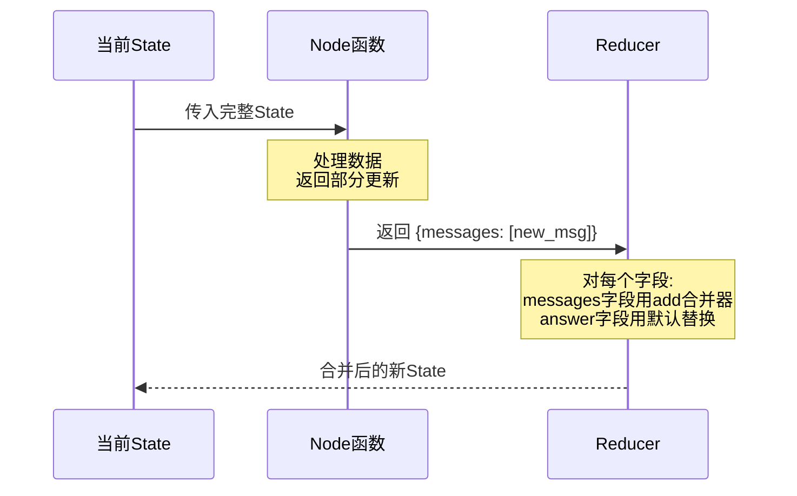

### 最常用的 State 模式

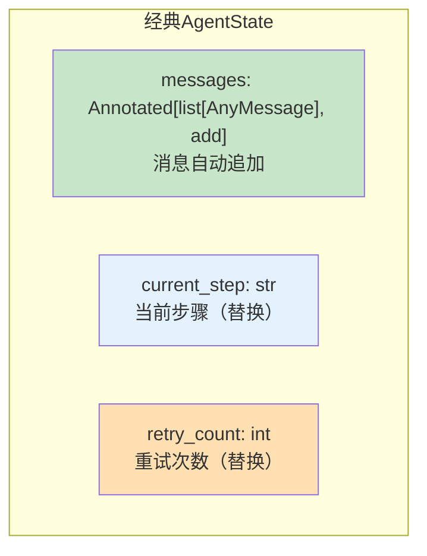

## 三、Node 节点详解

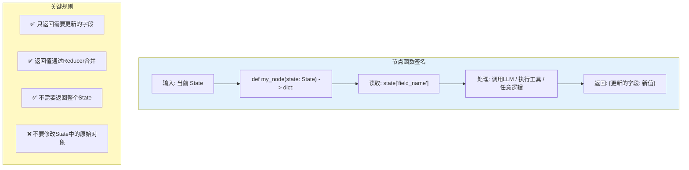

### 节点类型

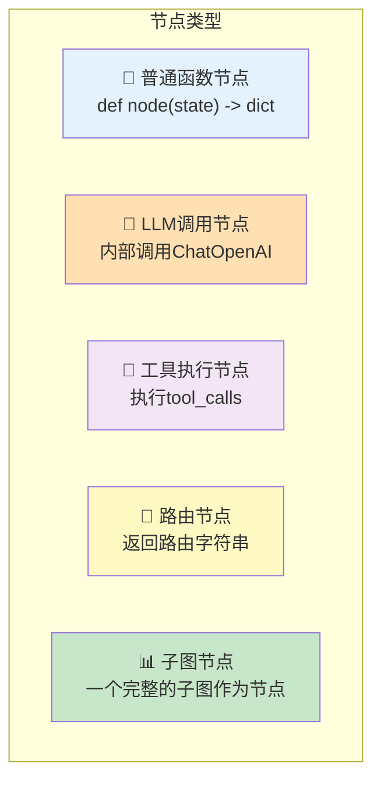

## 四、Edge 类型详解

### 普通边 vs 条件边

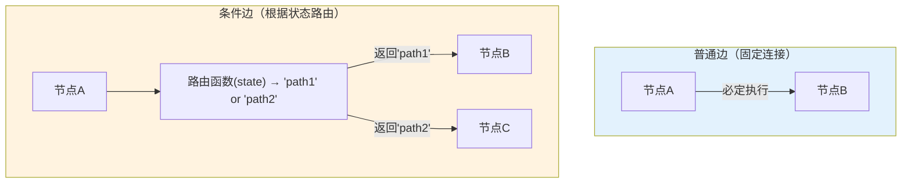

### 条件边实现循环

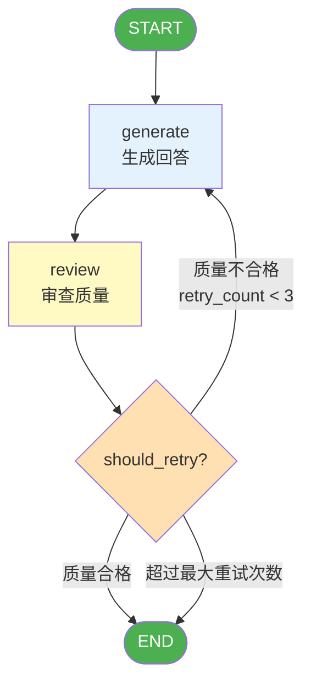

## 五、经典图模式

### 模式一：线性流程

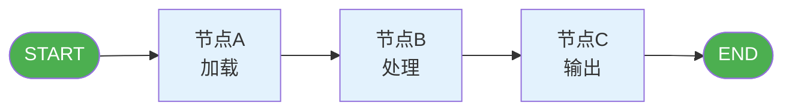

### 模式二：条件分支

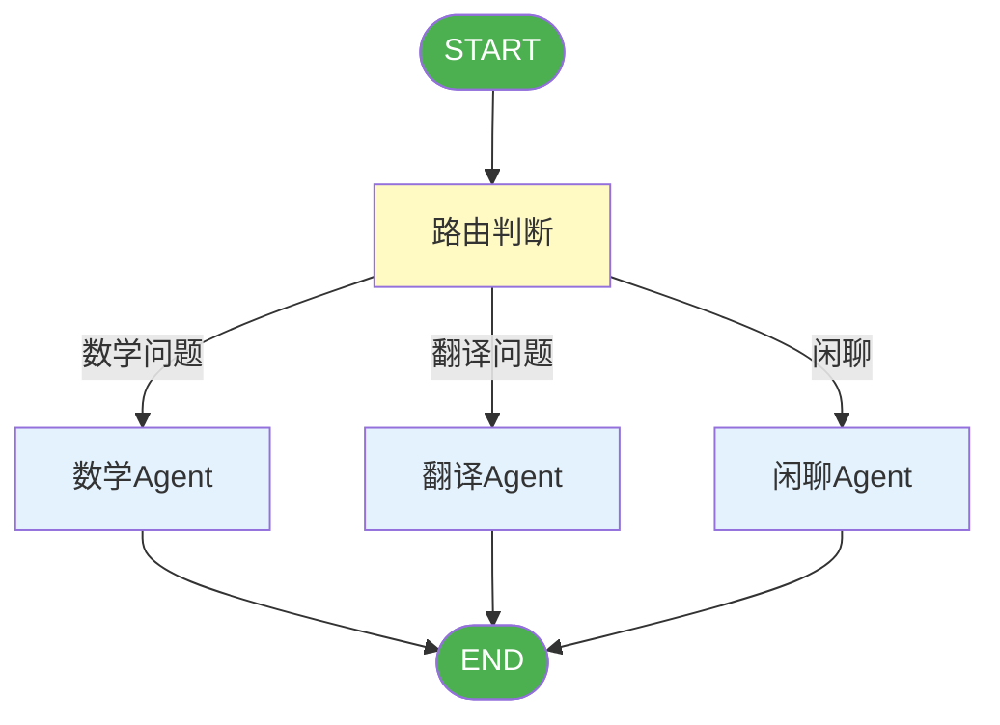

### 模式三：循环（迭代优化）

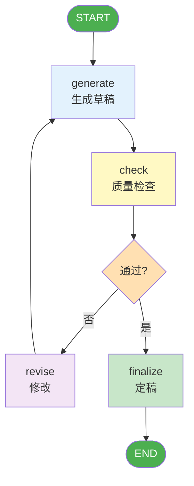

### 模式四：并行执行

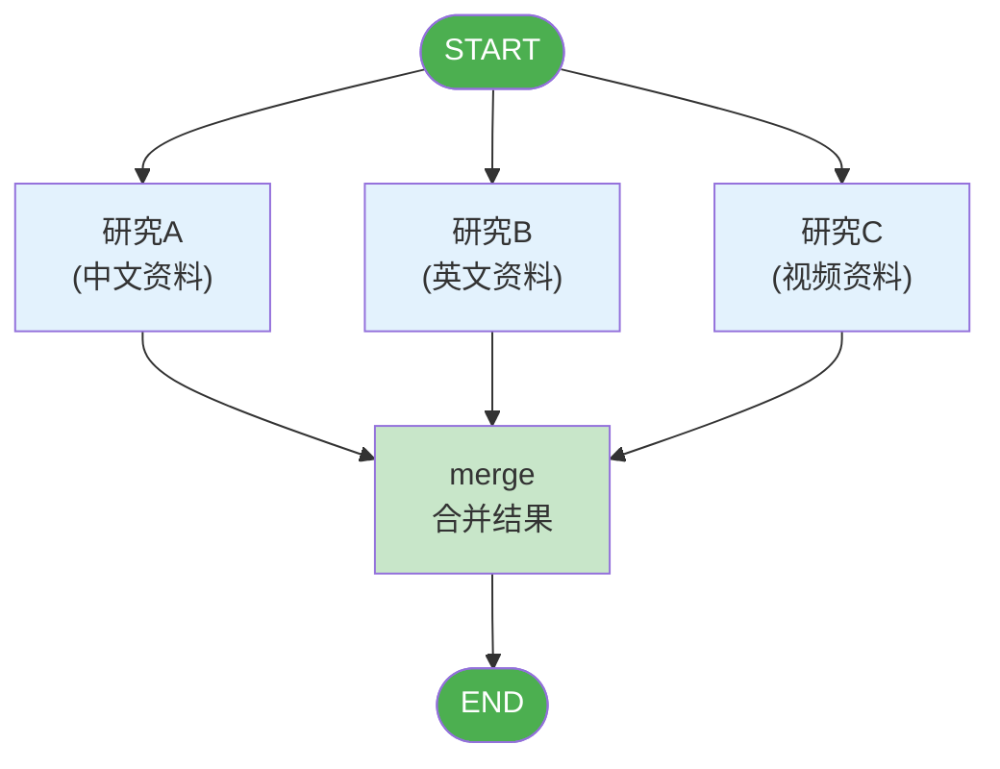

### 模式五：Supervisor 模式

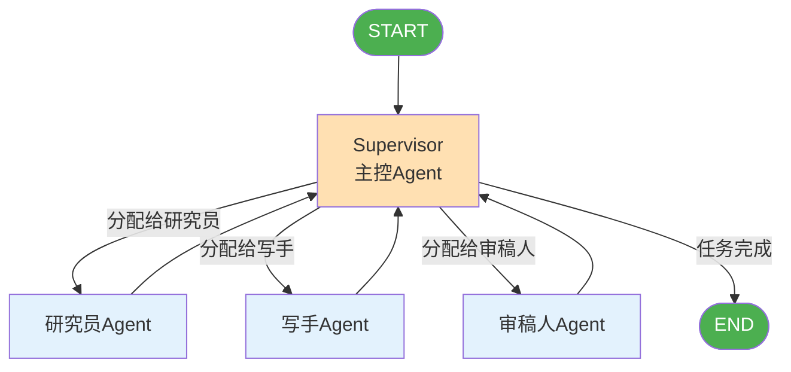

## 六、图的编译与运行

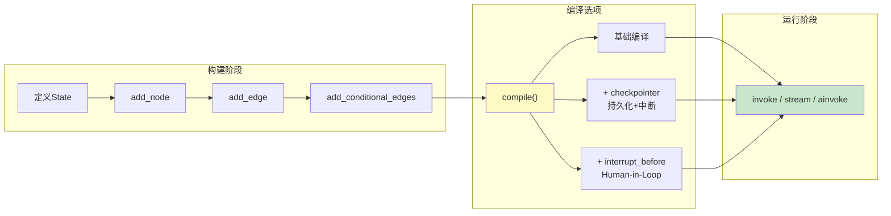

## 七、Human-in-the-Loop 机制

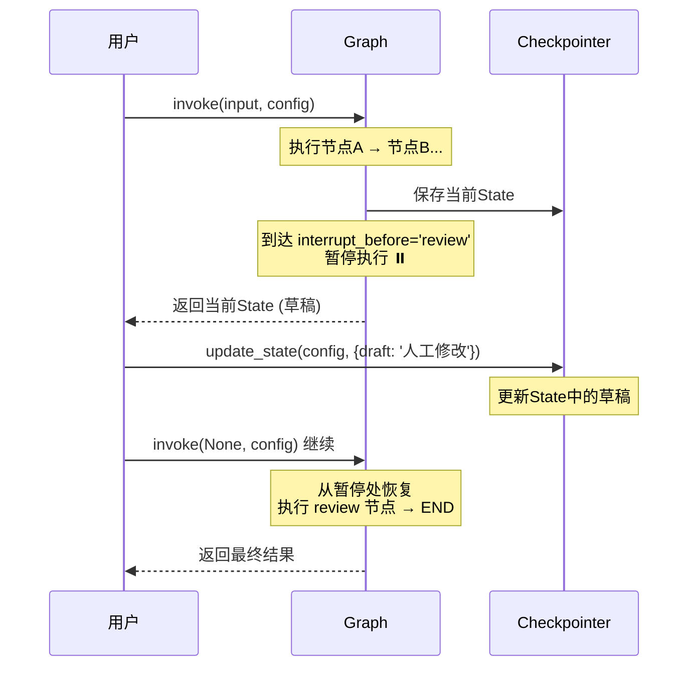

### 中断点的工作方式

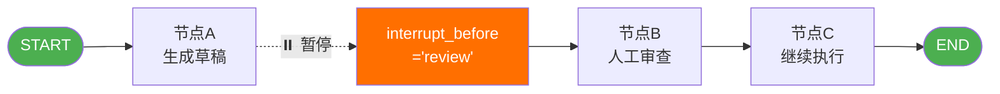

## 八、State 在图中的生命周期

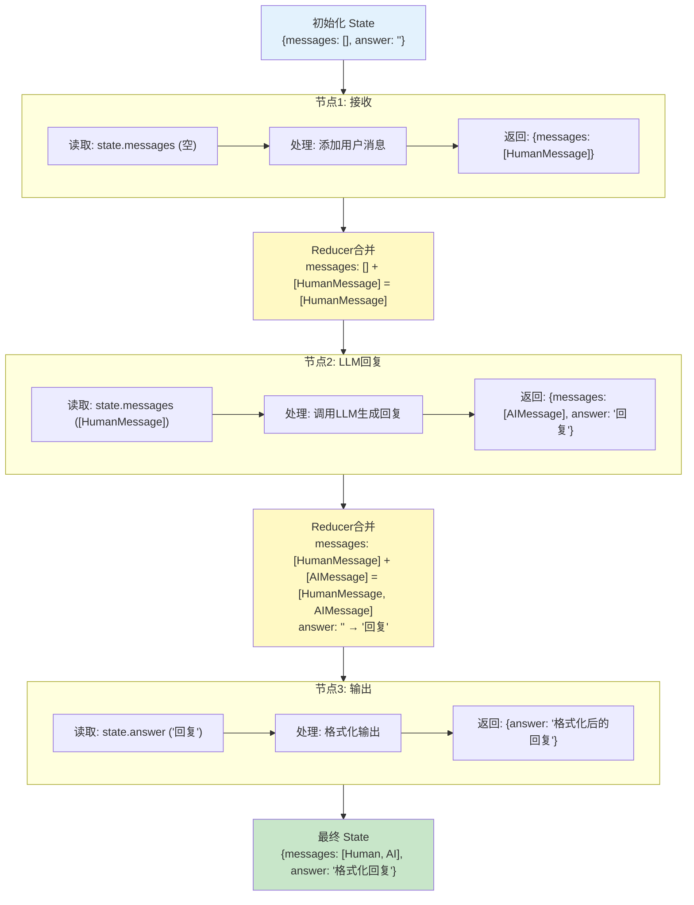
