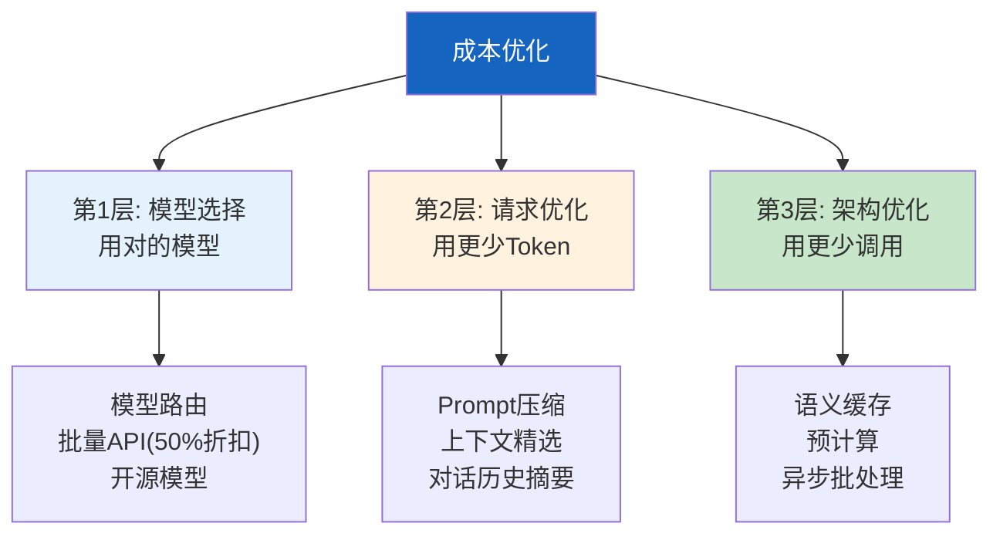
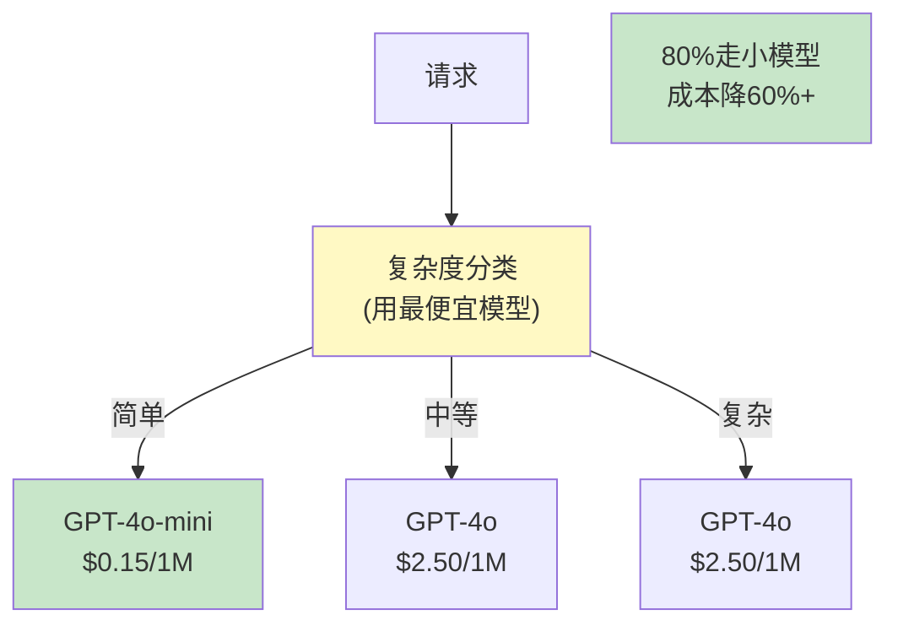
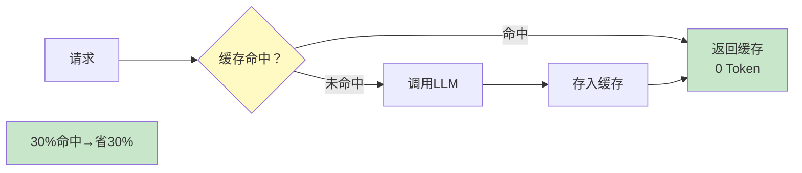

# 成本优化策略图解

> 用图解理解 LLM 应用成本构成、三层优化框架和节省效果估算。

---

## 一、成本构成

```mermaid
graph TB
    subgraph 构成 {"LLM成本构成"}
        C1["模型调用 60%"]
        C2["向量计算 10%"]
        C3["基础设施 15%"]
        C4["存储 5%"]
        C5["其他 10%"]
    end

    style C1 fill:#FFCDD2,stroke:#C62828,stroke-width:3px
    style C2 fill:#FFE0B2
```

---

## 二、三层优化



---

## 三、模型路由



---

## 四、语义缓存



---

## 五、批量API

```mermaid
graph LR
    subgraph 实时 {"实时API<br/>100%价格"}
        R1["请求1"] --> R2["立即返回"]
    end

    subgraph 批量 {"批量API<br/>50%价格"}
        B1["请求1"] --> BATCH["批量提交"]
        B2["请求2"] --> BATCH
        B3["请求3"] --> BATCH
        BATCH --> WAIT["24h内返回"]
    end

    style 实时 fill:#FFCDD2
    style 批量 fill:#C8E6C9
```

---

## 六、优化效果叠加

```mermaid
graph TB
    subgraph 优化前 {"优化前: $375/月"}
        B1["全用GPT-4o<br/>无缓存<br/>无压缩"]
    end

    subgraph 优化后 {"优化后: $42/月"}
        A1["+模型路由<br/>→$150"]
        A2["+语义缓存30%<br/>→$105"]
        A3["+上下文压缩50%<br/>→$52"]
        A4["+预计算<br/>→$42"]

        A1 --> A2 --> A3 --> A4
    end

    SAVE["节省89%"]

    style 优化前 fill:#FFCDD2
    style 优化后 fill:#C8E6C9
    style SAVE fill:#FFF9C4
```

---

## 七、成本监控

```mermaid
graph TB
    subgraph 监控 {"成本监控指标"}
        M1["实时成本<br/>$/小时, $/天"]
        M2["按模型分解"]
        M3["按任务分解"]
        M4["缓存命中率"]
        M5["预算告警<br/>>80%告警"]
    end

    style 监控 fill:#E3F2FD
```

---

## 八、各手段节省对比

| 手段 | 节省 | 难度 | 优先级 |
|------|------|------|--------|
| 模型路由 | 40-60% | 中 | ★★★ |
| 语义缓存 | 20-40% | 高 | ★★★ |
| max_tokens限制 | 10-30% | 低 | ★★★ |
| Prompt精简 | 10-20% | 低 | ★★☆ |
| 上下文压缩 | 30-50% | 中 | ★★☆ |
| 批量API | 50% | 低 | ★★☆ |

---

## 九、检查清单

| 检查项 | 状态 |
|--------|------|
| 实现了模型路由 | ☐ |
| 有语义缓存 | ☐ |
| 设了max_tokens | ☐ |
| 有成本监控 | ☐ |
| 有预算告警 | ☐ |
| 评估了优化效果 | ☐ |
