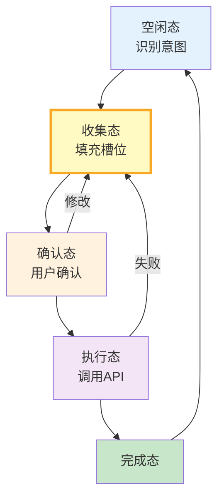
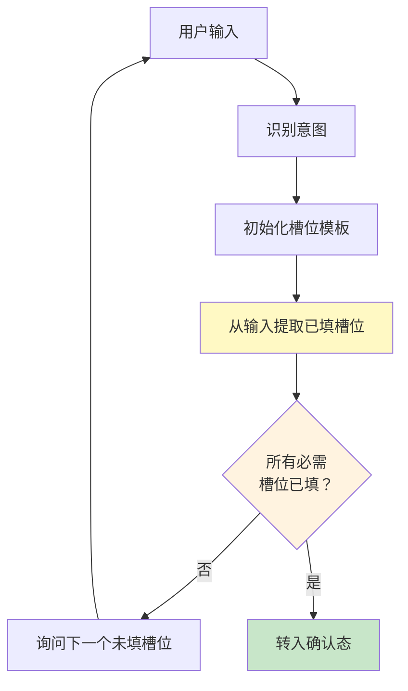
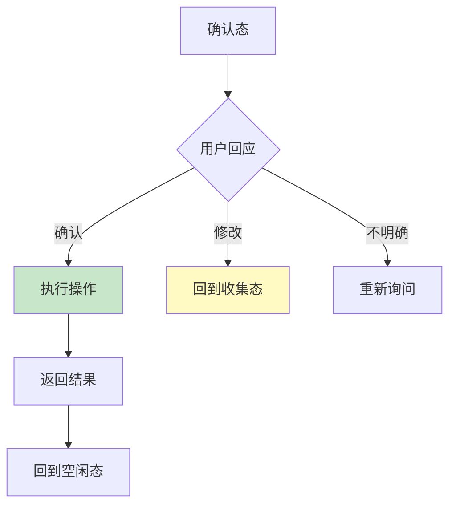
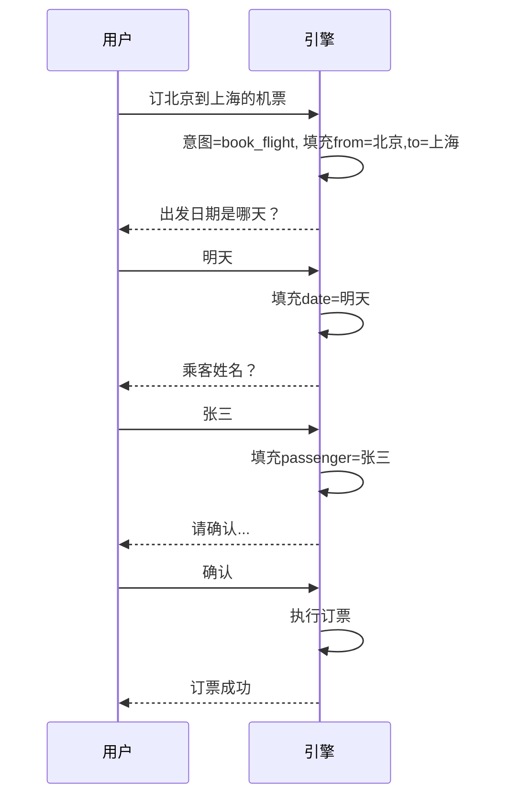

# 对话状态跟踪图解

> 用图解理解对话状态机模型、槽位填充流程和状态转移。

---

## 一、为什么需要状态跟踪

```mermaid
graph TB
    subgraph 无状态 {"无状态对话"}
        U1["订票"] --> A1["好的"]
        U2["选座位"] --> A2["❌ 哪张票？"]
    end

    subgraph 有状态 {"有状态对话"}
        U3["订票"] --> DST1["DST: intent=book<br/>from=北京,to=上海"]
        U4["选座位"] --> DST2["DST: +seat=window"]
        U5["付款"] --> DST3["DST: +pay=card"]
    end

    style 无状态 fill:#FFCDD2
    style 有状态 fill:#C8E6C9
```

---

## 二、对话状态机



---

## 三、槽位填充流程



---

## 四、确认与执行



---

## 五、对话示例



---

## 六、检查清单

| 检查项 | 状态 |
|--------|------|
| 理解状态机模型 | ☐ |
| 实现了槽位填充 | ☐ |
| 有确认步骤 | ☐ |
| 支持修改 | ☐ |
