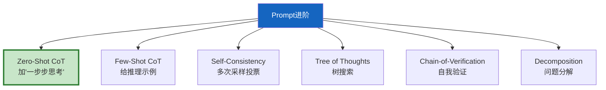
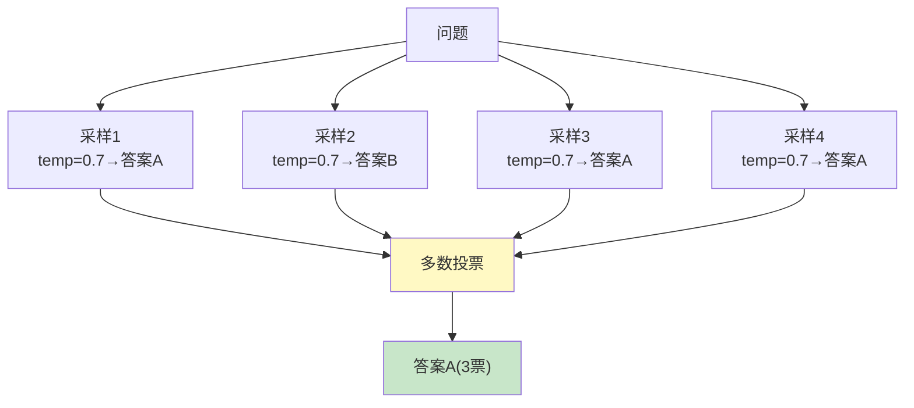
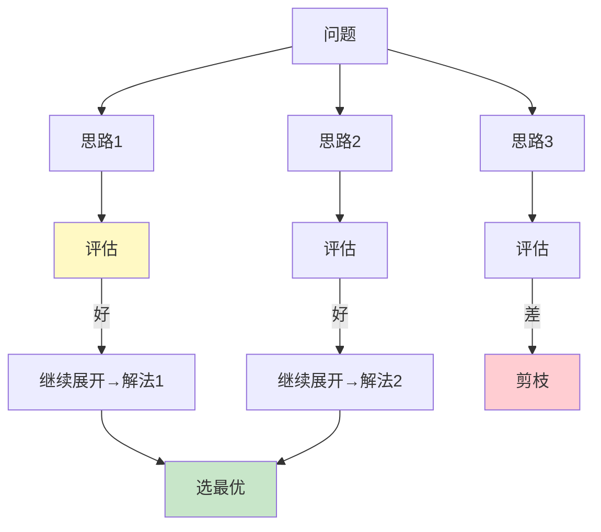
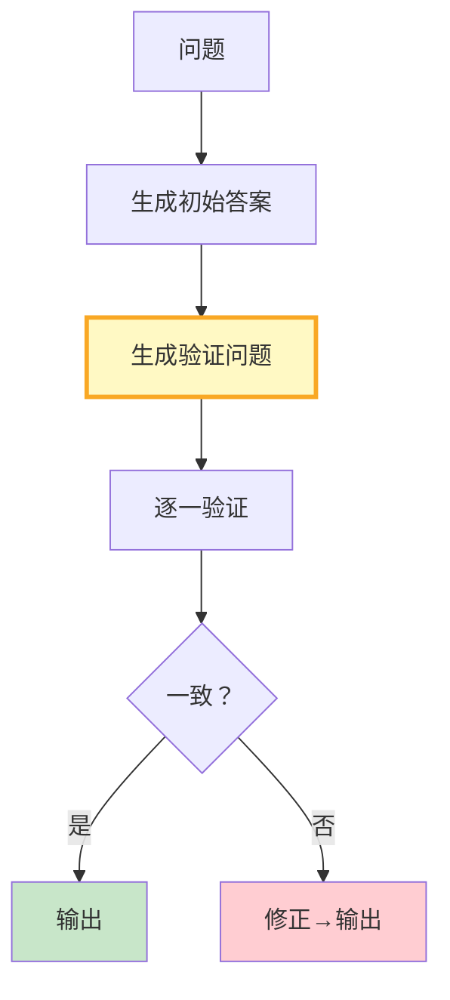
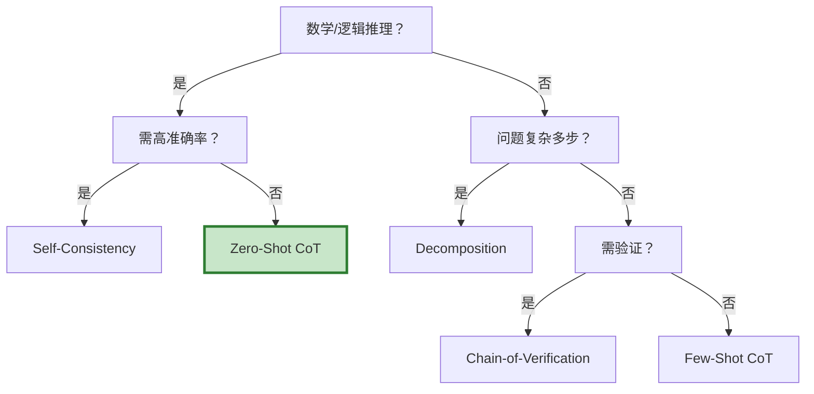

# Prompt 工程进阶模式图解

> 用图解理解 6 种进阶 Prompt 模式的原理、流程和选型。

---

## 一、6种模式总览



---

## 二、CoT对比

```mermaid
graph TB
    subgraph 普通 {"普通Prompt"}
        N["问题→直接猜答案<br/>可能跳过推理"]
    end

    subgraph CoT {"CoT Prompt"}
        C["问题+'一步步思考'<br/>→逐步推理→答案<br/>准确率+15-25%"]
    end

    style 普通 fill:#FFCDD2
    style CoT fill:#C8E6C9
```

---

## 三、Self-Consistency



---

## 四、Tree of Thoughts



---

## 五、Chain-of-Verification



---

## 六、选型决策



---

## 七、效果对比

| 模式 | LLM调用 | 准确率提升 | 成本 |
|------|---------|-----------|------|
| Zero-Shot CoT | 1次 | +15-25% | 低 |
| Few-Shot CoT | 1次 | +20-30% | 低 |
| Self-Consistency | N次 | +25-40% | 高 |
| Tree of Thoughts | 多次 | +30-50% | 高 |
| Chain-of-Verification | 3次 | +15-25% | 中 |
| Decomposition | 多次 | +20-30% | 中 |

---

## 八、检查清单

| 检查项 | 状态 |
|--------|------|
| 理解6种模式 | ☐ |
| 会用CoT触发词 | ☐ |
| 实现了Self-Consistency | ☐ |
| 理解ToT | ☐ |
| 能选模式 | ☐ |
