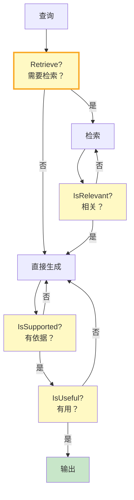
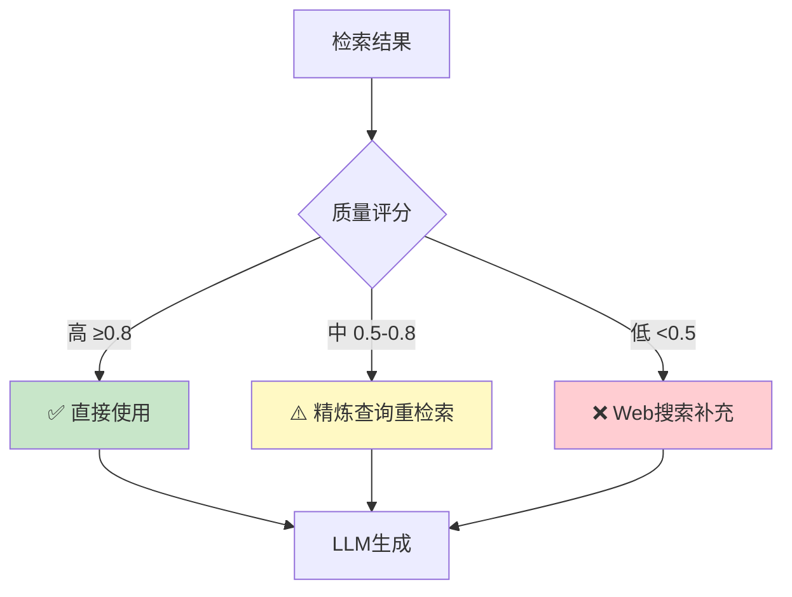
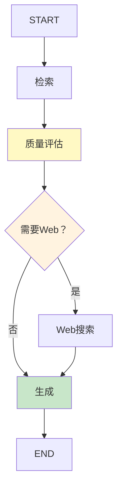
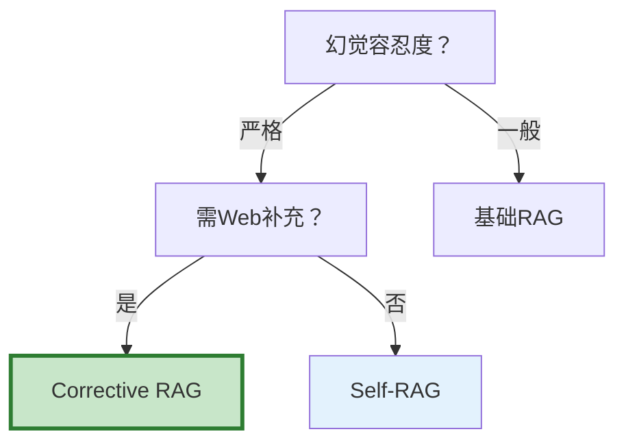

# 自适应 RAG 架构图解

> 用图解理解 Self-RAG 反思机制、Corrective RAG 纠错流程和三种策略对比。

---

## 一、三种RAG策略对比

```mermaid
graph TB
    subgraph 基础 {"基础RAG"}
        BQ["查询"] --> BR["总是检索"] --> BG["生成<br/>不管质量"]
    end

    subgraph SelfRAG {"Self-RAG"}
        SQ["查询"] --> SD1{"需要检索？"}
        SD1 -->|是| SR["检索→评估→生成→验证"]
        SD1 -->|否| SG["直接生成"]
    end

    subgraph CRAG {"Corrective RAG"}
        CQ["查询"] --> CR["检索"] --> CG{"质量评估"}
        CG -->|高| CGEN["直接生成"]
        CG -->|中| CREF["精炼重检索"]
        CG -->|低| CWEB["Web补充"]
    end

    style 基础 fill:#FFCDD2
    style SelfRAG fill:#E3F2FD
    style CRAG fill:#C8E6C9
```

---

## 二、Self-RAG四反思



---

## 三、Corrective RAG三级评估



---

## 四、LangGraph编排



---

## 五、效果对比

| 策略 | 召回率 | 幻觉率 | 延迟 | LLM调用 |
|------|--------|--------|------|---------|
| 基础RAG | 70% | 15% | 1x | 1次 |
| Self-RAG | 85% | 5% | 1.5x | 3-5次 |
| CRAG | 90% | 3% | 1.3x | 2-3次 |

---

## 六、选型决策



---

## 七、检查清单

| 检查项 | 状态 |
|--------|------|
| 理解Self-RAG四反思 | ☐ |
| 理解CRAG三级评估 | ☐ |
| 能用LangGraph编排 | ☐ |
| 知道何时选哪种 | ☐ |
