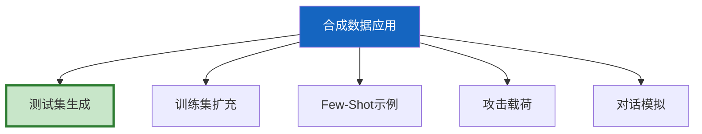
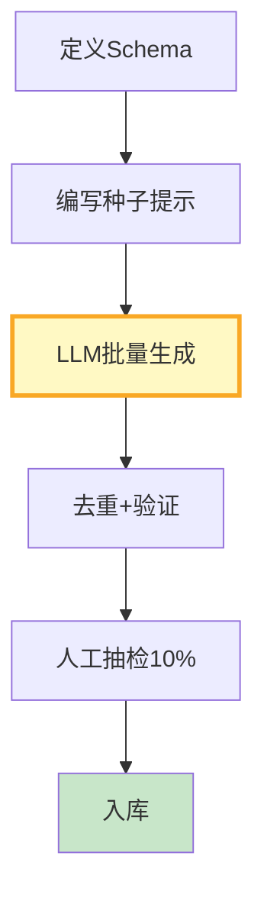
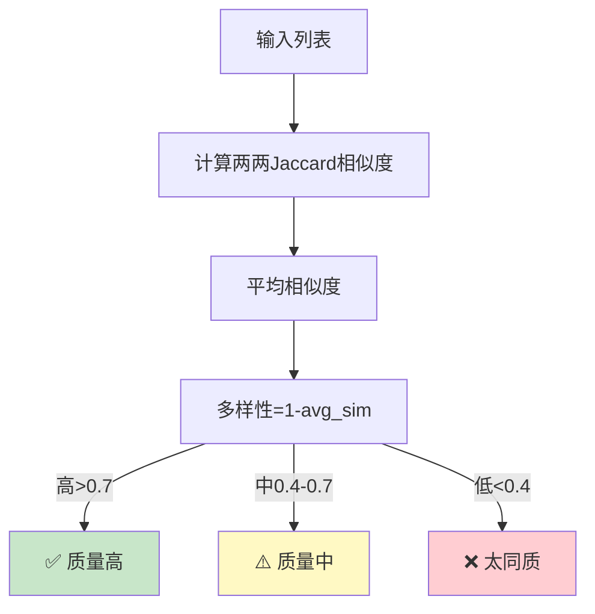

# 合成数据生成流程图解

> 用图解理解合成数据的5种应用场景、生成流程和质量控制。

---

## 一、5种应用场景



---

## 二、生成流程



---

## 三、质量控制

```mermaid
graph TB
    subgraph QC {"5步质量控制"}
        Q1["1.去重<br/>相同输入只留一个"]
        Q2["2.格式验证<br/>字段完整"]
        Q3["3.多样性检查<br/>不要太相似"]
        Q4["4.一致性检查<br/>输入输出匹配"]
        Q5["5.人工抽检<br/>10%审核"]
    end

    style QC fill:#E3F2FD
```

---

## 四、批量生成

```mermaid
graph LR
    TARGET["目标100条"] --> BATCH["分5批<br/>每批20条"]
    BATCH --> PARALLEL["并行生成"]
    PARALLEL --> DEDUPE["去重+验证"]
    DEDUPE → RESULT["最终数据集"]

    style PARALLEL fill:#FFF9C4
    style RESULT fill:#C8E6C9
```

---

## 五、多样性检查



---

## 六、检查清单

| 检查项 | 状态 |
|--------|------|
| 能生成测试用例 | ☐ |
| 能生成对话数据 | ☐ |
| 有去重和多样性检查 | ☐ |
| 能批量生成 | ☐ |
| 有人工抽检 | ☐ |
