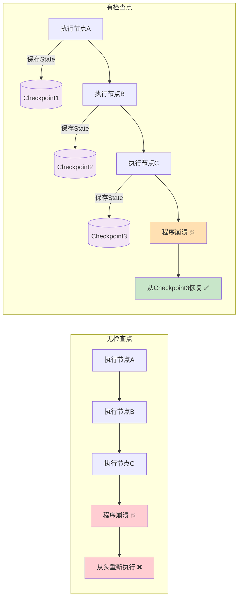
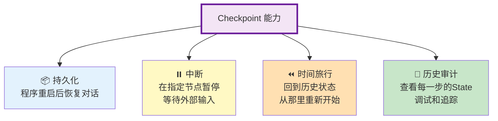
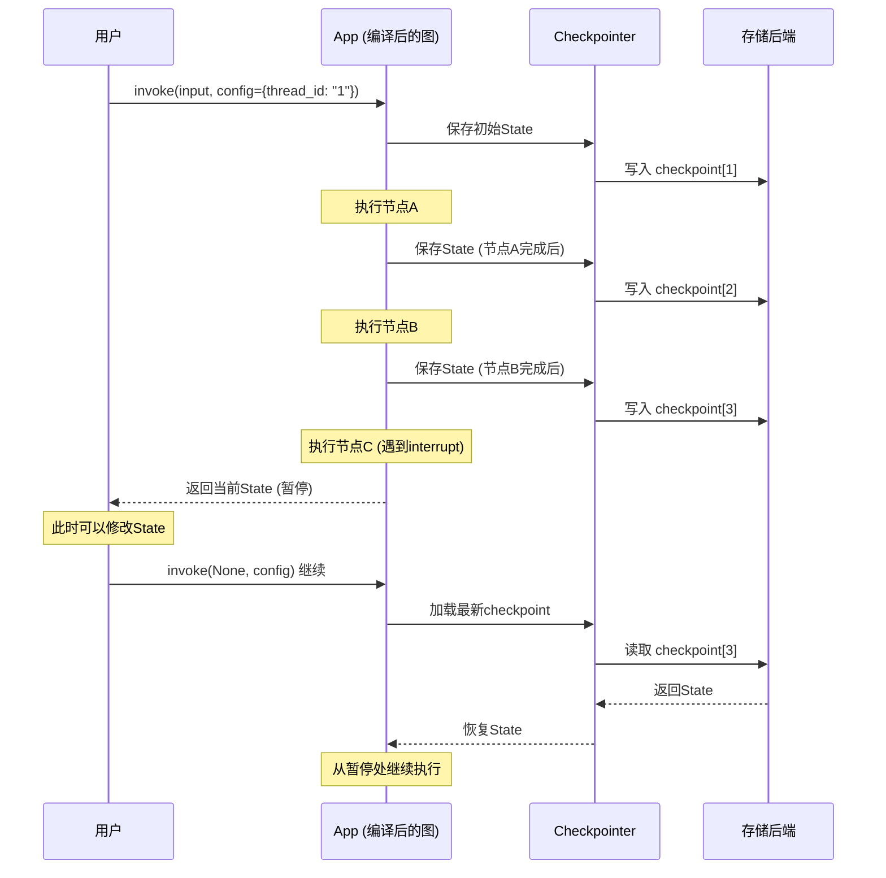
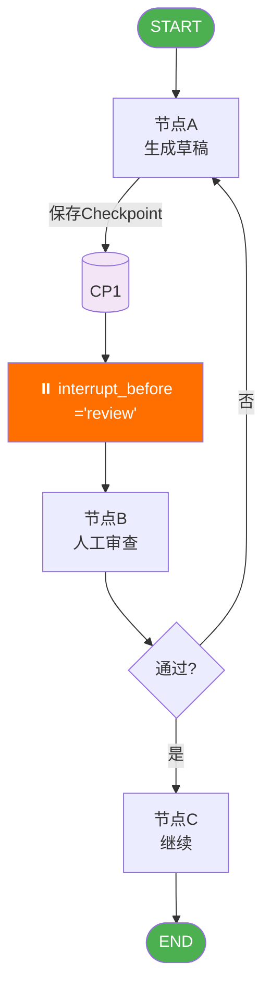
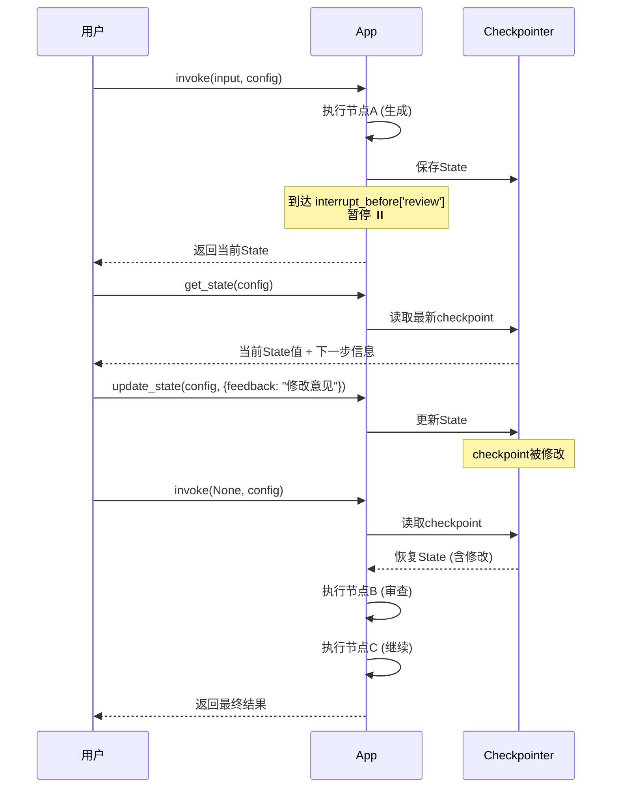
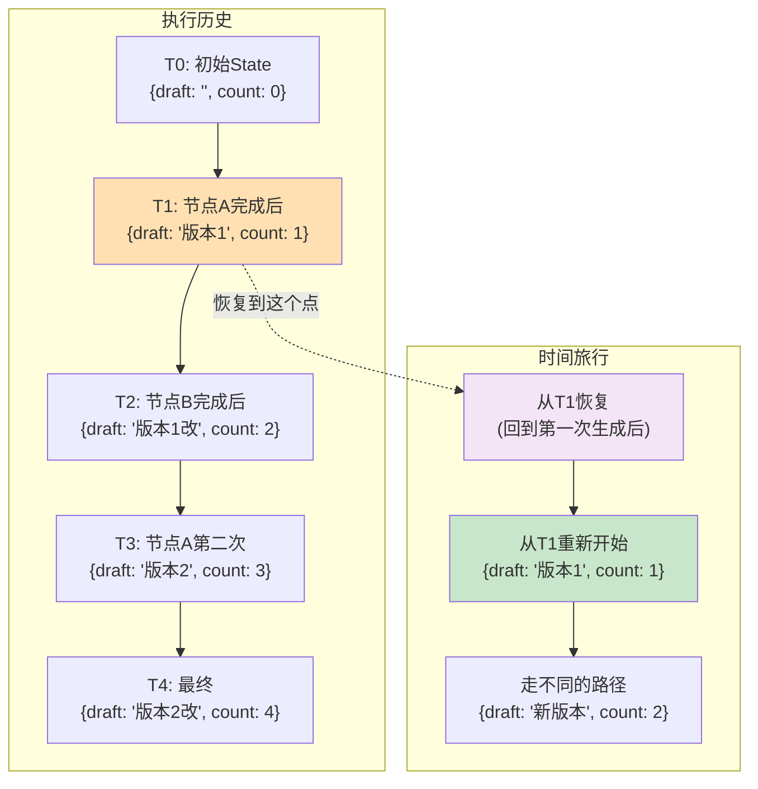
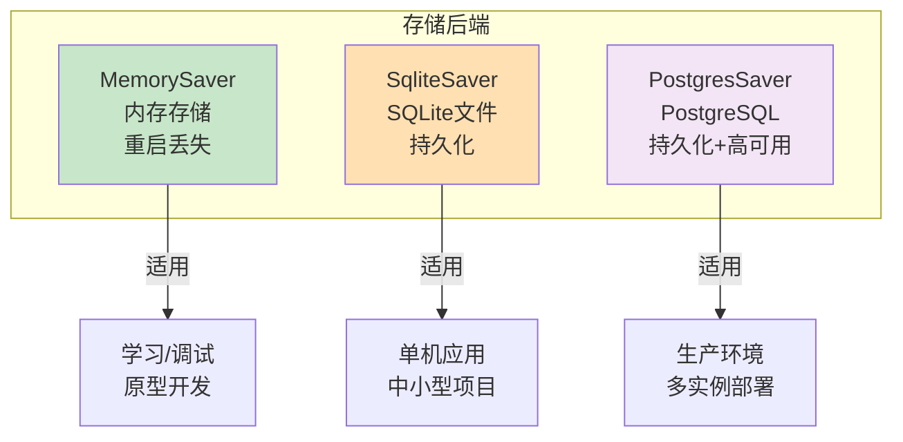
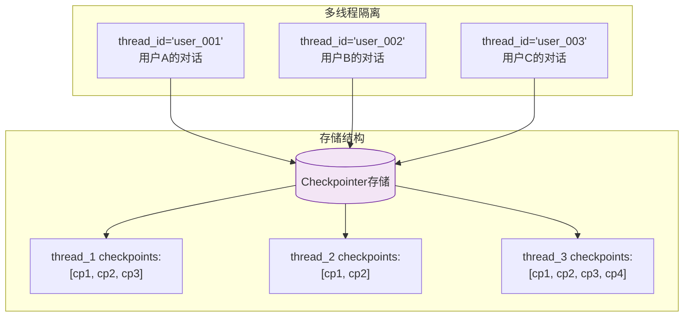

# LangGraph 检查点与时间旅行图解

> LangGraph 最强大的特性之一：检查点持久化、中断恢复和时间旅行。

---

## 一、检查点（Checkpoint）是什么



### 检查点的四项能力



## 二、检查点的工作机制



## 三、中断与恢复（Human-in-the-Loop）



### 完整中断恢复流程

```python
from langgraph.checkpoint.memory import MemorySaver

app = graph.compile(
    checkpointer=MemorySaver(),
    interrupt_before=["review"]  # 在 review 节点之前暂停
)

config = {"configurable": {"thread_id": "session_001"}}

# 第一次调用：执行到 review 之前暂停
result = app.invoke({"input": "生成报告"}, config=config)
# result 包含到暂停为止的 State

# --- 此时可以检查和修改 State ---

# 查看当前状态
state = app.get_state(config)
print(state.values)  # 当前的 State 值
print(state.next)    # 下一个要执行的节点

# 修改 State（模拟人工输入）
app.update_state(config, {
    "human_feedback": "请重点修改第二段"
})

# 继续执行
result = app.invoke(None, config=config)
# None 表示"从上次暂停处继续"
```



## 四、时间旅行



### 时间旅行代码

```python
app = graph.compile(checkpointer=MemorySaver())
config = {"configurable": {"thread_id": "thread_1"}}

# 执行图
result = app.invoke({"input": "hello"}, config=config)

# 查看历史状态
for state in app.get_state_history(config):
    print(f"Step: {state.config['configurable']['checkpoint_id']}")
    print(f"  Values: {state.values}")
    print(f"  Next: {state.next}")
    print(f"  Timestamp: {state.metadata.get('created_at')}")
    print()

# 从某个历史状态恢复
# 选择一个历史的 checkpoint_id
target_checkpoint_id = "历史checkpoint的ID"

# 从那个点重新执行
config_resume = {
    "configurable": {
        "thread_id": "thread_1",
        "checkpoint_id": target_checkpoint_id,
    }
}
result = app.invoke(None, config=config_resume)
# 从选定的历史状态开始，重新执行后续节点
```

## 五、存储后端对比



```python
# MemorySaver（内存，开发用）
from langgraph.checkpoint.memory import MemorySaver
app = graph.compile(checkpointer=MemorySaver())

# SqliteSaver（SQLite文件，持久化）
from langgraph.checkpoint.sqlite import SqliteSaver
checkpointer = SqliteSaver.from_conn_string("checkpoints.db")
app = graph.compile(checkpointer=checkpointer)

# PostgresSaver（生产环境）
from langgraph.checkpoint.postgres import PostgresSaver
# checkpointer = PostgresSaver.from_conn_string("postgresql://...")
# app = graph.compile(checkpointer=checkpointer)
```

## 六、检查点与对话隔离



每个 `thread_id` 拥有独立的检查点序列，不同用户/对话之间完全隔离。

## 七、实际应用场景

```mermaid
graph TB
    subgraph 场景1 ["场景1: 长流程中断恢复"]
        SC1["Agent执行多步任务<br/>(5个节点)"]
        SC1 --> SC1A["执行到第3步时<br/>用户关闭了浏览器"]
        SC1A --> SC1B["用户重新打开<br/>从第3步继续"]
    end

    subgraph 场景2 ["场景2: 人工审批"]
        SC2["Agent生成报告草稿"]
        SC2 --> SC2A["暂停，等待经理审批"]
        SC2A --> SC2B["经理批准/修改"]
        SC2B --> SC2C["继续执行"]
    end

    subgraph 场景3 ["场景3: A/B 测试"]
        SC3["执行到某步骤"]
        SC3 --> SC3A["回到历史某点"]
        SC3A --> SC3B["用不同参数重试"]
        SC3B --> SC3C["对比两条路径的结果"]
    end

    subgraph 场景4 ["场景4: 调试"]
        SC4["图执行结果不符合预期"]
        SC4 --> SC4A["查看历史State"]
        SC4A --> SC4B["定位哪一步出了问题"]
        SC4B --> SC4C["从那一步开始调试"]
    end

    style 场景1 fill:#E3F2FD
    style 场景2 fill:#FFF3E0
    style 场景3 fill:#F3E5F5
    style 场景4 fill:#C8E6C9
```


