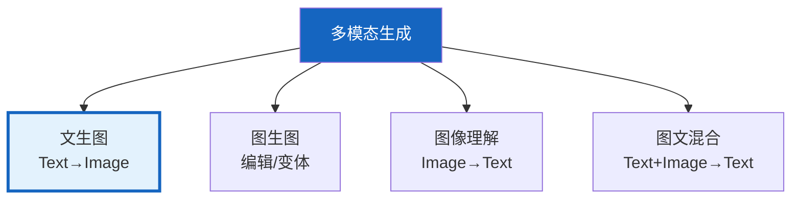
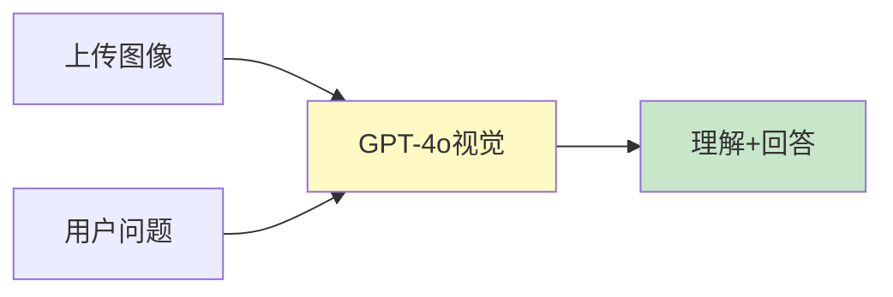

# 多模态生成架构图解

> 用图解理解文生图能力、图文混合工作流和图像理解集成。

---

## 一、多模态生成能力



---

## 二、文生图流程


---

## 三、图文混合工作流

```mermaid
graph TB
    Q["用户: '写文章配插图'"] --> WRITE["写作Agent"]
    WRITE --> EXTRACT["提取插图描述"]
    EXTRACT --> GEN["图像生成Agent"]
    GEN --> COMBINE["合并文章+插图"]
    COMBINE → OUT["图文结果"]

    style WRITE fill:#E3F2FD
    style EXTRACT fill:#FFF9C4
    style GEN fill:#FFF3E0
    style OUT fill:#C8E6C9
```

---

## 四、图像理解



---

## 五、DALL-E vs Stable Diffusion

```mermaid
graph TB
    subgraph DALLE {"DALL-E 3"}
        D1["API调用<br/>无需GPU<br/>英文为主"]
    end

    subgraph SD {"Stable Diffusion"}
        S1["本地部署<br/>需GPU<br/>可自定义模型"]
    end

    style DALLE fill:#E3F2FD
    style SD fill:#FFF3E0
```

---

## 六、检查清单

| 检查项 | 状态 |
|--------|------|
| 能用DALL-E生成 | ☐ |
| 能用Stable Diffusion | ☐ |
| 能集成到Agent | ☐ |
| 能做图像理解 | ☐ |
| 能做图文混合工作流 | ☐ |
