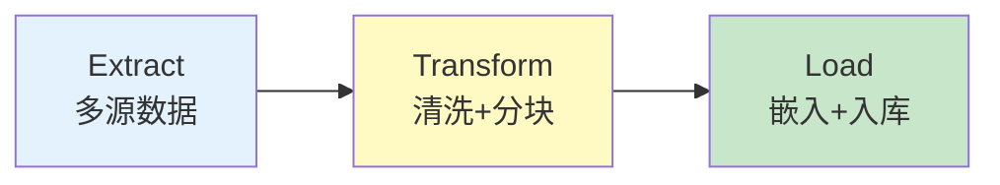
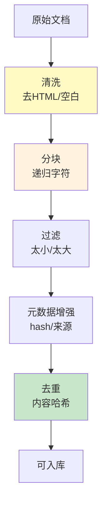
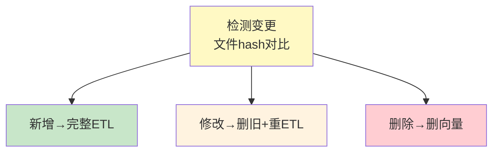
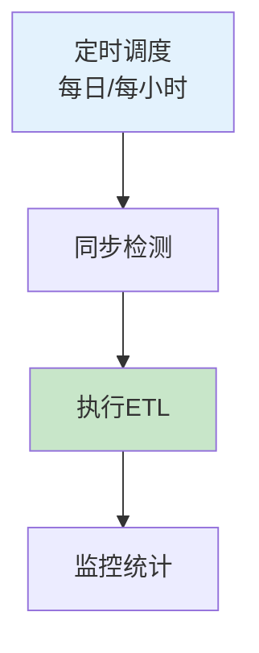

# 知识库 ETL 流程图解

> 用图解理解 ETL 全流程、增量更新和调度监控。

---

## 一、ETL全流程



---

## 二、数据源

```mermaid
graph TB
    subgraph 源 {"数据源"}
        S1["PDF/Word"]
        S2["数据库SQL"]
        S3["网页/API"]
        S4["Confluence/Notion"]
        S5["代码仓库"]
    end

    style 源 fill:#E3F2FD
```

---

## 三、Transform流程



---

## 四、增量更新



---

## 五、调度



---

## 六、检查清单

| 检查项 | 状态 |
|--------|------|
| 有多源数据提取 | ☐ |
| 有清洗和分块 | ☐ |
| 有增量更新 | ☐ |
| 有去重过滤 | ☐ |
| 有ETL监控 | ☐ |
