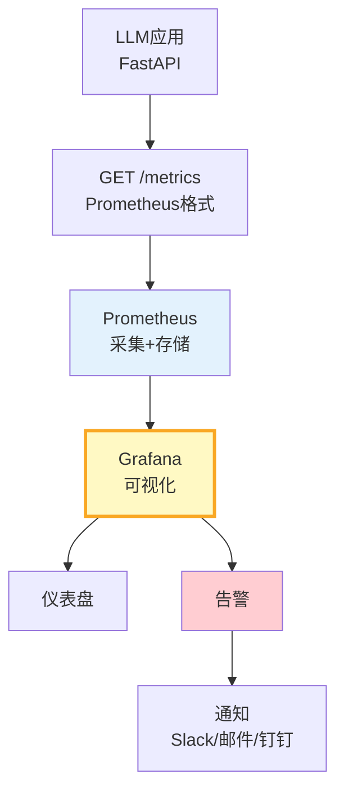
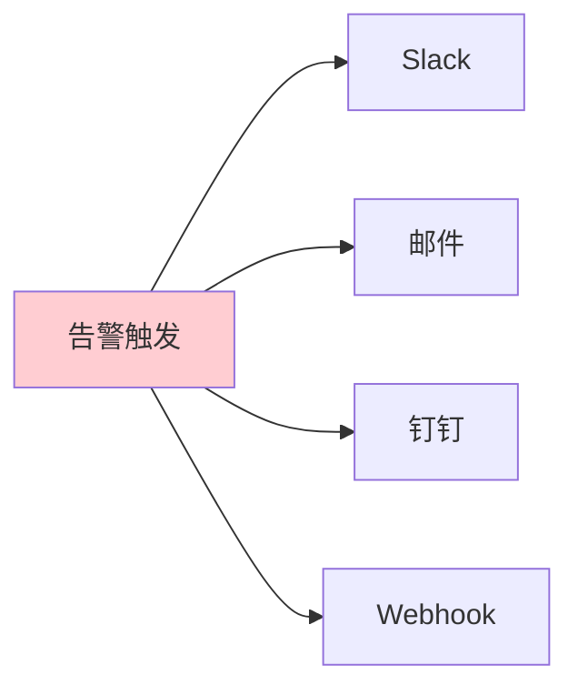

# 监控面板架构图解

> 用图解理解 LLM 应用监控的完整架构和面板设计。

---

## 一、监控架构



---

## 二、5大面板维度

```mermaid
graph TB
    subgraph 面板 {"监控面板体系"}
        D1["实时概览<br/>QPS/延迟/错误率/成本"]
        D2["模型分析<br/>各模型调用量/成本"]
        D3["用户行为<br/>活跃/会话/满意度"]
        D4["资源监控<br/>向量库/缓存/队列"]
        D5["告警视图<br/>活跃/历史/趋势"]
    end

    style 面板 fill:#E3F2FD
```

---

## 三、实时概览面板

```mermaid
graph TB
    subgraph 概览 {"实时概览指标"}
        M1["QPS<br/>req/s"]
        M2["P95延迟<br/>ms"]
        M3["错误率<br/>%"]
        M4["今日成本<br/>$"]
        M5["缓存命中率<br/>%"]
    end

    style 概览 fill:#C8E6C9
```

---

## 四、告警分级

```mermaid
graph TB
    subgraph 分级 {"告警三级"}
        CRIT["CRITICAL<br/>错误率>10%<br/>立即通知"]
        HIGH["HIGH<br/>P95>5s<br/>工作时间通知"]
        WARN["WARNING<br/>成本>80%预算<br/>记录观察"]
    end

    style CRIT fill:#FFCDD2,stroke:#C62828,stroke-width:3px
    style HIGH fill:#FFE0B2
    style WARN fill:#FFF9C4
```

---

## 五、通知渠道



---

## 六、检查清单

| 检查项 | 状态 |
|--------|------|
| 有/metrics端点 | ☐ |
| 有Grafana面板 | ☐ |
| 有5维度面板 | ☐ |
| 有告警分级 | ☐ |
| 有多渠道通知 | ☐ |
