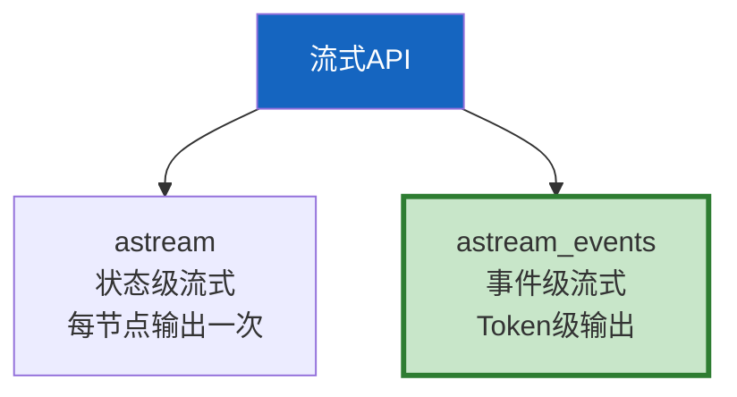
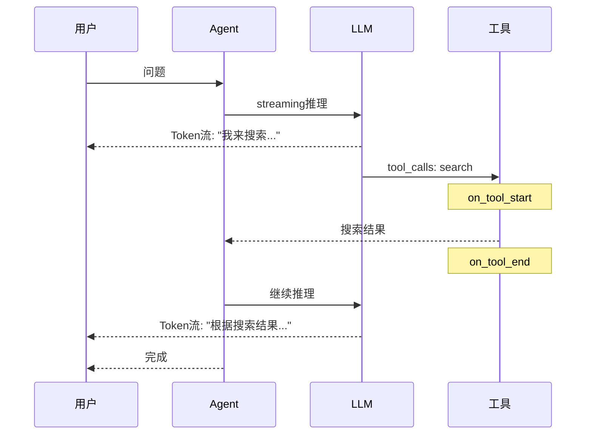

# LangGraph 流式 API 图解

> 用图解理解 astream 和 astream_events 的区别、事件类型和常见陷阱。

---

## 一、两种流式模式



---

## 二、事件类型

```mermaid
graph TB
    subgraph 事件 {"astream_events事件"}
        E1["on_chat_model_stream<br/>LLM Token流<br/>打字机效果"]
        E2["on_tool_start<br/>工具开始"]
        E3["on_tool_end<br/>工具完成"]
        E4["on_chain_start<br/>链开始"]
        E5["on_chain_end<br/>链结束"]
    end

    style E1 fill:#C8E6C9,stroke:#2E7D32,stroke-width:3px
```

---

## 三、stream_mode

```mermaid
graph TB
    subgraph 模式 {"4种stream_mode"}
        M1["values<br/>完整状态"]
        M2["updates<br/>只输出变更"]
        M3["messages<br/>消息级流式"]
        M4["多模式<br/>同时输出"]
    end

    style 模式 fill:#E3F2FD
```

---

## 四、Agent流式时序



---

## 五、常见陷阱

```mermaid
graph TB
    subgraph 陷阱 {"常见陷阱"}
        T1["❌ 忘streaming=True"]
        T2["❌ 忘version=v2"]
        T3["❌ 不检查content非空"]
        T4["❌ 不过滤事件刷屏"]
    end

    style 陷阱 fill:#FFCDD2
```

---

## 六、检查清单

| 检查项 | 状态 |
|--------|------|
| 理解两种模式区别 | ☐ |
| 能用astream_events | ☐ |
| 知道4种stream_mode | ☐ |
| 能过滤事件 | ☐ |
| 避免常见陷阱 | ☐ |
