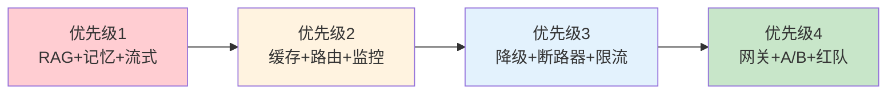

# LLM 应用架构演进图解

> 用图解理解四个成熟度阶段的架构差异和演进路线图。

---

## 一、四个阶段


---

## 二、各阶段架构

```mermaid
graph TB
    subgraph 原型 {"原型: 直接调API"}
        P1["脚本→OpenAI"]
    end

    subgraph MVP {"MVP: 加RAG+记忆"}
        M1["FastAPI+RAG+MemorySaver"]
    end

    subgraph 生产 {"生产: 加缓存+路由+监控"}
        PR1["缓存+路由+监控+降级+PostgreSQL"]
    end

    subgraph 规模 {"规模: 加网关+A/B+红队"}
        SC1["LLM网关+A/B+红队+混沌"]
    end

    style 原型 fill:#FFCDD2
    style MVP fill:#FFF3E0
    style 生产 fill:#E3F2FD
    style 规模 fill:#C8E6C9
```

---

## 三、MVP到生产需要加什么

```mermaid
graph TB
    subgraph 升级 {"需要加的组件"}
        A1["+语义缓存 -30%成本"]
        A2["+模型路由 -60%成本"]
        A3["+监控告警"]
        A4["+降级链"]
        A5["+断路器"]
        A6["+限流"]
        A7["+PostgreSQL"]
        A8["+结构化日志"]
    end

    style 升级 fill:#E3F2FD
```

---

## 四、演进优先级



---

## 五、成熟度评估

| 阶段 | 核心标志 | 达标条件 |
|------|----------|----------|
| 原型 | 能跑通 | LLM API调用成功 |
| MVP | 可用 | RAG+记忆+流式+错误处理 |
| 生产就绪 | 可靠 | 缓存+路由+监控+降级+限流 |
| 规模化 | 高效 | 网关+A/B+红队+自动扩缩容 |

---

## 六、检查清单

| 检查项 | 状态 |
|--------|------|
| 知道自己在哪个阶段 | ☐ |
| 知道下一步加什么 | ☐ |
| 有持久化存储 | ☐ |
| 有监控告警 | ☐ |
| 有降级链 | ☐ |
