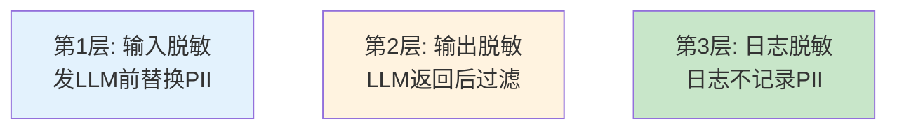

# 数据隐私技术图解

> 用图解理解隐私风险、三层脱敏和差分隐私原理。

---

## 一、隐私风险

```mermaid
graph TB
    subgraph 风险 {"四大风险"}
        R1["传输风险<br/>数据到API路上"]
        R2["存储风险<br/>向量库/日志"]
        R3["记忆风险<br/>LLM复述训练数据"]
        R4["推理风险<br/>从输出推断输入"]
    end

    style 风险 fill:#FFCDD2
```

---

## 二、三层脱敏



---

## 三、数据脱敏流程

```mermaid
graph LR
    INPUT["用户输入<br/>含PII"] → MASK["脱敏<br/>PII→占位符"]
    MASK → LLM["发送给LLM<br/>无PII"]
    LLM → RESPONSE["LLM返回"]
    RESPONSE → UNMASK["恢复占位符<br/>→原文"]
    UNMASK → OUTPUT["输出给用户"]

    style MASK fill:#FFF9C4,stroke:#F9A825,stroke-width:3px
    style LLM fill:#E3F2FD
```

---

## 四、差分隐私

```mermaid
graph TB
    subgraph DP {"差分隐私"}
        D1["原始向量"] → ADD["加拉普拉斯噪声"]
        ADD → D2["加噪向量"]
        D2 → USE["可用但保护个体"]
    end

    style ADD fill:#FFF9C4,stroke:#F9A825,stroke-width:3px
```

---

## 五、数据不出内网

```mermaid
graph TB
    subgraph 本地 {"全栈本地化"}
        L1["本地LLM<br/>Ollama/vLLM"]
        L2["本地Embedding<br/>BGE"]
        L3["本地向量库<br/>Milvus"]
        L4["本地沙箱<br/>Docker禁网"]
    end

    style 本地 fill:#C8E6C9,stroke:#2E7D32,stroke-width:3px
```

---

## 六、检查清单

| 检查项 | 状态 |
|--------|------|
| 有PII脱敏 | ☐ |
| 日志不记录PII | ☐ |
| 敏感数据可本地 | ☐ |
| 有合规审计 | ☐ |
