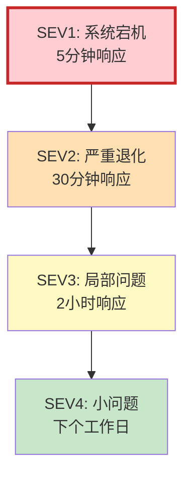
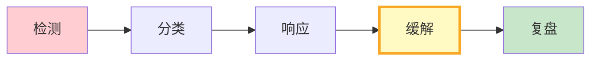
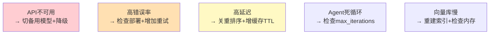

# LLM 应用 SRE 运维图解

> 用图解理解事故分级、响应流程和复盘要点。

---

## 一、LLM SRE独特挑战

```mermaid
graph TB
    subgraph 额外关注 {"LLM SRE额外关注"}
        L1["模型API可用性"]
        L2["Token消耗趋势"]
        L3["幻觉率"]
        L4["Agent行为"]
        L5["向量库健康"]
    end

    style 额外关注 fill:#FFCDD2
```

---

## 二、事故四级



---

## 三、事故响应流程



---

## 四、缓解措施



---

## 五、复盘5要素

```mermaid
graph TB
    subgraph 复盘 {"复盘5要素"}
        R1["时间线"]
        R2["根因(5Why)"]
        R3["影响评估"]
        R4["改进项"]
        R5["经验文档化"]
    end

    style 复盘 fill:#E3F2FD
```

---

## 六、检查清单

| 检查项 | 状态 |
|--------|------|
| 有事故分级 | ☐ |
| 有响应流程 | ☐ |
| 有值班制度 | ☐ |
| 有复盘模板 | ☐ |
| 有运维手册 | ☐ |
