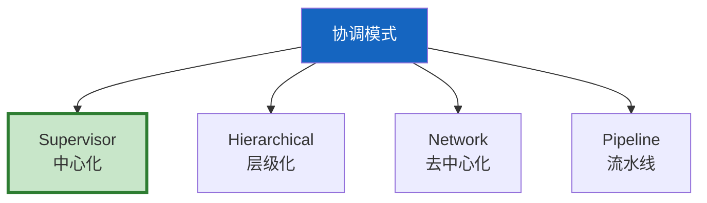
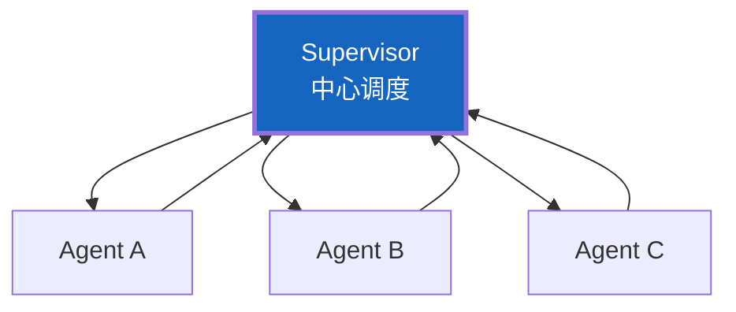
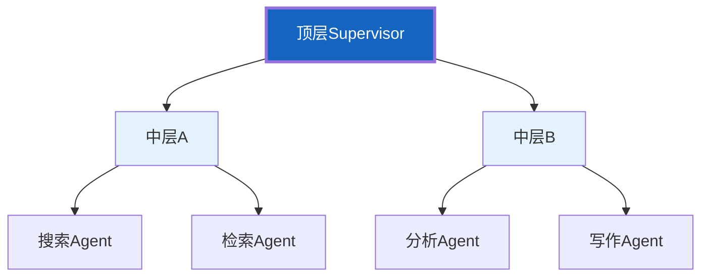
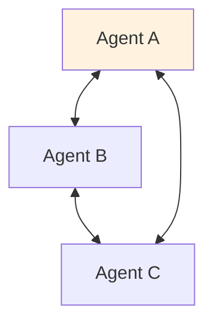
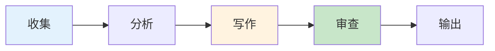
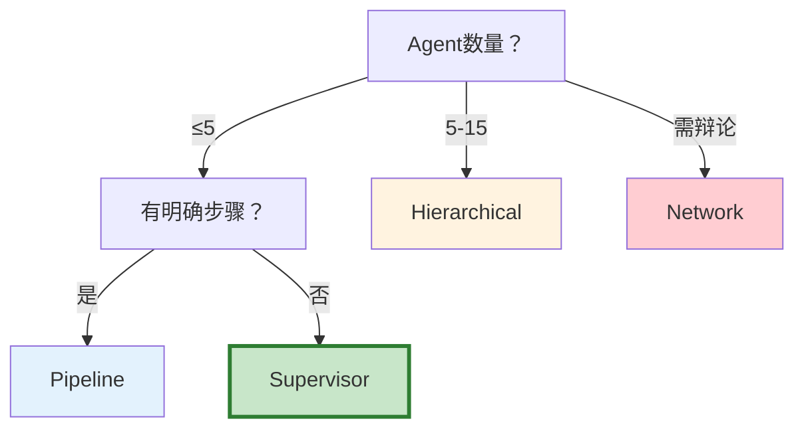

# 多 Agent 协调拓扑图解

> 用图解理解四种协调模式的拓扑结构和选型决策。

---

## 一、四种模式

---

## 二、Supervisor模式

---

## 三、Hierarchical模式

---

## 四、Network模式

---

## 五、Pipeline模式

---

## 六、选型决策

---

## 七、检查清单

| 检查项 | 状态 |
|--------|------|
| 理解四种模式 | ☐ |
| 能实现Supervisor | ☐ |
| 能实现Pipeline | ☐ |
| 能根据场景选模式 | ☐ |
