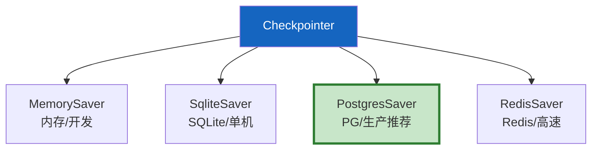
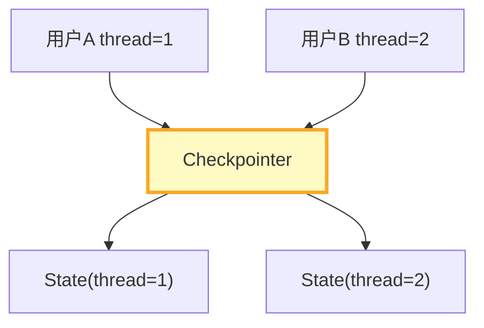
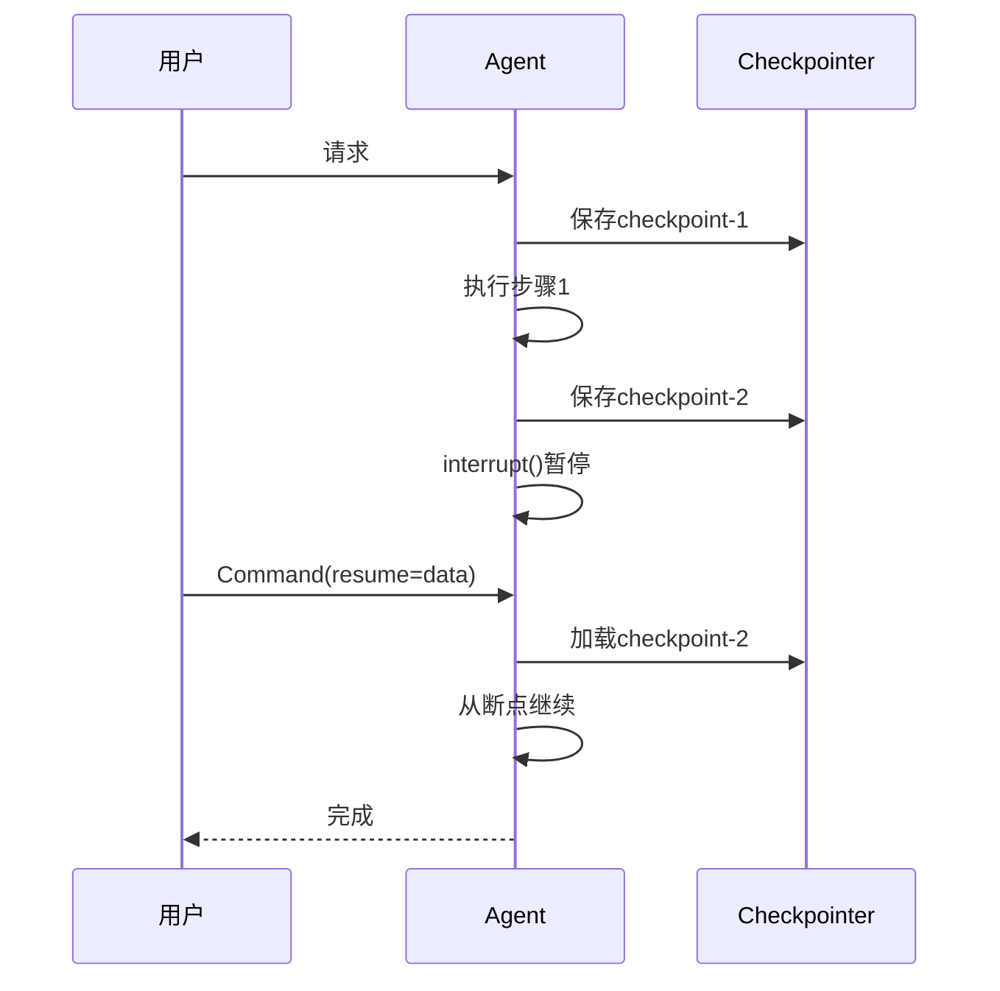
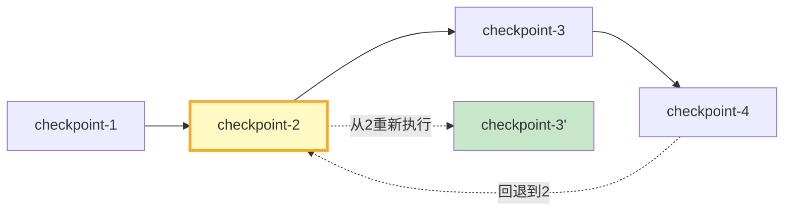

# LangGraph 持久化图解

> 用图解理解 Checkpointer 四种类型、thread_id 隔离、中断恢复和两层存储。

---

## 一、Checkpointer价值

```mermaid
graph TB
    subgraph 没有 {"没有检查点"}
        N1["崩溃→从头执行"]
        N2["无法回到历史"]
        N3["多用户状态混淆"]
    end

    subgraph 有 {"有检查点"}
        Y1["崩溃→从断点恢复"]
        Y2["时间旅行"]
        Y3["thread_id隔离"]
    end

    style 没有 fill:#FFCDD2
    style 有 fill:#C8E6C9
```

---

## 二、四种类型



---

## 三、thread_id隔离



---

## 四、中断恢复



---

## 五、两层存储

```mermaid
graph TB
    subgraph 两层 {"两层存储"}
        CP["Checkpointer<br/>短期记忆<br/>线程内<br/>对话历史"]
        ST["Store<br/>长期记忆<br/>跨线程<br/>用户画像"]
    end

    style CP fill:#E3F2FD
    style ST fill:#FFF3E0
```

---

## 六、时间旅行



---

## 七、检查清单

| 检查项 | 状态 |
|--------|------|
| 理解四种Checkpointer | ☐ |
| 配置了PostgresSaver | ☐ |
| 理解thread_id隔离 | ☐ |
| 能中断恢复 | ☐ |
| 理解Store长期记忆 | ☐ |
