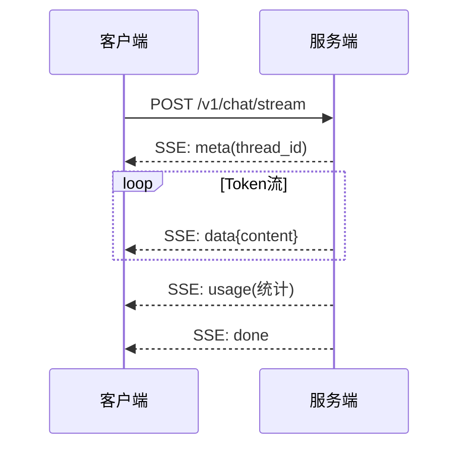

# LLM 应用 API 设计图解

> 用图解理解 LLM API 的特殊性、端点设计和版本管理。

---

## 一、LLM API特殊性

```mermaid
graph TB
    subgraph 特殊 {"LLM API特殊性"}
        L1["可能流式(SSE)"]
        L2["响应1-30秒"]
        L3["有状态(对话历史)"]
        L4["Token计费"]
        L5["可能需人工审批"]
    end

    style 特殊 fill:#FFF3E0,stroke:#E65100,stroke-width:3px
```

---

## 二、核心端点

```mermaid
graph TB
    subgraph 端点 {"API端点"}
        E1["POST /v1/chat<br/>同步对话"]
        E2["POST /v1/chat/stream<br/>流式SSE"]
        E3["POST /v1/threads<br/>创建线程"]
        E4["GET /v1/threads/{id}/history<br/>历史"]
        E5["POST /v1/feedback<br/>反馈"]
        E6["GET /v1/health<br/>健康检查"]
    end

    style E2 fill:#FFF9C4,stroke:#F9A825,stroke-width:3px
```

---

## 三、流式响应



---

## 四、错误规范

```mermaid
graph TB
    subgraph 错误 {"统一错误格式"}
        E1["400 INVALID_REQUEST"]
        E2["401 UNAUTHORIZED"]
        E3["429 RATE_LIMITED"]
        E4["502 MODEL_ERROR"]
        E5["504 TIMEOUT"]
    end

    style 错误 fill:#FFCDD2
```

---

## 五、检查清单

| 检查项 | 状态 |
|--------|------|
| 有同步+流式端点 | ☐ |
| 有线程管理 | ☐ |
| 有统一错误格式 | ☐ |
| 有版本前缀 | ☐ |
| 有OpenAPI文档 | ☐ |
