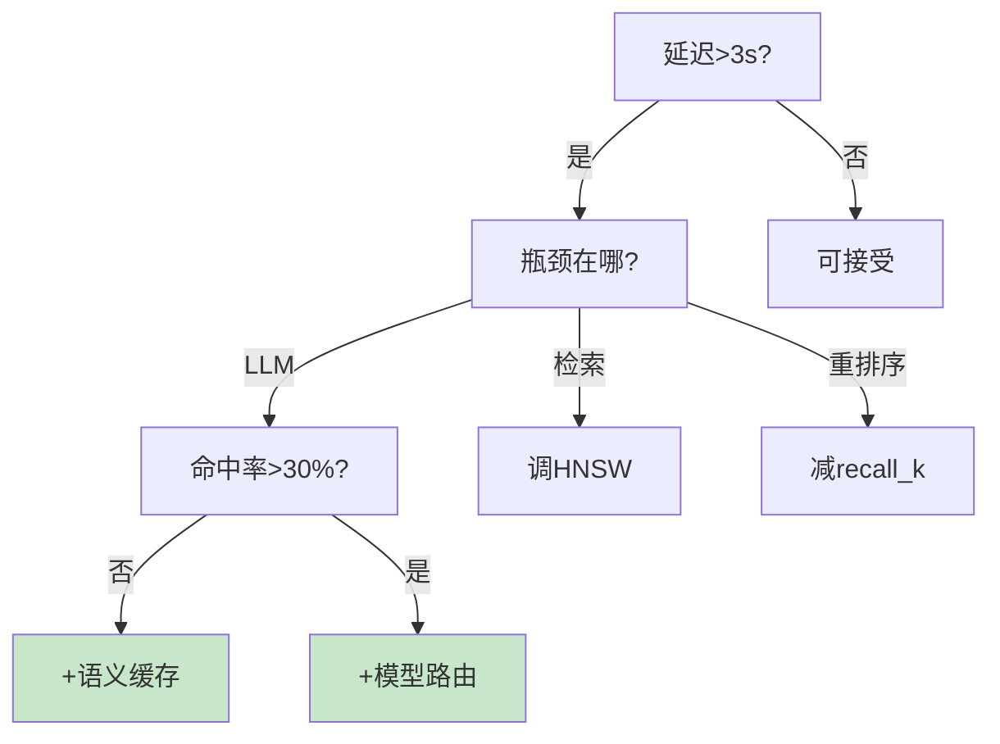

# 性能调优系统图解

> 用图解理解全链路性能分析和各环节调优策略。

---

## 一、全链路分析


---

## 二、各环节调优

```mermaid
graph TB
    subgraph 调优 {"各环节策略"}
        S1["LLM: 模型路由+缓存<br/>最大瓶颈"]
        S2["检索: HNSW调优+减k"]
        S3["重排序: 减recall_k"]
        S4["历史: 摘要压缩"]
        S5["缓存: 语义缓存"]
    end

    style S1 fill:#FFCDD2,stroke:#C62828,stroke-width:3px
    style S5 fill:#C8E6C9,stroke:#2E7D32,stroke-width:3px
```

---

## 三、调优决策树



---

## 四、效果对比

| 优化项 | 延迟降低 | 优先级 |
|--------|----------|--------|
| 语义缓存 | 100%(命中) | ★★★ |
| 模型路由 | 60-80% | ★★★ |
| 流式输出 | 80%感知 | ★★★ |
| 上下文压缩 | 30-50% | ★★☆ |

---

## 五、检查清单

| 检查项 | 状态 |
|--------|------|
| 有全链路追踪 | ☐ |
| 识别了瓶颈 | ☐ |
| 启用语义缓存 | ☐ |
| 启用模型路由 | ☐ |
| 做了基准测试 | ☐ |
