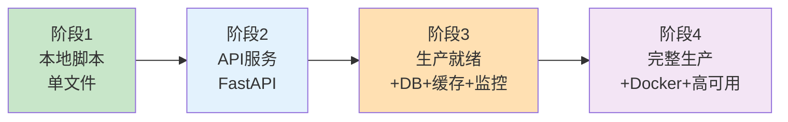
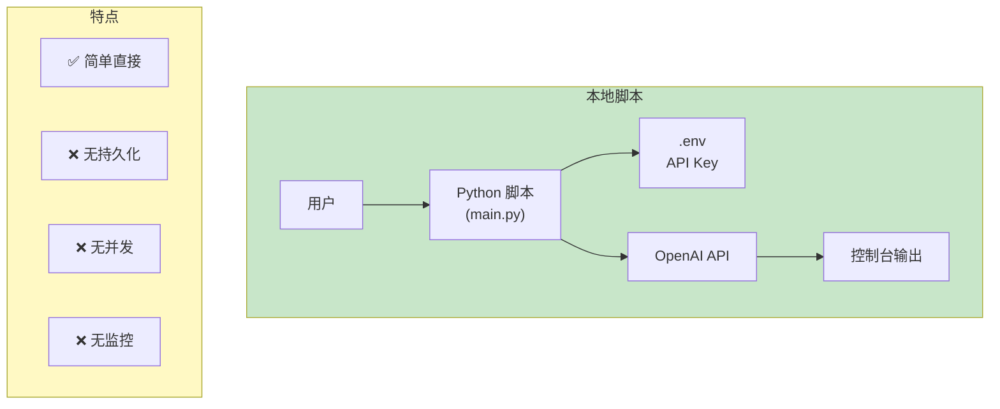
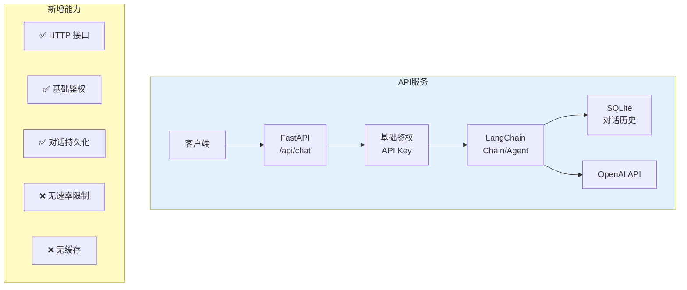
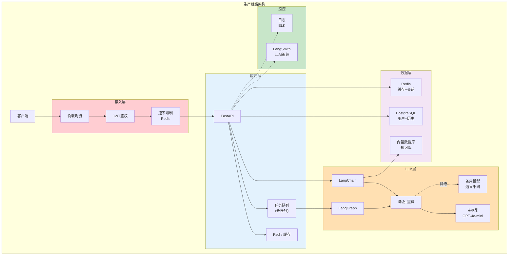
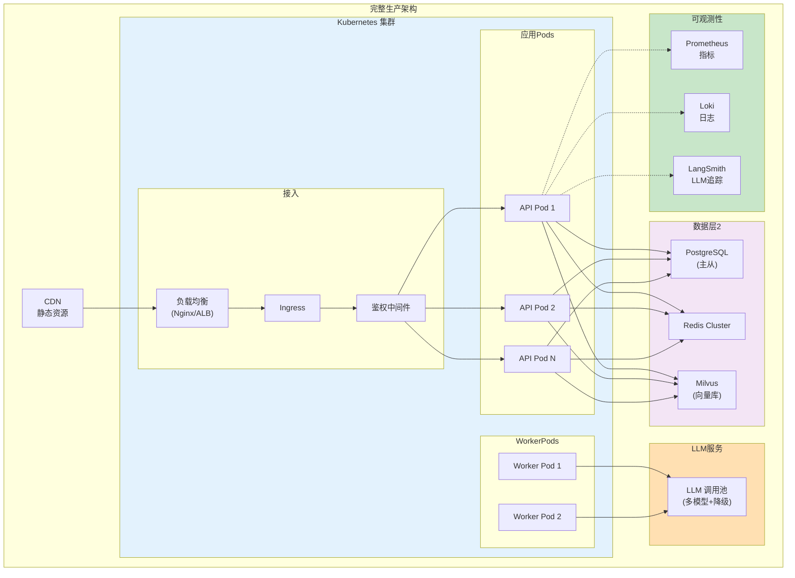
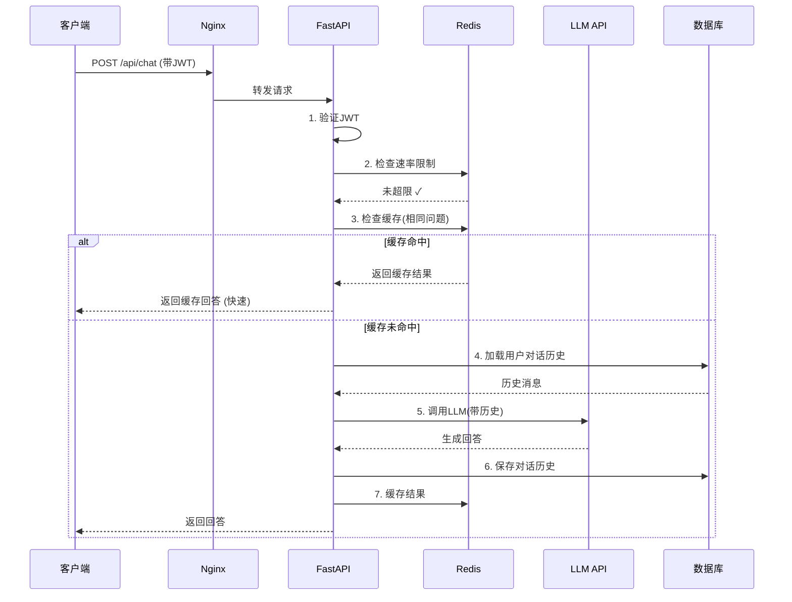
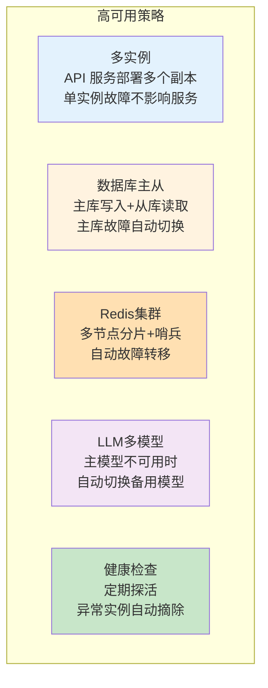
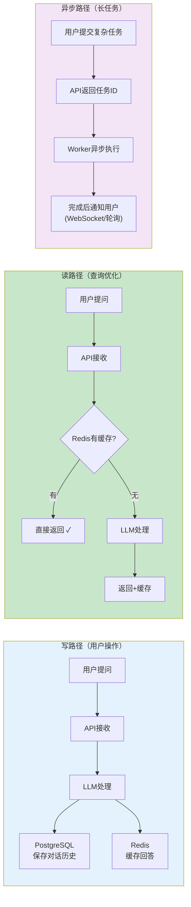
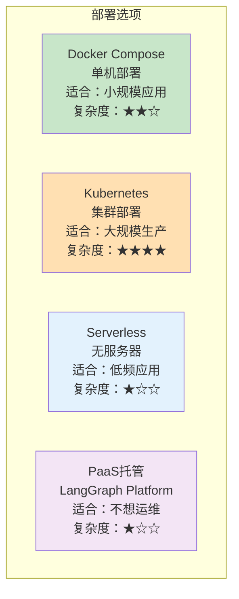
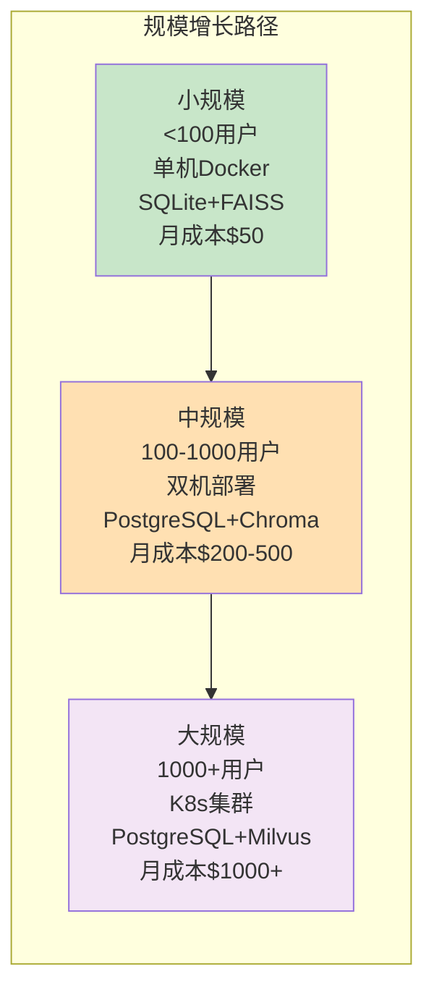

# 生产架构图解

> 用图解方式理解 LLM 应用从本地脚本到生产系统的完整架构演进。

---

## 一、架构演进全景

## 二、阶段一：本地脚本

## 三、阶段二：API 服务

## 四、阶段三：生产就绪

## 五、阶段四：完整生产

## 六、请求处理流程

## 七、高可用设计

## 八、数据流架构

## 九、部署方式对比

## 十、成本与规模的平衡

| 规模 | 架构 | 数据库 | 向量库 | 月成本(估) |
|------|------|--------|--------|-----------|
| <100用户 | Docker单机 | SQLite | FAISS | $50 |
| 100-1K用户 | 双机部署 | PostgreSQL | Chroma | $200-500 |
| 1K+用户 | K8s集群 | PostgreSQL主从 | Milvus | $1000+ |
| 学习/原型 | 本地运行 | 内存/SQLite | FAISS | $10-20 |
