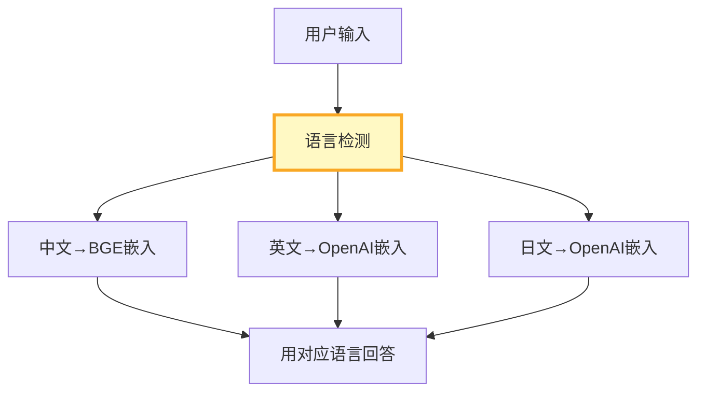

# 国际化部署图解

> 用图解理解多语言路由、多语言RAG和系统提示翻译。

---

## 一、国际化挑战

```mermaid
graph TB
    subgraph 挑战 {"6大挑战"}
        C1["嵌入模型选型"]
        C2["系统提示翻译"]
        C3["分词器差异"]
        C4["文化适配"]
        C5["UI文案"]
        C6["合规差异"]
    end

    style 挑战 fill:#FFF3E0
```

---

## 二、语言检测与路由



---

## 三、两种多语言RAG策略

```mermaid
graph TB
    subgraph 策略1 {"策略1: 按语言分库"}
        S1["中文库(BGE)"]
        S2["英文库(OpenAI)"]
        S1 & S2 --> "按语言路由"
    end

    subgraph 策略2 {"策略2: 统一嵌入"}
        S3["BGE-m3多语言<br/>统一向量库"]
    end

    style 策略1 fill:#E3F2FD
    style 策略2 fill:#C8E6C9,stroke:#2E7D32,stroke-width:3px
```

---

## 四、检查清单

| 检查项 | 状态 |
|--------|------|
| 有语言检测 | ☐ |
| 有多语言配置 | ☐ |
| 有多语言RAG | ☐ |
| 有提示翻译 | ☐ |
