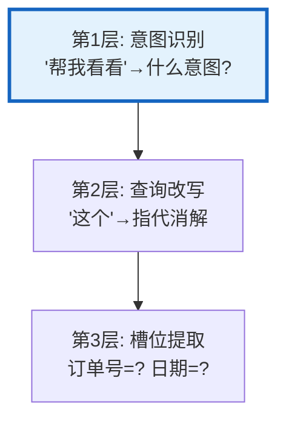
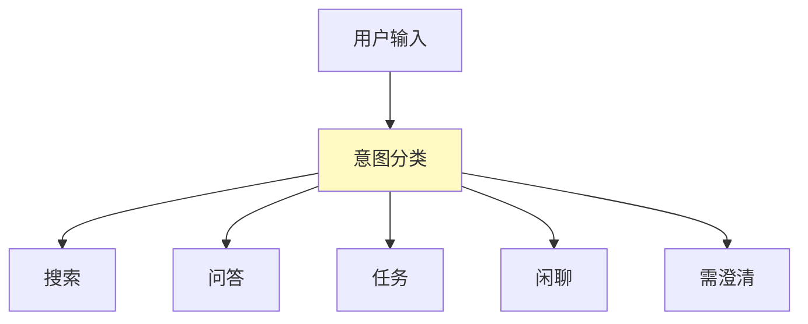
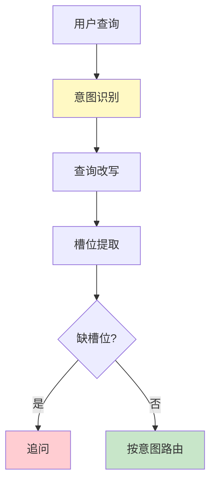
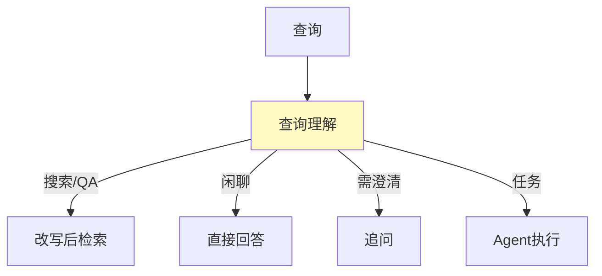

# 查询理解流程图解

> 用图解理解意图识别、查询改写和槽位提取的三层管线。

---

## 一、三层理解



---

## 二、意图分类



---

## 三、查询改写场景

```mermaid
graph TB
    subgraph 改写 {"4种改写场景"}
        R1["指代消解: '这个'→'LangChain'"]
        R2["口语→书面: '咋用'→'如何使用'"]
        R3["补全上下文: '还有吗'→'还有其他方法吗'"]
        R4["多意图拆分: '查天气和订票'→2个查询"]
    end

    style 改写 fill:#E3F2FD
```

---

## 四、完整管线



---

## 五、与RAG集成



---

## 六、检查清单

| 检查项 | 状态 |
|--------|------|
| 有意图识别 | ☐ |
| 有查询改写 | ☐ |
| 有槽位提取 | ☐ |
| 有缺失槽位追问 | ☐ |
| 与RAG集成 | ☐ |
