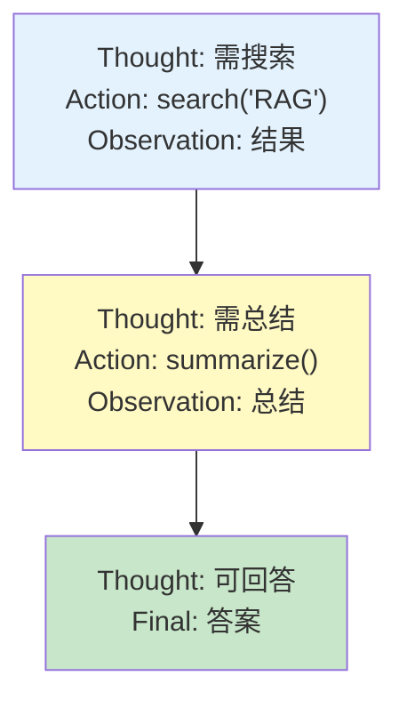
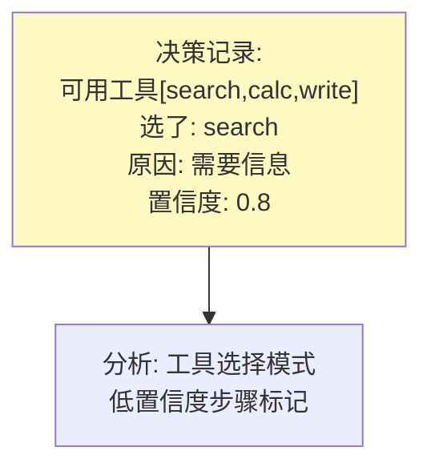

# Agent 可观测性图解

> 用图解理解推理链追踪、工具决策审计和循环检测。

---

## 一、Agent特有可观测性

```mermaid
graph TB
    subgraph 特有 {"Agent特有"}
        A1["推理链追踪"]
        A2["工具决策审计"]
        A3["状态变化记录"]
        A4["循环检测"]
        A5["多Agent通信"]
    end

    style 特有 fill:#FFF3E0,stroke:#E65100,stroke-width:3px
```

---

## 二、推理链追踪



---

## 三、循环检测

```mermaid
graph TB
    subgraph 重复 {"重复行动检测"}
        R1["步骤N: search('X')"]
        R2["步骤N+1: search('X')"]
        R3["步骤N+2: search('X')"]
        R1 & R2 & R3 --> ALERT["⚠️ 循环!"]
    end

    style ALERT fill:#FFCDD2
```

---

## 四、工具决策审计



---

## 五、检查清单

| 检查项 | 状态 |
|--------|------|
| 有推理链追踪 | ☐ |
| 有循环检测 | ☐ |
| 有工具决策审计 | ☐ |
| 有状态变化追踪 | ☐ |
