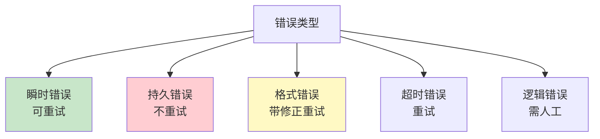
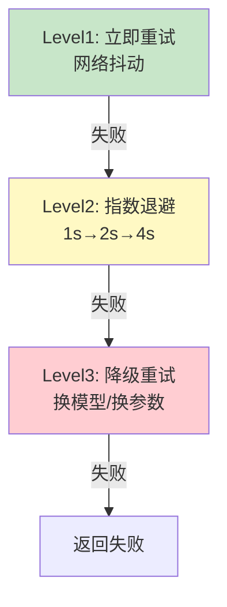
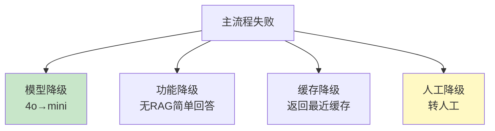
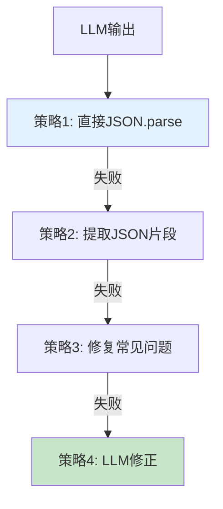

# Agent 错误恢复图解

> 用图解理解错误分类、三级重试和降级策略。

---

## 一、错误分类

---

## 二、三级重试

---

## 三、降级策略

---

## 四、格式错误恢复

---

## 五、检查清单

| 检查项 | 状态 |
|--------|------|
| 有错误分类 | ☐ |
| 有指数退避重试 | ☐ |
| 有降级链 | ☐ |
| 有格式错误恢复 | ☐ |
