# LangGraph 高级模式图解

> 超越基础的线性/分支/循环，掌握 Map-Reduce、动态路由、子图嵌套等高级编排模式。

---

## 一、高级模式总览

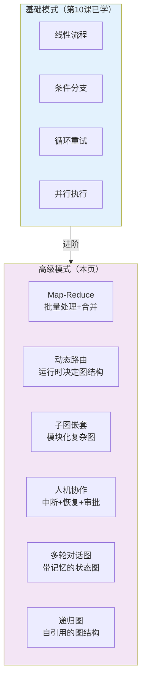

## 二、Map-Reduce 模式

将一个任务拆分为多个子任务并行处理，最后合并结果。

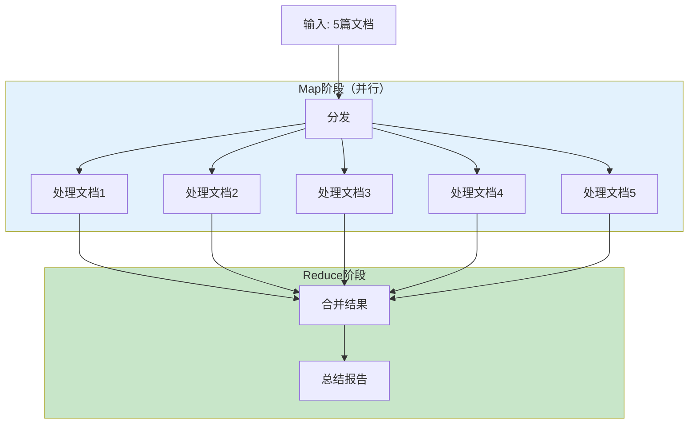

### 代码实现

```python
from typing import TypedDict, Annotated
from operator import add
from langgraph.graph import StateGraph, START, END

class MapReduceState(TypedDict):
    documents: list[str]              # 输入文档列表
    summaries: Annotated[list, add]  # 各文档摘要（自动追加）
    final_report: str                  # 最终报告

def map_documents(state: MapReduceState) -> dict:
    """返回多个节点指令（并行处理每篇文档）"""
    # LangGraph 支持在节点中返回 Send() 对象实现动态分发
    from langgraph.constants import Send
    return [
        Send("summarize", {"doc": doc})
        for doc in state["documents"]
    ]

def summarize_node(data: dict) -> dict:
    """处理单个文档"""
    from langchain_openai import ChatOpenAI
    from langchain_core.prompts import ChatPromptTemplate
    llm = ChatOpenAI(model="gpt-4o-mini")
    prompt = ChatPromptTemplate.from_template("用一句话总结：{doc}")
    chain = prompt | llm
    summary = chain.invoke({"doc": data["doc"]}).content
    return {"summaries": [summary]}

def reduce_node(state: MapReduceState) -> dict:
    """合并所有摘要"""
    combined = "\n".join(state["summaries"])
    from langchain_openai import ChatOpenAI
    from langchain_core.prompts import ChatPromptTemplate
    llm = ChatOpenAI(model="gpt-4o-mini")
    prompt = ChatPromptTemplate.from_template("将以下各文档摘要合并为一份报告：\n{summaries}")
    report = prompt | llm
    result = report.invoke({"summaries": combined}).content
    return {"final_report": result}

# 构建图
graph = StateGraph(MapReduceState)
graph.add_node("summarize", summarize_node)
graph.add_node("reduce", reduce_node)

graph.add_conditional_edges(START, map_documents)
graph.add_edge("summarize", "reduce")
graph.add_edge("reduce", END)

app = graph.compile()
```

## 三、动态路由模式

根据运行时状态动态决定下一步执行哪些节点：

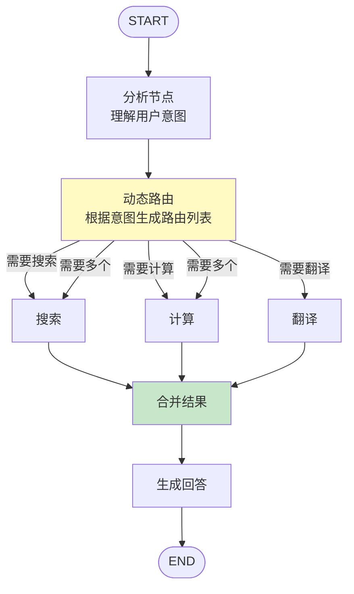

### 与固定条件边的区别

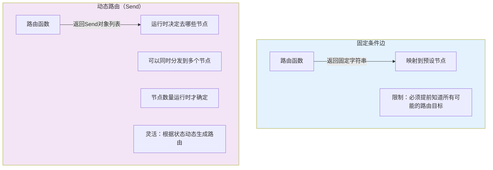

## 四、子图嵌套模式

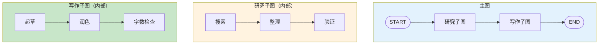

### 子图的状态传递

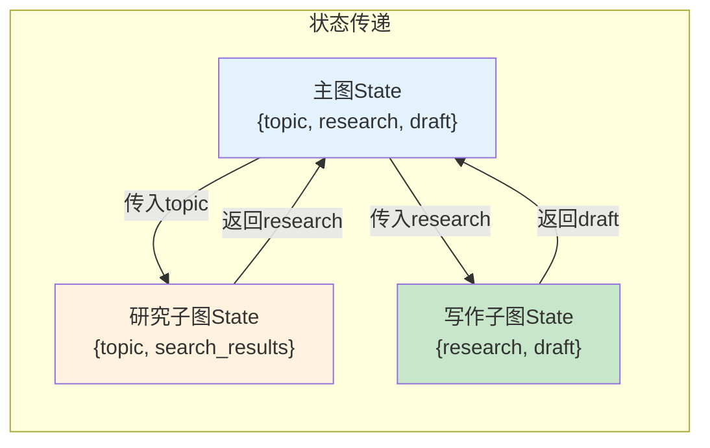

```python
# 子图作为主图的一个节点
research_subgraph = build_research_graph().compile()
writing_subgraph = build_writing_graph().compile()

main_graph = StateGraph(MainState)
main_graph.add_node("research", research_subgraph)  # 子图作为节点
main_graph.add_node("write", writing_subgraph)
main_graph.add_edge(START, "research")
main_graph.add_edge("research", "write")
main_graph.add_edge("write", END)
```

## 五、多轮对话状态图

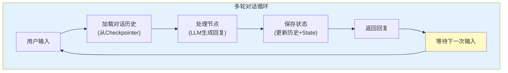

### 关键：State 中管理消息列表

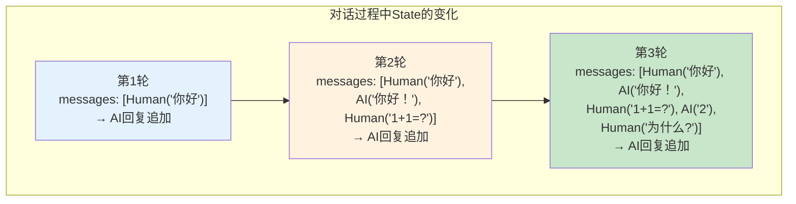

## 六、递归自引用图

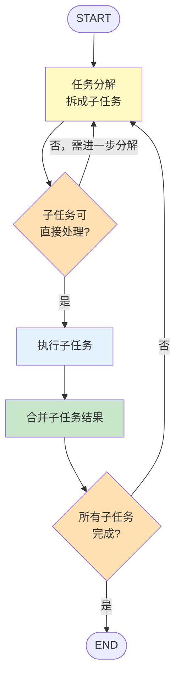

## 七、Map-Reduce vs 固定并行的区别

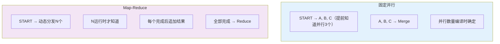

## 八、模式选择决策树

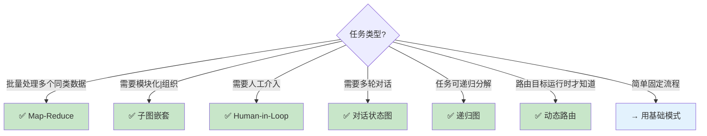

## 九、实际应用场景映射

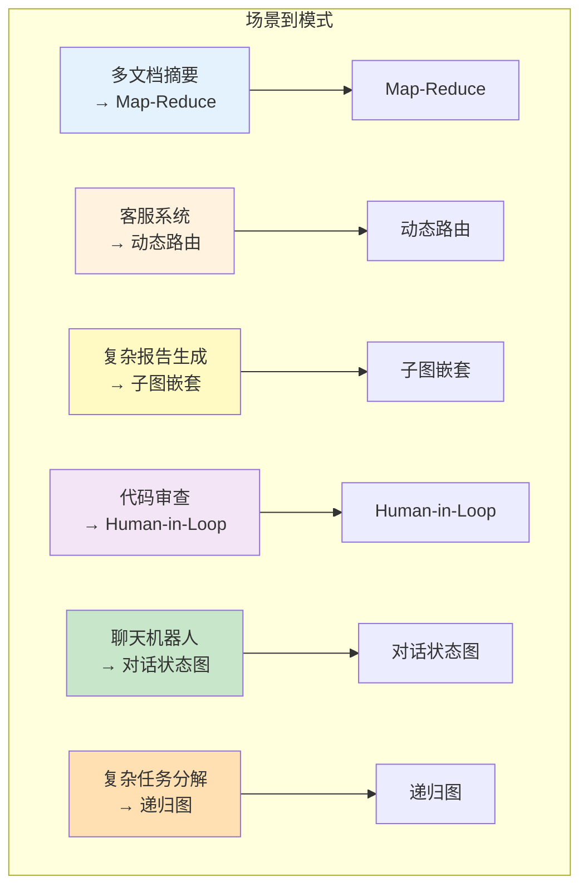
