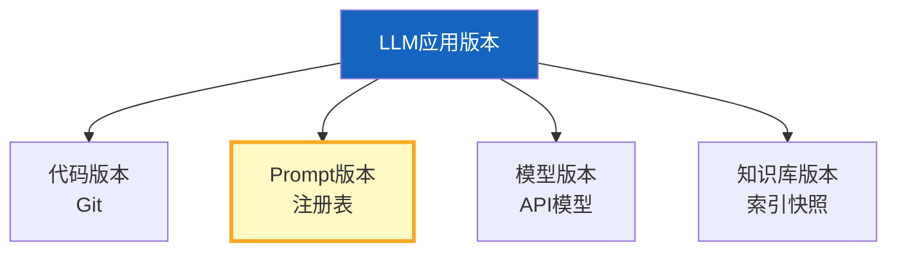
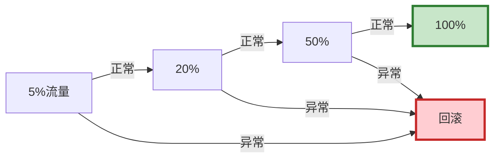

# 版本管理与灰度发布图解

> 用图解理解四维版本、灰度发布流程和 A/B 测试。

---

## 一、四维版本



---

## 二、灰度发布流程



---

## 三、A/B测试

```mermaid
graph TB
    subgraph AB {"A/B测试"}
        A["变体A(50%)<br/>Prompt v1"]
        B["变体B(50%)<br/>Prompt v2"]
        A & B --> COMPARE["对比好评率"]
    end

    style AB fill:#E3F2FD
```

---

## 四、灰度指标检查

```mermaid
graph TB
    subgraph 指标 {"灰度检查指标"}
        M1["错误率≤基线×1.5"]
        M2["P95延迟≤基线×1.3"]
        M3["满意度≥基线×0.9"]
    end
    指标 --> RESULT{"全部通过?"}
    RESULT -->|是| PROCEED["推进下一阶段"]
    RESULT -->|否| ROLLBACK["回滚"]

    style PROCEED fill:#C8E6C9
    style ROLLBACK fill:#FFCDD2
```

---

## 五、检查清单

| 检查项 | 状态 |
|--------|------|
| 有Prompt版本管理 | ☐ |
| 有灰度发布流程 | ☐ |
| 有A/B测试 | ☐ |
| 有回滚机制 | ☐ |
