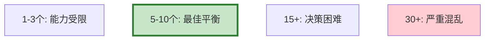
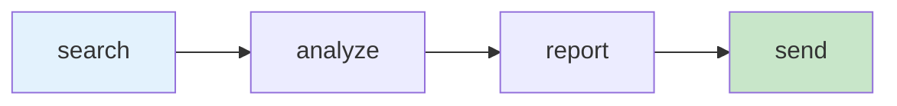

# Agent 工具链设计图解

> 用图解理解工具选型、命名规范和数量与效果的关系。

---

## 一、选型5原则

```mermaid
graph TB
    subgraph 原则 {"工具选型5原则"}
        P1["最小够用<br/>5-10个最佳"]
        P2["正交不重叠"]
        P3["描述要精确"]
        P4["参数要简单"]
        P5["错误要友好"]
    end

    style 原则 fill:#E3F2FD
```

---

## 二、数量与效果



---

## 三、工具依赖



---

## 四、组合模式

```mermaid
graph TB
    subgraph 模式 {"3种组合"}
        M1["串行链: A→B→C"]
        M2["并行: A→{B,C,D}"]
        M3["条件: A→if→B/C"]
    end

    style 模式 fill:#C8E6C9
```

---

## 五、检查清单

| 检查项 | 状态 |
|--------|------|
| 工具5-10个 | ☐ |
| 描述含"何时用" | ☐ |
| 有依赖管理 | ☐ |
| 有错误处理 | ☐ |
