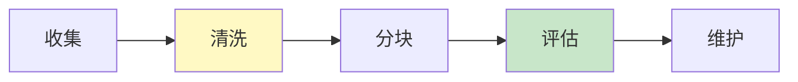
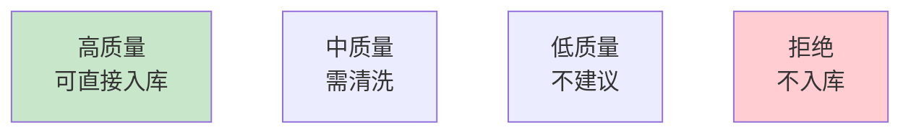

# RAG 数据准备流程图解

> 用图解理解数据准备全流程和质量标准。

---

## 一、5步流程



---

## 二、质量四级



---

## 三、清洗规则

```mermaid
graph TB
    subgraph 清洗 {"清洗5步"}
        C1["去HTML标签"]
        C2["去控制字符"]
        C3["标准化空白"]
        D4["去零宽字符"]
        C5["修复编码问题"]
    end

    style 清洗 fill:#E3F2FD
```

---

## 四、检查清单

| 检查项 | 状态 |
|--------|------|
| 有质量检查 | ☐ |
| 有清洗器 | ☐ |
| 有去重 | ☐ |
| 有元数据增强 | ☐ |
