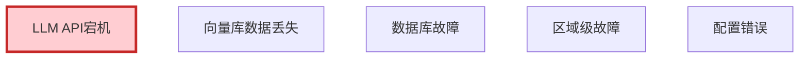
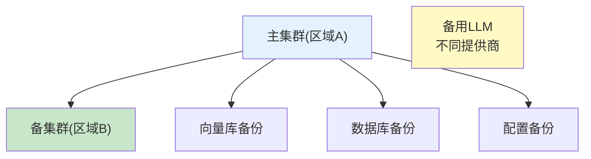
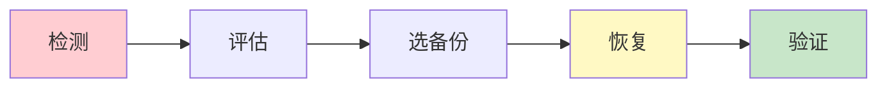

# 灾难恢复图解

> 用图解理解灾备架构、备份策略和恢复流程。

---

## 一、灾难场景



---

## 二、灾备架构



---

## 三、恢复5步



---

## 四、RTO/RPO

```mermaid
graph TB
    subgraph 目标 {"RTO/RPO目标"}
        RTO["RTO: 恢复时间<br/>向量库4h/DB30min/配置5min"]
        RPO["RPO: 数据丢失<br/>向量库24h/DB1h/配置0"]
    end

    style 目标 fill:#E3F2FD
```

---

## 五、检查清单

| 检查项 | 状态 |
|--------|------|
| 有备份管理 | ☐ |
| 有恢复流程 | ☐ |
| 有LLM灾备 | ☐ |
| 有RTO/RPO | ☐ |
