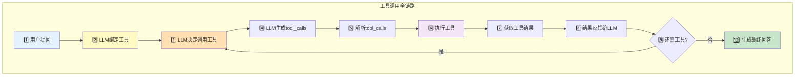
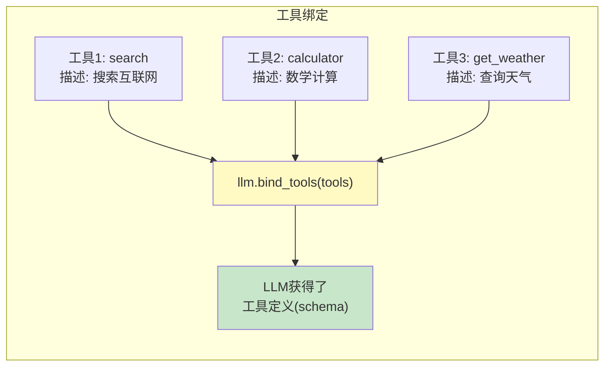
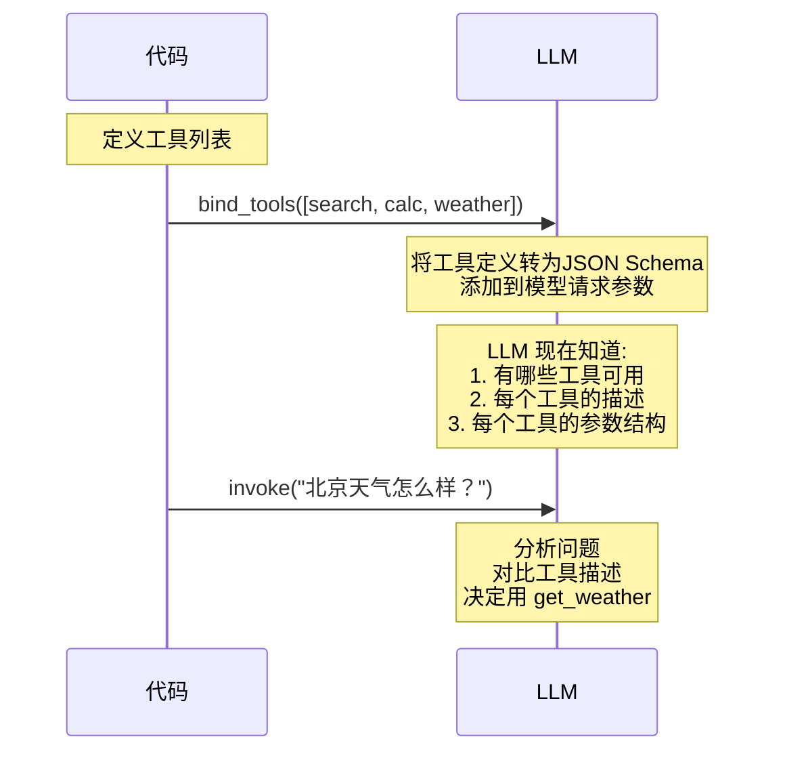
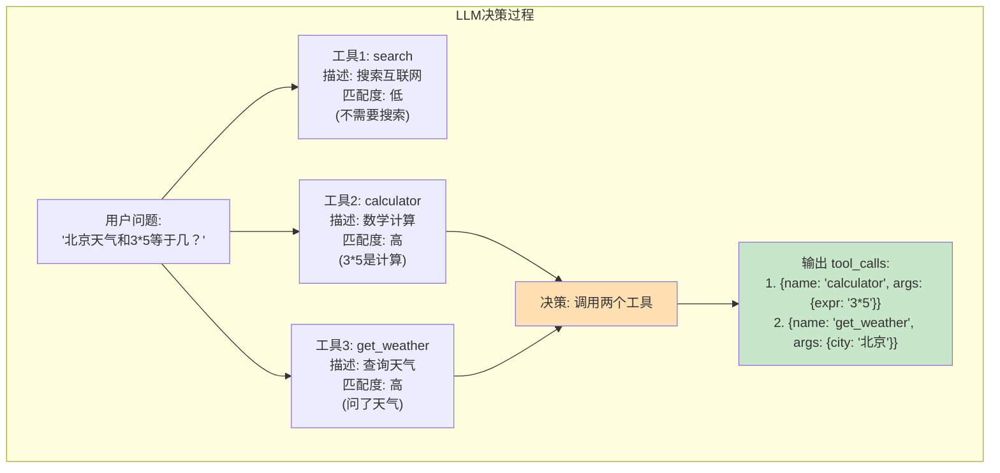
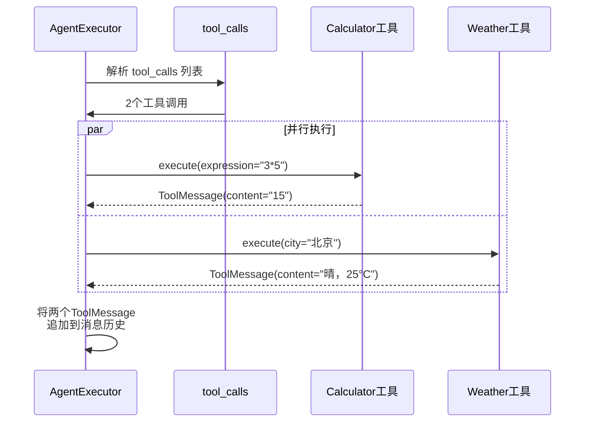
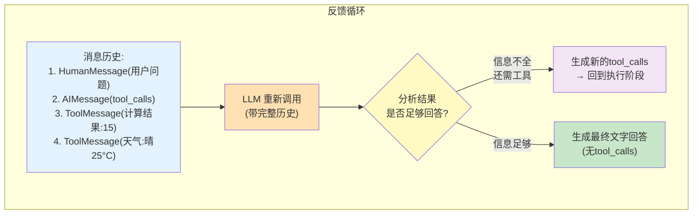
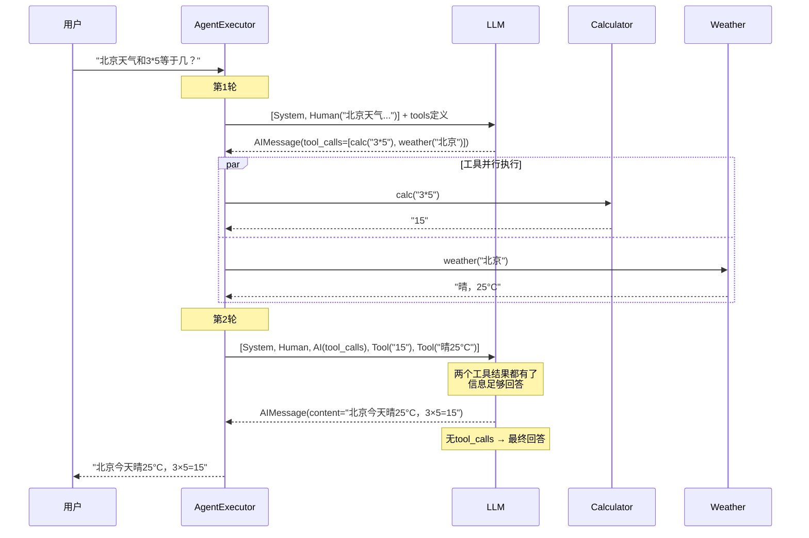
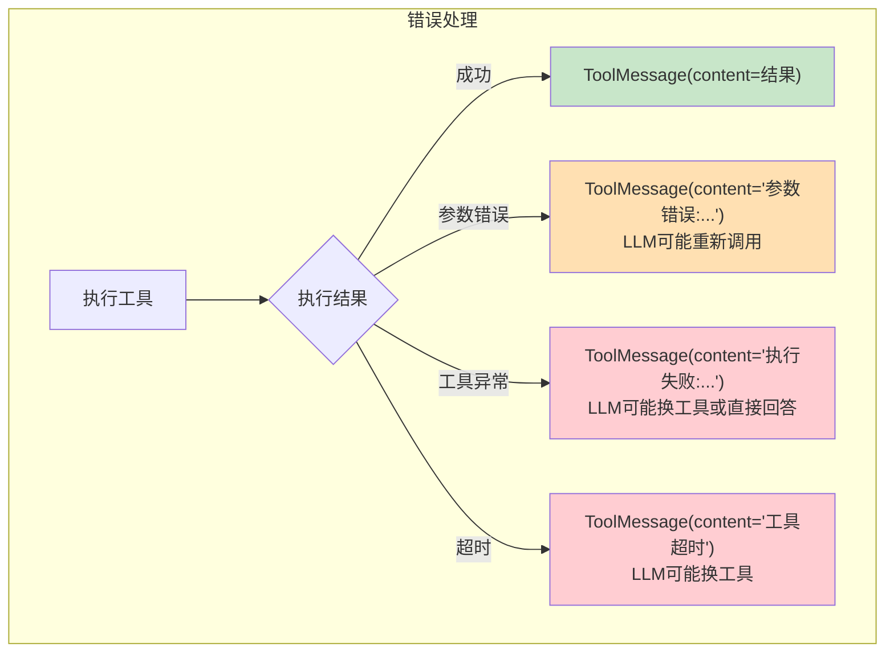
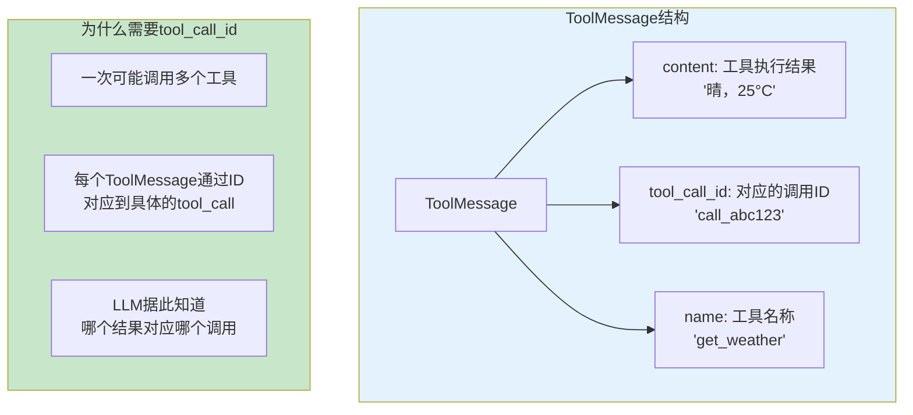
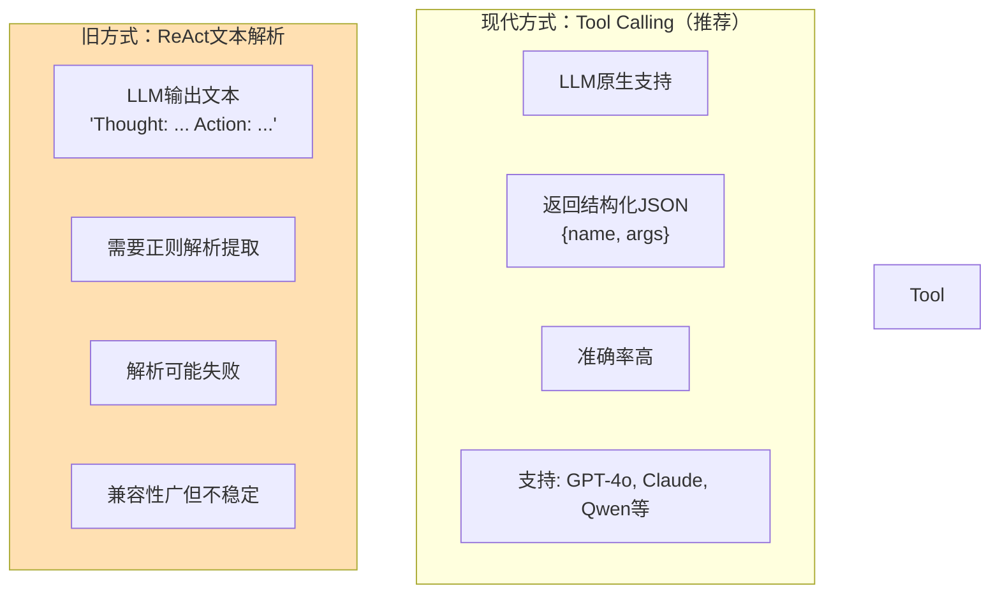

# 工具调用全链路图解

> 从用户提问到工具执行再到最终回答，完整追踪 Agent 调用工具的每一步。

---

## 一、工具调用的完整生命周期



## 二、工具绑定阶段



### 绑定时发生了什么



## 三、工具调用决策



### LLM 返回的 tool_calls 结构

```json
{
  "content": null,
  "tool_calls": [
    {
      "id": "call_abc123",
      "type": "function",
      "function": {
        "name": "calculator",
        "arguments": "{\"expression\": \"3*5\"}"
      }
    },
    {
      "id": "call_def456",
      "type": "function",
      "function": {
        "name": "get_weather",
        "arguments": "{\"city\": \"北京\"}"
      }
    }
  ]
}
```

## 四、工具执行阶段



## 五、结果反馈与循环判断



## 六、完整时序图



## 七、tool_calls 为空的情况

```mermaid
graph TB
    subgraph 无需工具 ["场景：LLM直接回答"]
        U["用户: '你好'"]
        U --> LLM["LLM分析:<br/>'你好'是问候<br/>不需要工具']
        LLM --> EMPTY["tool_calls: [] (空)"]
        EMPTY --> DIRECT["直接生成文字回答"]
        DIRECT --> A["回答: '你好！有什么可以帮你的？'"]
    end

    style LLM fill:#E3F2FD
    style EMPTY fill:#FFF9C4
    style A fill:#C8E6C9
```

## 八、工具调用失败的错误处理



```python
# 错误处理的工具实现
@tool
def safe_api_call(endpoint: str, params: dict) -> str:
    """调用外部API。"""
    import requests
    try:
        response = requests.get(endpoint, params=params, timeout=10)
        response.raise_for_status()
        return response.text
    except requests.Timeout:
        return "错误: API调用超时，请稍后重试或换一种方式"
    except requests.ConnectionError:
        return "错误: 无法连接到服务器，可能网络问题"
    except Exception as e:
        return f"错误: {type(e).__name__}: {str(e)}"
```

## 九、ToolMessage 的关键属性



## 十、工具调用 vs ReAct 文本解析


