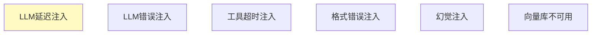
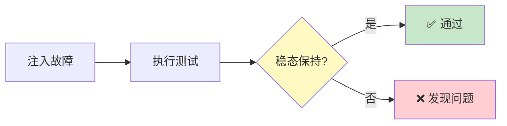

# 故障注入测试图解

> 用图解理解故障注入场景和稳态验证。

---

## 一、故障注入 vs 混沌工程

```mermaid
graph TB
    subgraph 混沌 {"混沌工程"}
        C1["随机注入<br/>发现未知问题"]
    end
    subgraph 注入 {"故障注入测试"}
        F1["精确注入<br/>验证已知风险"]
    end

    style 混沌 fill:#E3F2FD
    style 注入 fill:#C8E6C9,stroke:#2E7D32,stroke-width:3px
```

---

## 二、6个注入场景



---

## 三、测试流程



---

## 四、稳态检查

```mermaid
graph TB
    subgraph 稳态 {"稳态验证5项"}
        C1["有响应返回"]
        C2["系统未崩溃"]
        C3["延迟可接受"]
        C4["错误已处理"]
        C5["无数据丢失"]
    end

    style 稳态 fill:#E3F2FD
```

---

## 五、检查清单

| 检查项 | 状态 |
|--------|------|
| 有故障注入器 | ☐ |
| 有测试套件 | ☐ |
| 有稳态验证 | ☐ |
| 有结果摘要 | ☐ |
