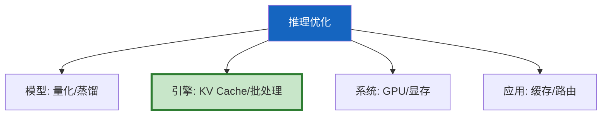
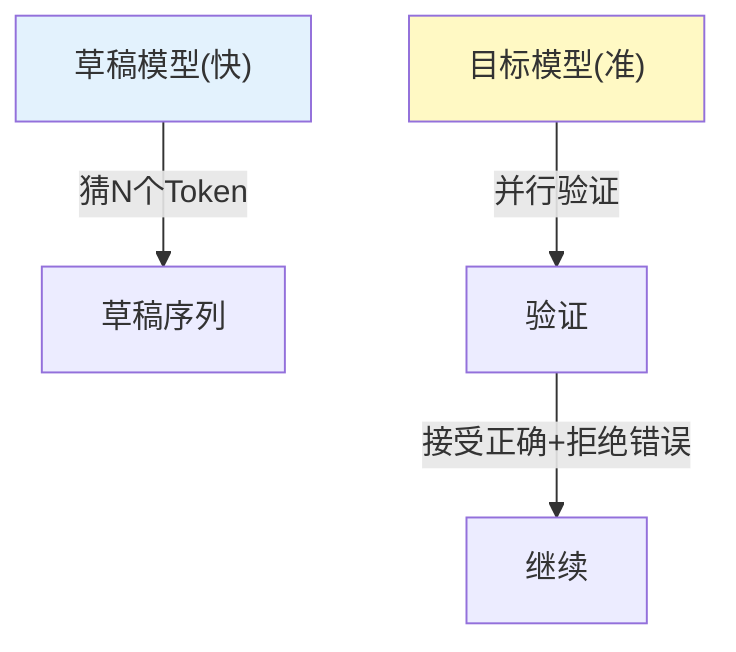
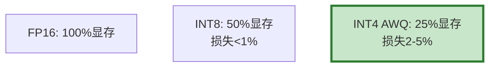
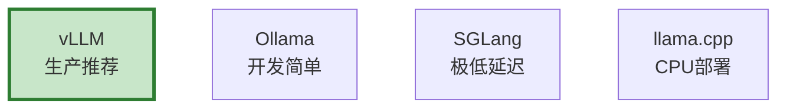

# LLM 推理优化图解

> 用图解理解 KV Cache、推测解码、量化和部署方案。

---

## 一、优化全景



---

## 二、KV Cache

```mermaid
graph LR
    subgraph 无缓存 {"无KV Cache"}
        T1["每Token重算所有QKV"]
    end
    subgraph 有缓存 {"有KV Cache"}
        T2["复用缓存+只算新Token"]
    end

    style 无缓存 fill:#FFCDD2
    style 有缓存 fill:#C8E6C9
```

---

## 三、推测解码



---

## 四、量化方案



---

## 五、部署方案



---

## 六、检查清单

| 检查项 | 状态 |
|--------|------|
| 理解KV Cache | ☐ |
| 理解推测解码 | ☐ |
| 知道量化选择 | ☐ |
| 能选部署方案 | ☐ |
