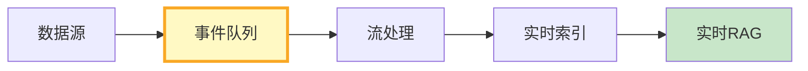
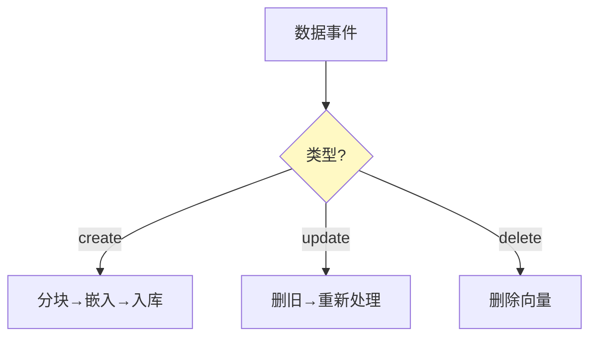

# 实时数据管道图解

> 用图解理解数据源接入、流处理和实时索引。

---

## 一、管道架构



---

## 二、数据源

```mermaid
graph TB
    subgraph 源 {"4种数据源"}
        S1["Webhook推送"]
        S2["文件监听"]
        S3["数据库CDC"]
        S4["API轮询"]
    end

    style 源 fill:#E3F2FD
```

---

## 三、事件处理



---

## 四、检查清单

| 检查项 | 状态 |
|--------|------|
| 有事件队列 | ☐ |
| 有流处理器 | ☐ |
| 有增量更新 | ☐ |
| 有处理统计 | ☐ |
