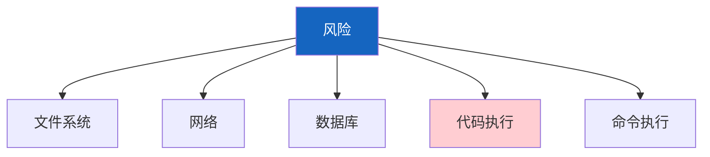
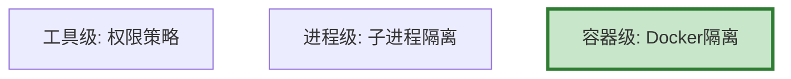
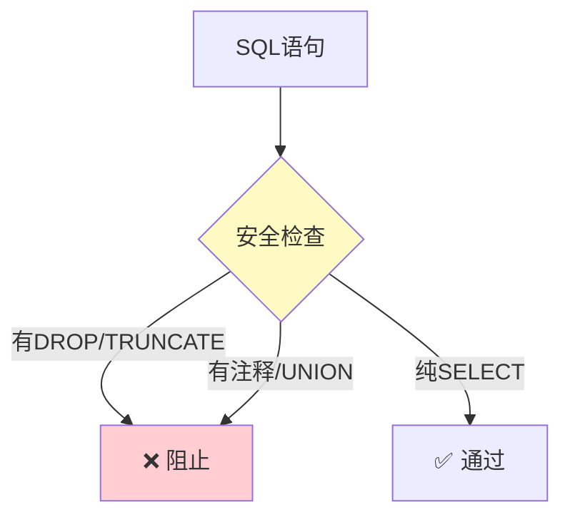

# Agent 安全沙箱图解

> 用图解理解三层隔离、权限控制和SQL过滤。

---

## 一、安全风险



---

## 二、三层隔离



---

## 三、工具权限

```mermaid
graph TB
    subgraph 权限 {"工具权限模型"}
        P1["search_web: 仅网络白名单"]
        P2["execute_code: 仅/tmp目录"]
        P3["send_email: 需人工审批"]
        P4["database: 仅SELECT"]
    end

    style 权限 fill:#E3F2FD
```

---

## 四、SQL过滤



---

## 五、检查清单

| 检查项 | 状态 |
|--------|------|
| 有工具安全策略 | ☐ |
| 有权限检查 | ☐ |
| 有SQL过滤 | ☐ |
| 有审计日志 | ☐ |
