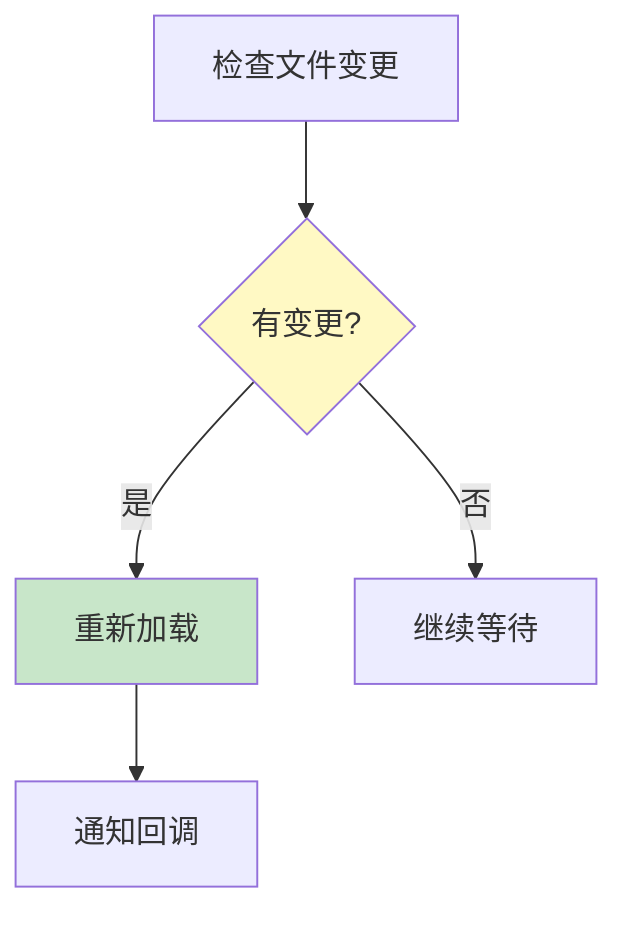
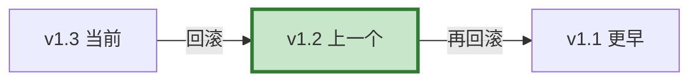

# 配置即代码图解

> 用图解理解 YAML 配置、热更新和版本回滚。

---

## 一、配置架构


---

## 二、配置内容

```mermaid
graph TB
    subgraph 配置 {"YAML配置内容"}
        C1["模型配置"]
        C2["Prompt版本"]
        C3["工具+权限"]
        C4["RAG参数"]
        C5["缓存配置"]
        C6["安全配置"]
        C7["监控配置"]
    end

    style 配置 fill:#E3F2FD
```

---

## 三、热更新



---

## 四、版本回滚



---

## 五、检查清单

| 检查项 | 状态 |
|--------|------|
| 有YAML配置 | ☐ |
| 有配置验证 | ☐ |
| 有热更新 | ☐ |
| 有版本回滚 | ☐ |
