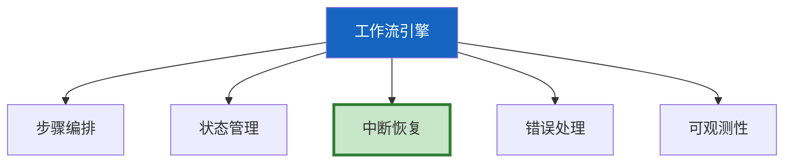
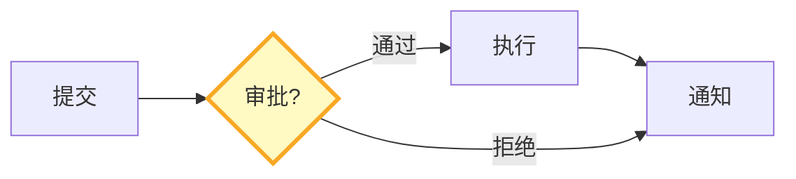

# Agent 工作流引擎图解

> 用图解理解工作流定义、步骤类型和引擎架构。

---

## 一、引擎核心能力



---

## 二、步骤类型

```mermaid
graph TB
    subgraph 类型 {"6种步骤"}
        S1["LLM调用"]
        S2["工具调用"]
        S3["条件判断"]
        S4["人工审批"]
        S5["并行执行"]
        S6["等待"]
    end

    style S4 fill:#FFF9C4
```

---

## 三、审批工作流



---

## 四、检查清单

| 检查项 | 状态 |
|--------|------|
| 有工作流定义 | ☐ |
| 有引擎实现 | ☐ |
| 有模板 | ☐ |
