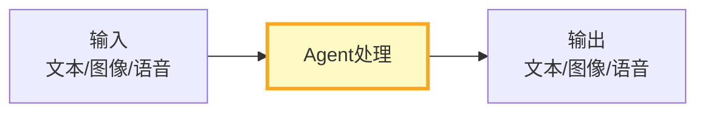
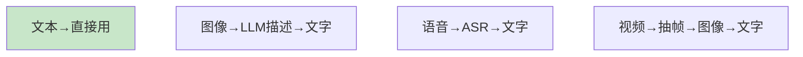
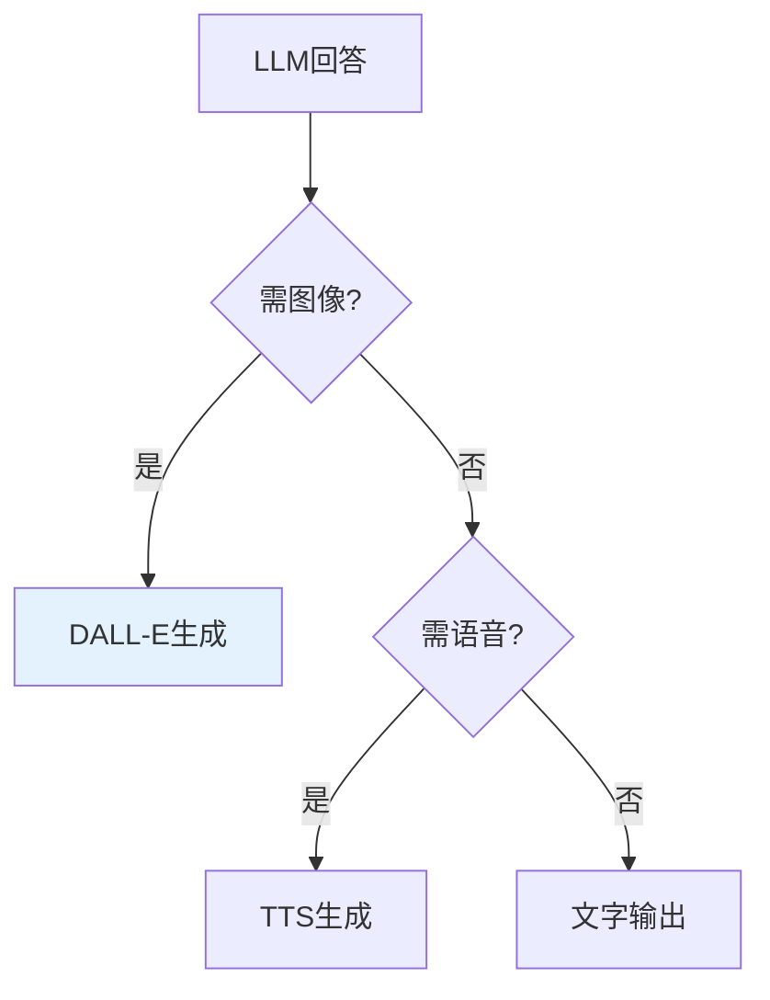

# 多模态交互图解

> 用图解理解多模态输入处理和输出生成。

---

## 一、多模态全景

```mermaid
graph LR
    INPUT["输入<br/>文本/图像/语音"] --> PROCESS["Agent处理"] --> OUTPUT["输出<br/>文本/图像/语音"]

    style PROCESS fill:#FFF9C4,stroke:#F9A825,stroke-width:3px
```

---

## 二、输入处理

```mermaid
graph TB
    TEXT["文本→直接用"]
    IMAGE["图像→LLM描述→文字"]
    AUDIO["语音→ASR→文字"]
    VIDEO["视频→抽帧→图像→文字"]

    style TEXT fill:#C8E6C9
```

---

## 三、输出生成

```mermaid
graph TB
    RESPONSE["LLM回答"] --> NEED_IMG{"需图像?"}
    NEED_IMG -->|是| GEN_IMG["DALL-E生成"]
    NEED_IMG -->|否| NEED_AUDIO{"需语音?"}
    NEED_AUDIO -->|是| TTS["TTS生成"]
    NEED_AUDIO -->|否| TEXT_OUT["文字输出"]

    style GEN_IMG fill:#E3F2FD
```

---

## 四、检查清单

| 检查项 | 状态 |
|--------|------|
| 有多模态输入 | ☐ |
| 有图像理解 | ☐ |
| 有语音输入 | ☐ |
| 有多模态输出 | ☐ |
