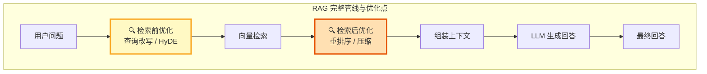
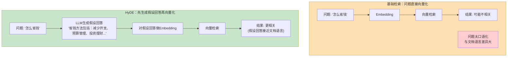
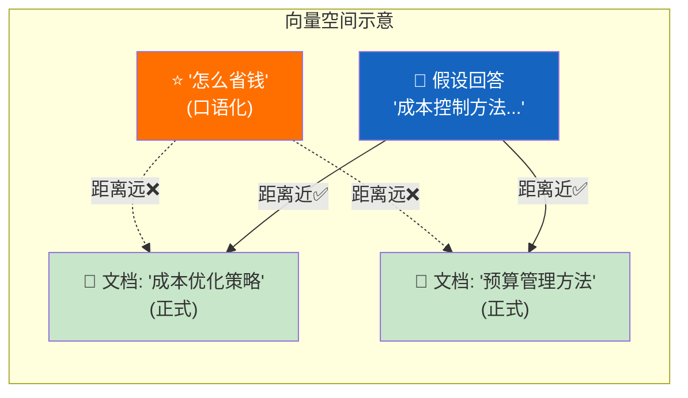
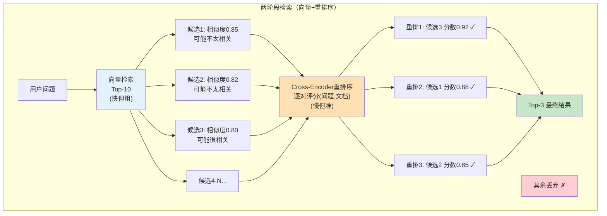
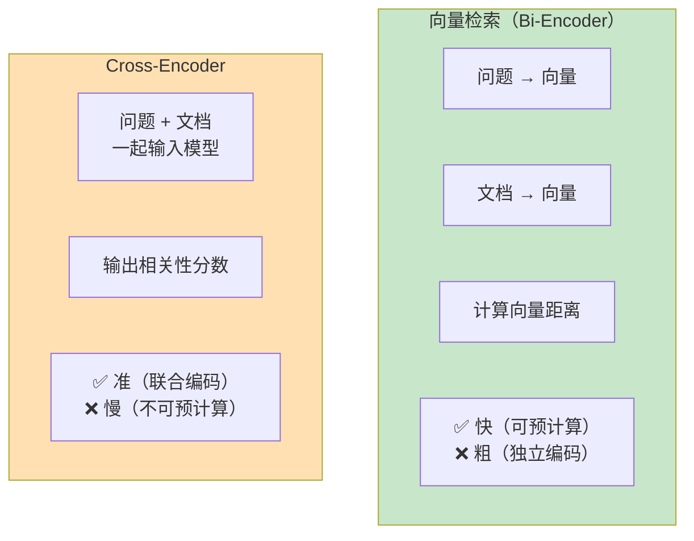
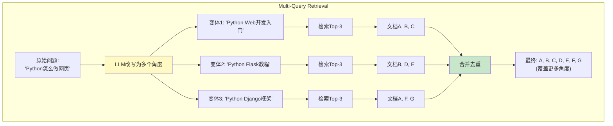
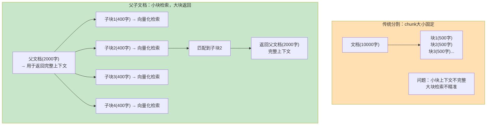
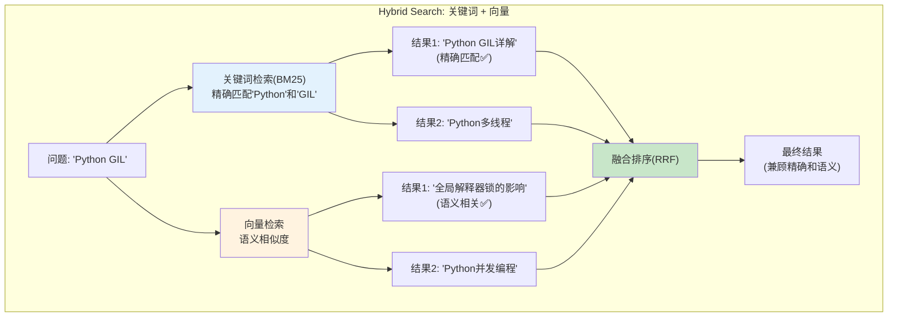
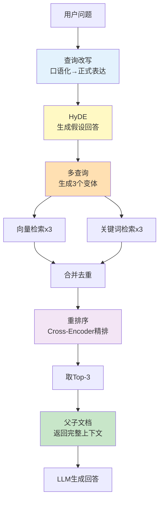
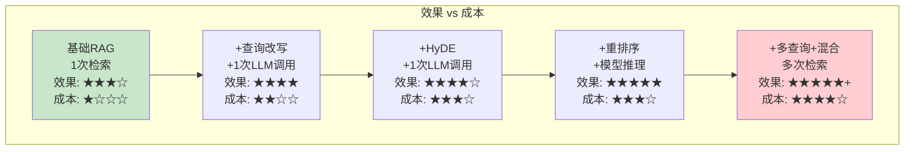

# 高级 RAG 模式图解

> 用图解方式理解 RAG 的进阶优化模式，知道什么时候用哪种。

---

## 一、RAG 优化全景

## 二、HyDE 原理图解

### HyDE 效果对比

## 三、重排序流程图解

### 向量检索 vs Cross-Encoder

## 四、多查询检索图解

## 五、父子文档检索图解

## 六、混合检索图解

## 七、模式组合：完整高级 RAG 管线

## 八、效果-成本权衡图

> 💡 不是模式越多越好——根据实际效果和成本选择最小够用的组合。
