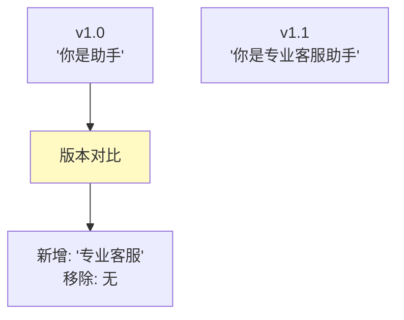
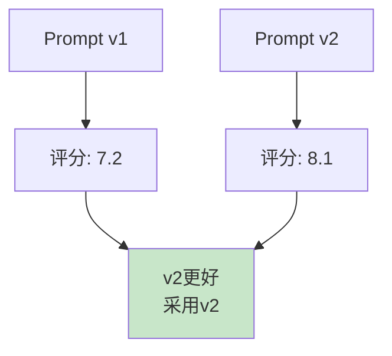

# Prompt 版本管理图解

> 用图解理解版本生命周期、A/B实验和回滚。

---

## 一、版本生命周期

---

## 二、版本对比

---

## 三、A/B实验

---

## 四、检查清单

| 检查项 | 状态 |
|--------|------|
| 有版本注册表 | ☐ |
| 有回滚能力 | ☐ |
| 有版本对比 | ☐ |
| 有A/B实验 | ☐ |
