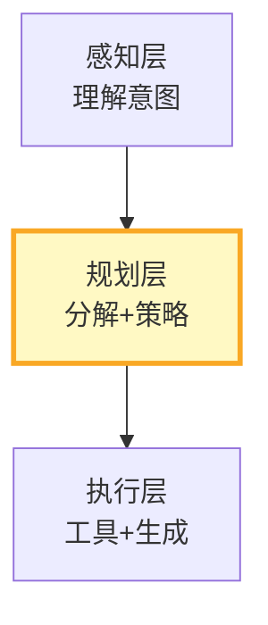
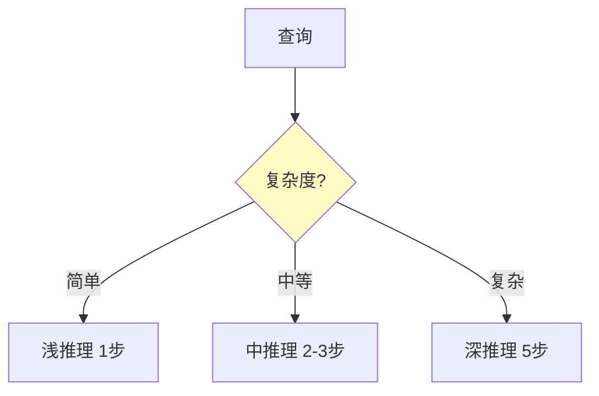

# Agent 推理链优化图解

> 用图解理解推理链问题、动态深度和质量评估。

---

## 一、推理链三层

```mermaid
graph TB
    L1["感知层<br/>理解意图"] --> L2["规划层<br/>分解+策略"]
    L2 --> L3["执行层<br/>工具+生成"]

    style L2 fill:#FFF9C4,stroke:#F9A825,stroke-width:3px
```

---

## 二、5种问题

```mermaid
graph TB
    P1["冗余推理"]
    P2["推理跳跃"]
    P3["循环推理"]
    P4["无效推理"]
    P5["过度推理"]

    style P3 fill:#FFCDD2
```

---

## 三、动态推理深度

```mermaid
graph TB
    Q["查询"] --> CLASSIFY{"复杂度?"}
    CLASSIFY -->|简单| S1["浅推理 1步"]
    CLASSIFY -->|中等| S2["中推理 2-3步"]
    CLASSIFY -->|复杂| S3["深推理 5步"]

    style CLASSIFY fill:#FFF9C4
```

---

## 四、检查清单

| 检查项 | 状态 |
|--------|------|
| 有推理优化器 | ☐ |
| 有动态深度 | ☐ |
| 有质量评估 | ☐ |
