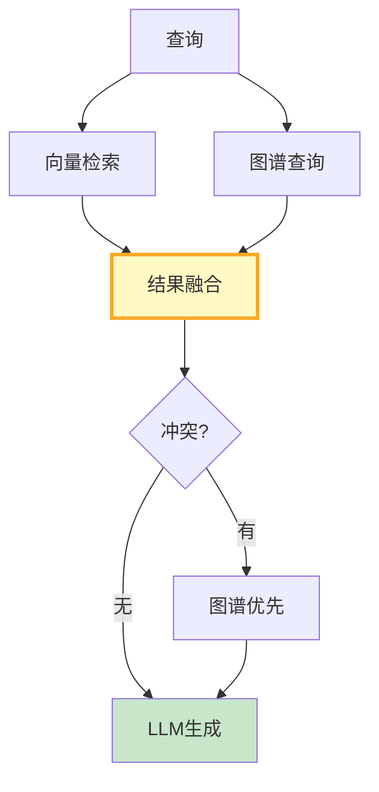

# 知识图谱融合图解

> 用图解理解向量+图谱并行检索和结果融合。

---

## 一、融合架构



---

## 二、融合策略

```mermaid
graph TB
    subgraph 策略 {"融合策略"}
        S1["向量结果: 语义相似<br/>置信度0.7"]
        S2["图谱结果: 关系精确<br/>置信度0.9"]
        S3["重叠: 合并增强<br/>置信度0.9+"]
    end

    style 策略 fill:#E3F2FD
```

---

## 三、检查清单

| 检查项 | 状态 |
|--------|------|
| 有融合器 | ☐ |
| 有冲突检测 | ☐ |
| 有查询路由 | ☐ |
