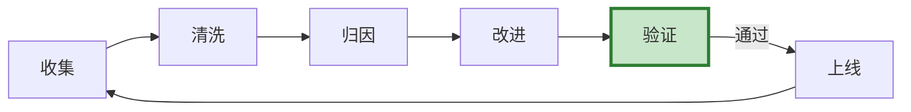
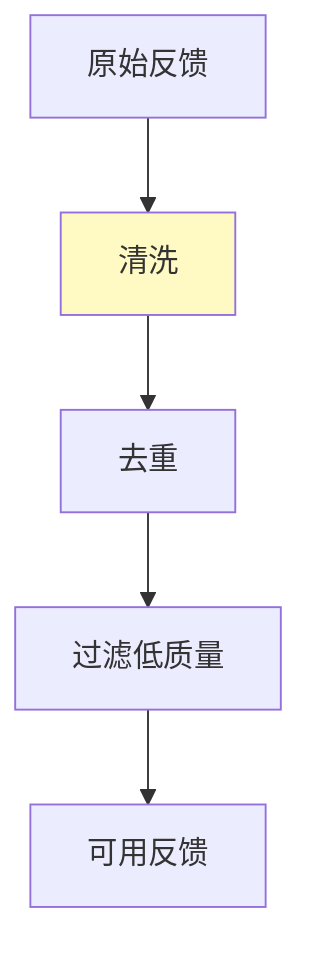
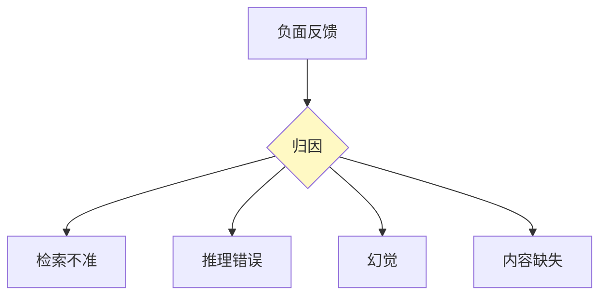

# 反馈闭环图解

> 用图解理解反馈清洗、归因分析和改进验证。

---

## 一、闭环流程

```mermaid
graph LR
    A["收集"] --> B["清洗"]
    B --> C["归因"]
    C --> D["改进"]
    D --> E["验证"]
    E -->|"通过"| F["上线"]
    F --> A

    style E fill:#C8E6C9,stroke:#2E7D32,stroke-width:3px
```

---

## 二、反馈清洗

```mermaid
graph TB
    RAW["原始反馈"] --> CLEAN["清洗"]
    CLEAN --> DEDUPE["去重"]
    DEDUPE --> FILTER["过滤低质量"]
    FILTER --> READY["可用反馈"]

    style CLEAN fill:#FFF9C4
```

---

## 三、归因分类

```mermaid
graph TB
    NEG["负面反馈"] --> CAT{"归因"}
    CAT --> R1["检索不准"]
    CAT --> R2["推理错误"]
    CAT --> R3["幻觉"]
    CAT --> R4["内容缺失"]

    style CAT fill:#FFF9C4
```

---

## 四、检查清单

| 检查项 | 状态 |
|--------|------|
| 有清洗器 | ☐ |
| 有归因分析 | ☐ |
| 有改进验证 | ☐ |
