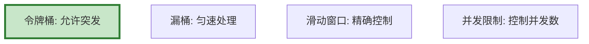
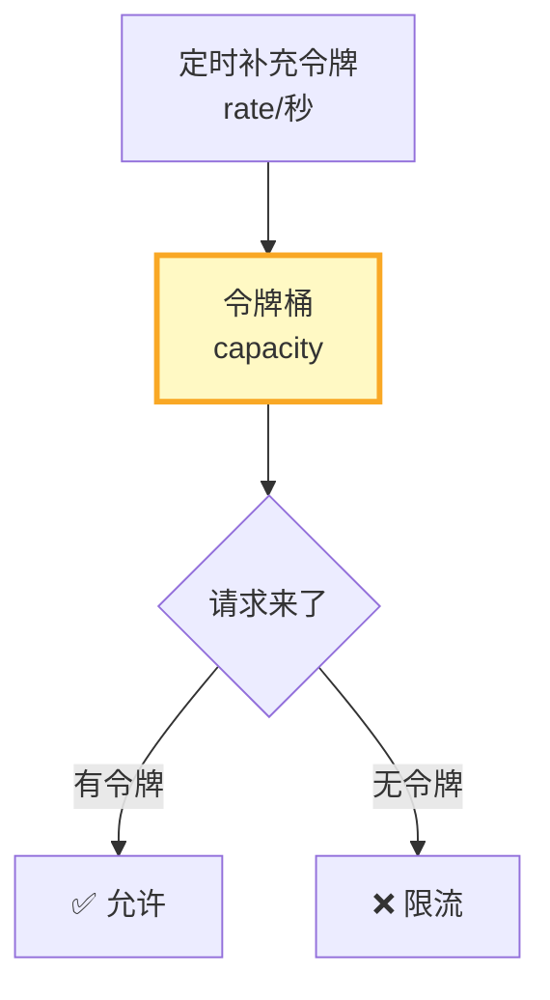
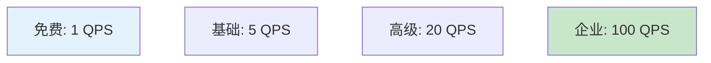

# API 限流图解

> 用图解理解令牌桶、分级限流和自适应限流。

---

## 一、4种算法

```mermaid
graph TB
    A1["令牌桶: 允许突发"]
    A2["漏桶: 匀速处理"]
    A3["滑动窗口: 精确控制"]
    A4["并发限制: 控制并发数"]

    style A1 fill:#C8E6C9,stroke:#2E7D32,stroke-width:3px
```

---

## 二、令牌桶原理

```mermaid
graph TB
    REFILL["定时补充令牌<br/>rate/秒"] --> BUCKET["令牌桶<br/>capacity"]
    BUCKET --> REQUEST{"请求来了"}
    REQUEST -->|有令牌| ALLOW["✅ 允许"]
    REQUEST -->|无令牌| REJECT["❌ 限流"]

    style BUCKET fill:#FFF9C4,stroke:#F9A825,stroke-width:3px
```

---

## 三、分级限流

```mermaid
graph TB
    FREE["免费: 1 QPS"]
    BASIC["基础: 5 QPS"]
    PREMIUM["高级: 20 QPS"]
    ENTERPRISE["企业: 100 QPS"]

    style FREE fill:#E3F2FD
    style ENTERPRISE fill:#C8E6C9
```

---

## 四、检查清单

| 检查项 | 状态 |
|--------|------|
| 有令牌桶 | ☐ |
| 有分级限流 | ☐ |
| 有优先级队列 | ☐ |
| 有自适应限流 | ☐ |
