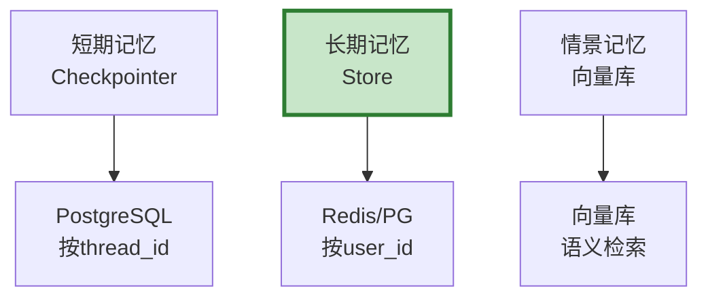
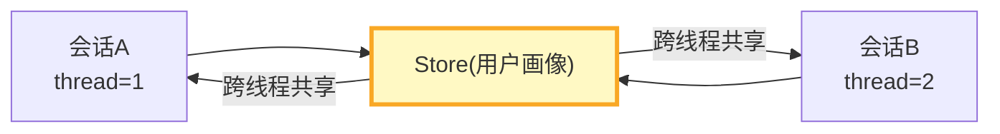
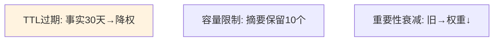

# Agent 记忆持久化图解

> 用图解理解跨会话记忆、自动提取和遗忘策略。

---

## 一、记忆持久化架构

```mermaid
graph TB
    SHORT["短期记忆<br/>Checkpointer"] --> STORE1["PostgreSQL<br/>按thread_id"]
    LONG["长期记忆<br/>Store"] --> STORE2["Redis/PG<br/>按user_id"]
    EPISODIC["情景记忆<br/>向量库"] --> STORE3["向量库<br/>语义检索"]

    style LONG fill:#C8E6C9,stroke:#2E7D32,stroke-width:3px
```

---

## 二、跨会话记忆

```mermaid
graph LR
    S1["会话A<br/>thread=1"] --> STORE["Store(用户画像)"]
    S2["会话B<br/>thread=2"] --> STORE
    STORE -->|"跨线程共享"| S1
    STORE -->|"跨线程共享"| S2

    style STORE fill:#FFF9C4,stroke:#F9A825,stroke-width:3px
```

---

## 三、遗忘策略

```mermaid
graph TB
    F1["TTL过期: 事实30天→降权"]
    F2["容量限制: 摘要保留10个"]
    F3["重要性衰减: 旧→权重↓"]

    style F1 fill:#FFF3E0
```

---

## 四、检查清单

| 检查项 | 状态 |
|--------|------|
| 有跨会话记忆 | ☐ |
| 有自动提取 | ☐ |
| 有遗忘策略 | ☐ |
