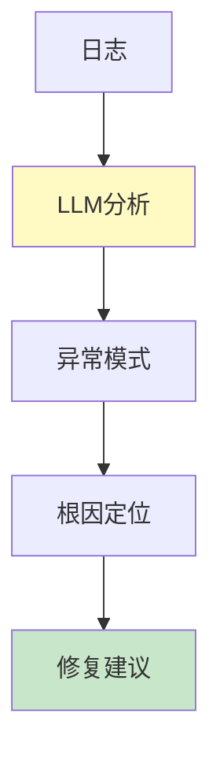

# 日志分析图解

> 用图解理解结构化日志、智能诊断和聚合分析。

---

## 一、LLM日志特殊字段

```mermaid
graph TB
    subgraph 特殊 {"LLM日志特殊"}
        L1["request_id"]
        L2["Prompt内容"]
        L3["模型版本"]
        L4["Token使用"]
        L5["工具调用"]
        L6["延迟分解"]
    end

    style 特殊 fill:#FFF3E0
```

---

## 二、智能诊断



---

## 三、检查清单

| 检查项 | 状态 |
|--------|------|
| 有结构化日志 | ☐ |
| 有智能诊断 | ☐ |
| 有聚合分析 | ☐ |
