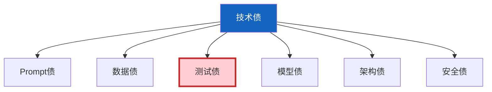
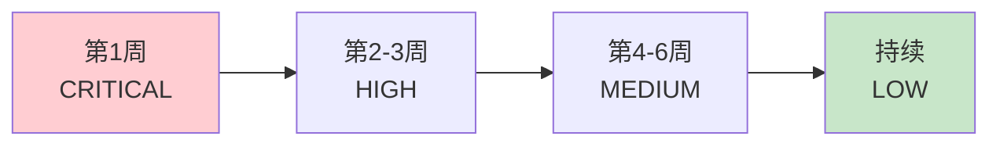

# 技术债管理图解

> 用图解理解技术债类型、评估和偿还计划。

---

## 一、6种技术债

```mermaid
graph TB
    ROOT["技术债"] --> D1["Prompt债"]
    ROOT --> D2["数据债"]
    ROOT --> D3["测试债"]
    ROOT --> D4["模型债"]
    ROOT --> D5["架构债"]
    ROOT --> D6["安全债"]

    style ROOT fill:#1565C0,color:#fff
    style D3 fill:#FFCDD2,stroke:#C62828,stroke-width:3px
```

---

## 二、偿还计划

```mermaid
graph LR
    W1["第1周<br/>CRITICAL"] --> W2["第2-3周<br/>HIGH"]
    W2 --> W3["第4-6周<br/>MEDIUM"]
    W3 --> W4["持续<br/>LOW"]

    style W1 fill:#FFCDD2
    style W4 fill:#C8E6C9
```

---

## 三、检查清单

| 检查项 | 状态 |
|--------|------|
| 有技术债评估 | ☐ |
| 有优先级排序 | ☐ |
| 有偿还计划 | ☐ |
